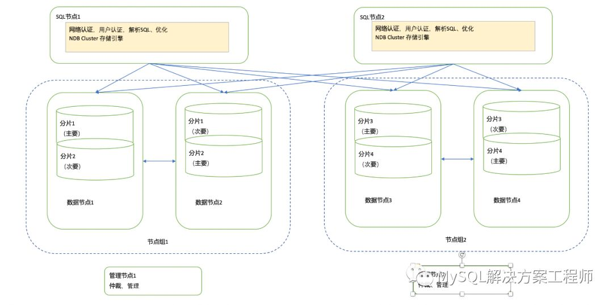

# Chapter 01 MySQL体系结构和存储引擎

主题:
- MySQL架构
- [存储引擎](https://dev.mysql.com/doc/refman/8.0/en/storage-engines.html)

## 1.1 定义数据库和实例

**数据库** & **实例**
- 数据库: 物理操作系统文件或者其它形式文件类型的集合
    - frm, MYD, MYI, ibd
- 实例: 数据库启动后的进程, 包括若干后台线程和线程共享的共享内存区
  - 单进程多线程: mysql
  - 多进程: oracle
 

启动配置:
- my.ini/my.cnf
- 多配置多优化级: mysql会从多个目录去读配置文件, 其中后读的优先级更高

datadir: 指定数据库所在路径

## 1.2 MySQL体系结构

MySQL Server的组成部分: 
- 连接池组件(Connection Pool): 
  > 认证, 线程与连接管理, 内存检查, cache
- 核心:
  > SQL接口(DML, DDL, 存储过程, 视图)
  > 解析器
  > 优化器
  > cache, buffer
- 存储引擎: **插件式**
- 管理服务和工具组件: 
  > 备份, 恢复, 安全, 复制, 管理(Administration), 配置, 迁移, 元数据
- 物理文件

**存储引擎以表为单位**

//TODO

## 1.3 MySQL存储引擎

### 1.3.1 InnoDB存储引擎

InnoDB存储引擎: 面向在线联机事务处理(OLTP)
- 事务支持: 支持
- 锁: 行锁, 表锁, 一致性非锁定读, 外键
- 索引: 
  - 聚集索引: 如果没有唯一主键, 则定义一个6字节的ROWID
- 存储:
  - 文件: ibd (ver >= 4.1): 对应一个表空间, 即一张逻辑表
  - 支持**裸设备**: 即不经过操作系统的文件管理系统
- 多版本并发控制(MVCC): 实现4种隔离级别
- 其它优化: 插入缓存, 二次写, 自适应哈希索引, 预读
 

### 1.3.2 MyISAM引擎

MyISAM:
- 不支持事务
- 锁: 只有表锁
- 索引:
  - B+树, 全文索引, 地理空间索引
- 存储: 
  - 文件: 
    - MYD(data): 数据文件
    - MYI(index): 索引文件
  - 带压缩(Huffman)
  - MySQL只缓存(cache)索引, 不缓存数据 

### innoDB与MyISAM对比

innoDB & MyISAM对比
- 事务:
    - MyISAM不支持事务
    - innoDB支持事务, autocommit时所有语句都封闭成事务
- 外键:
    - MyISAM不支持外键
    - innoDB支持外键
        - 相关问题: 外键实现方法(强制建索引, S锁)
- 索引:
    - MyISAM用B+Tree, 但数据和索引分开, 索引叶结点存的是指针
    - innoDB**索引即数据**, 数据直接放叶结点, 并且一定要有主键, 用聚集索引实现主键
        - 辅助索引放主键
- 行数: 
    - MyISAM记录行数
        - MyISAM只有表锁, 可以通过表锁保证行数与实际行数一致
    - innoDB不记录行数, 统计要全表扫描
        - 行数对于不同事务来说可能不一样
- 压缩:
    - MyISAM的数据文件可以被压缩后查询(但压缩后不能修改)
- 文件
    - MyISAM: frm MYD(数据文件) MYI(索引文件)
    - innodb: frm ibd(表空间)
- 锁:
    - MyISAM支持表锁, innoDB支持行级页 & 表锁
- 其它:
    - innoDB特性: 二次写, 缓冲池, 一致性非锁定读(MVCC实现), 预读, 自适应索引hash

### 其它引擎

#### NDB

参考: [MySQL NDB Cluster介绍](https://www.modb.pro/db/15243)

**NDB**(Network DB): 实际上是个集群
- 无共享架构(share nothing): 达到高可用的效果
  - 相比之下, Oracle RAC的share everthing偏向保证一致性
- 结点类型:
  - SQL结点: 访问入口
  - 管理结点: 管理和协调各节点
  - 数据结点: 存数据
- 缺点: 连接操作要跨网络, 开销巨大

#### Memory

**Memory**: 数据存在内存
- 索引: hash
- 锁: 只支持表锁
- 存储: 
  - 数据类型不支持TEXT, BLOB
    - Q: 为什么不支持? A: Memory就是设计用于数据量小, 可全部存在内存的场景

使用场景:
- MySQL用来存储中间结果
  - 如果超出容量限制或者使用了TEXT/BLOB, MySQL会用MyISAM兜底
    - **因此尽量避免让TEXT/BLOB出现在中间结果中**

#### Archive 引擎

**Archive**: 
- 只支持select / insert操作
- 存储:
  - 压缩: zlib压缩
  - 索引: **无**

使用场景: 高速插入且无修改的场景, 如日志存储

#### Federated

**Federated**: 指向一个远程MySQL数据库服务器的表

## 1.5 MySQL连接

连接方式:
- TCP/IP: ``mysql -h127.0.0.1 -uroot -p``
- UNIX Socket: 
  - ``mysql -uroot -S /tmp/mysql.sock``
- 命名管道
  - 配置启用: ``--enabled-named-pip``
- 共享内存
  - 配置启用: ``--enabled-named-pip``
  - 连接参数: ``--protocol=memory``

