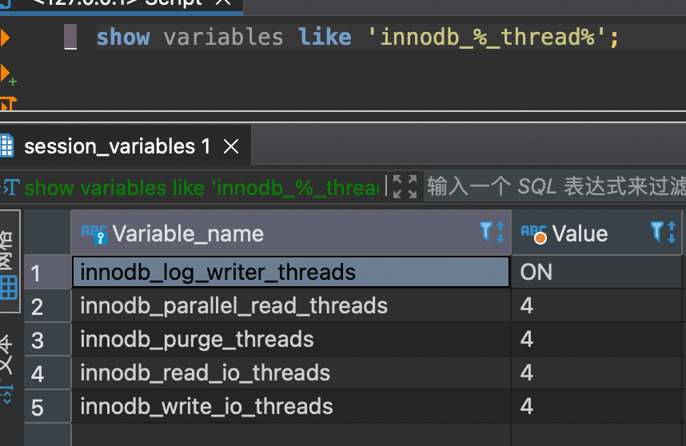
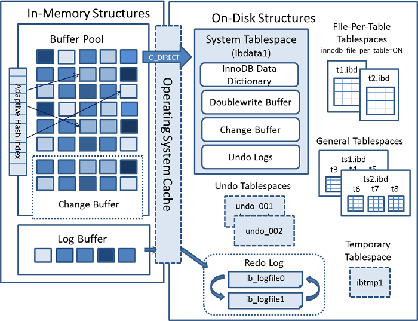

# Chapter 02 

知识结构:
- 内存池:
  - 额外内存池
  - 缓冲池
    - change buffer
  - redo log
    - 持久性(Duration)保证
    - Checkpoint机制
    - Redo Log与缓冲池

## 2.3 InnoDB体系架构

InnoDB体系架构
- 内存池:
    - 额外内存池
    - 缓冲池
      > 数据页, undo页, i等
    - redo log buffer
- 后台线程: 刷新缓存到磁盘, 以及从磁盘读取数据到缓存
  > Master/IO/Purge/Page Cleaner


参考:
- 
- [官方文档 - innodb启动选项和系统变量](https://dev.mysql.com/doc/refman/8.0/en/innodb-parameters.html)


### 2.3.1 后台线程

后台线程:
- Master Thread
- IO Thread 
- Purge Thread
- Page Cleaner Thread
- Log Writer Thread (v8.0)


<br/>


Master Thread:
- 将数据异步刷新到磁盘, 保持一致性
- 合并插入缓存(Insert Buffer)
- 脏页刷新(老版本)
- 回收UNDO页(老版本)
  - *新版本在purge threads中完成*
<br/>


IO Threads: 通过独立的线程实现AIO, 接收指令进行回调
- 四种:
    - read thread 
    - write thread
    - insert buffer thread
    - log IO thread
- 配置: 
  - `inodb_read_io_threads`, `inodb_write_io_threads`
<br/>

Purge Thread: 回收[UNDO](./ch07-%E4%BA%8B%E5%8A%A1.md#7.2.2%20undo)页
- 原本由Master Thread完成
- 配置: `innodb_purge_threads`
<br/>


Page Cleaner Thread: 回写脏页
- 原本由Master Thread完成

Log Writer Thread(v8.0): 专门负责将redo log缓冲页写入文件系统缓冲区, 并将文件缓冲区刷新到redo log文件


### 2.3.2 内存

先验知识: [缓冲与缓存的区别](https://www.zhihu.com/question/26190832)
参考[ch04-表#4.2.4 页](./ch04-表.md#424页)

innodb内存区域
- 缓冲池(Buffer Pool)
  - 更改缓冲(Change Buffur)
- 重做日志缓存(Redo Log Buffer)
- 额外内存池

#### 1. 缓冲池


缓冲池(Buffer Pool): 本质上是个**LRU**队列
- 空间管理单位: **页**
- 数据页类型(参考[页](ch04-表.md#424-页)):
    - 索引页
    - 数据页
    - undo页
    - 插入缓冲
    - 自适合哈希索引
    - InnoDB存储的锁信息
    - 数据字典信息

优化手段
- 多实例: 一个MySQL实例可开多个buffer pool, 分别管理不同的内存/磁盘区域

<br/>

参考:
- [官方文档 - innodb缓冲池](https://dev.mysql.com/doc/refman/8.0/en/innodb-buffer-pool.html)
- [官方文档 - innode体系架构](https://dev.mysql.com/doc/refman/8.0/en/innodb-architecture.html)


#### 2. LRU List, Free List 和 Flush List

三种列表:
- LRU list: 缓冲页不够时, 用来选择缓存进行回收
- Free List: 空闲列表
    - 伙伴算法进行合并
- Flush List: 脏页列表

LRU算法(Latsest Recent Used)
- 中点插入策略(midpoint insertion strategy): 新加入的结点入到中点而不是队首, 防止把热点页刷掉
    - innodb_old_blocks_pct(37): 默认后3/8 
    - *为什么不放队尾*? 有些操作需要遍历所有的页, 如果放队首, 可能把热点页刷掉
    - innodb_old_blocks_time(1000ms): 新加载的页需要等一段时间才能进入new列表
- 相关指标
    - `innodb_old_blocks_time`: 新加入的空闲页要多久才能进行new部分
        - `page make young`: 成功从old部分移动到new部分的页的数量
        - `page not make young`: 由于`innodb_old_blocks_time`导致没有成功加入到new的页数量
    - `Buffer pool hit rate`: 缓冲池命中率


#### 3. 重做日志缓冲

重做日志相关话题:
- [ch07-事务 #7.2.1 redo](./ch07-事务.md#721-redo)

redo log buffer 与 buffer pool 关系: 
- redo log 缓冲不属于 buffer pool, 因为 redo log 本身就是用来保证各 buffer page 的持久性的

<br/>

redo log的flush时机
- Master Thread定时执行
  - *v8.0提供Log Writer Thread*
- 事务提交时
- redo log缓冲池空间不够(小于1/2)

配置参数:
- 缓冲区大小: `innodb_log_buffer_size`
  - 影响: 刷入redo log文件的频率
- 超时刷入: `innodb_flush_log_at_timeout`, 默认: 1s
  - 由 Log Writer Thread 执行
- 事务提交时刷入: `innodb_flush_log_at_trx_commit`, 默认: 1
  - 0: 定时刷新
  - 1: 事务提交时刷新(保证ACID)
    - **完全ACID保证需要配合
  - 2: 事务提交后, 定时刷新

参考:
- [官方文档 - 日志缓冲区](https://dev.mysql.com/doc/refman/8.0/en/innodb-redo-log-buffer.html)
- [官方文档 - 优化innodb重做日志](https://dev.mysql.com/doc/refman/8.0/en/optimizing-innodb-logging.html)

#### 4. 额外的内存池

额外的内存池:
- 存储一些元数据和状态信息:
  - 缓冲控制对象: LRU信息, 锁, 等待


## 2.4 Checkpoint技术

持久性的实现方法-**Write Ahead Log**: 先写redo log, 再将更新应用到page上
- 保证以下page的持久性:
  - data 
  - index
  - undo log
  - insert buffer
  - ...

Checkpoint: 界定一个时间点, 表示这之前的数据都是完成了**持久化**的

LSN: Checkpoint用LSN作为标记
<br/>

Checkpoint选项:
- Sharp Checkpoint: 将所有脏页都刷新到数据库
  - **关闭时使用**
  - `innodb_fast_shutdown=1`时生效
- Fuzzy Checkpoint: 只刷新一部分脏页, 减少对查询的阻塞
  - **运行时使用**
  - 触发时机:
    - Master Thread Checkpoint
    - FLUSH_LRU_LIST Checkpoint: LRU空闲页不够, 移除脏页时
    - Async/Sync Flush Checkpoint: redo log文件不够用
    - Dirty Page too much Checkpoint: 脏页太多
<br/>


Async/Sync Flush CheckPoint: 
- 当redo log占用空间达到阈值时, 强制play redo log, 然后生成新checkpoint, 释放redo log 空间
- 阈值:
  - Async Water Mark: 达到阈值后, 阻塞查询线程进行flush
  - Sync Water Mark: 阻塞所有用户线程进行flush
- 调优: 阈值过高时, 可能会造成flush过程漫长, 影响查询响应速度


## 2.5 Master Thread的工作方式

Master Thread的工作内容
- 将redo log冲刷到磁盘
- 刷新脏页到磁盘
- 合并插入缓冲
- 清理undo页(后到放到了Purge Thread)

Master Thread的两种循环:
- 大循环(Loop)


## 2.6 插入缓冲

#### 简介

Insert Buffer:
- 设计初衷: 辅助索引插入时在磁盘中不连续, 通过先插入缓冲, 合并相邻的更改, 再批量写磁盘, 来**减少IO**
- 约束: 
    - 只有**辅助索引**使用: 主键索引相对连续, 不需要这种优化
    - **非唯一索引**: 无法立即判断同key记录是否存在
- 过程: 
    1. `INSERT/UPDATE/DELETE`时, 先写入change buffer
    2. 在一定条件下, 被merge (应用到索引上) 
        - 有事务要读尚未merge的索引 (关联话题: MESI)
        - Insert Buf Page 不够: (小于1/32)
        - Master Thread定时触发

Change Buffer:
- 分类:
  - Insert Buffer: 记录插入操作
  - Delete Buffer: 标记记录为已删除
  - Purge Buffer: 实际执行操作过程

开关参数: `innodb_change_buffering`:
- `inserts`
- `deletes`
- `purges`
- `changes`: (`inserts`, `deletes`)
- `all`
- `none`

#### 内部实现 

Insert Buffer逻辑结构: **B+树**: 
- 顺序访问: merge时用到
- 随机访问: 
  - 插入时用到
  - 读索引触发merge时可能用到

Insert Buffer 存储结构
- MySQL v4.1 前, 每个表有一颗B+树
- MySQL v4.1 后, 所有表共享一颗B+树, 放在**共享表空间**

Insert Buffer B+树
- key: 在哪个表空间(space)的第几页(offset)
    ```yaml
    space:    # 4B  表空间ID 
    mark:     # 1B  
    offset:   # 4B  页偏移(page_no)
    ```
- 叶结点:
    ```yaml
    key_fields:                  # 共9B
        space:                      # 4B  
        mark:                       # 1B
        offset:                     # 4B
    metadata:                    # 共4B
        IBUF_REC_OFFSET_COUNT:      # 2B 记录顺序, 保证replay顺序
        IBUF_REC_OFFSET_TYPE:       # 1B 类型
        IBUF_REC_OFFSET_FLAGS:      # 1B
    secondary-index-recode:      # 数据字段
        ...
    ```

Insert Buffer Bitmap: 特殊页, 用来记录表空中所有Insert Buffer Bitmap的位置与状态
- 固定为表空间**第2页**
- 管理16384页, 每页状态信息4B
    ```yaml
    IBUF_BITMAP_FREE:     # 2b: 0: 无剩余, 1: 剩余>1/32, 2: 剩余>1/16, 3: 剩余>1/8
    IBUF_BITMAP_BUFFERED: # 1b: 缓存有记录
    IBUF_BITMAP_IBUF:     # 2b: IBUF标志, 表示这是一个Insert Buffer页
    ```

#### 配置&管理

配置:
- `innodb_change_buffering`: 开启的Change Buffer类型
    - `inserts`: 插入
    - `deletes`: 删除
    - `purges`: 更新. UPDATE操作会先记录delete buffer对记录做标记, 再记录purge buffer真正删除记录
    - `changes`: `inserts`+`delete`
    - `all`
    - `none`
- `innodb_change_buffer_max_size` 最大buffer尺寸


管理: 
- 查看IBUF使用情况: `show engine innodb status`
    ```
    Ibuf: size 1, free list len 0, seg size 2, 0 merges
    merged operations:
     insert 0, delete mark 0, delete 0
    discarded operations:
     insert 0, delete mark 0, delete 0
    ```
    - `size`: IBUF总大小(MB)
    - `free list len`: 空闲列表长度
    - `merges`: 合并了多少次
    - `merged operations`: 被合并的操作数
    - `discarded operations`: 被丢弃的操作数(如表被删除)

## 2.6.2 两次写

douwrite buffer: 位于**共享表空间**, 所有表共享

doublewrite: 将脏页刷新到磁盘时, 为防止宕机
1. 先把1MB的脏页复制到`double write buffer`
2. 把`double write buffer`, 分两次写到磁盘两个连续的区(2MB)(每次写完都做fsync)

如果写脏页到磁盘时宕机, 则可以通过double write的两个区恢复
- 如果两个区一致: 可认为两个区的数据是完整的, 可以重新刷到磁盘
- 如果两个区不一致: 丢弃double write的数据(而此时脏页并没有写到对应的页, 因此还是完整的)

### 2.6.3 自适应哈希索引

自适应哈希索引: 针对热点页建立的哈希索引
- key: 索引组合(如: a=1 && b=2 && c=3)
- 要求:
    - 以固定的模式访问了100次某个索引
      - - `where a=xxx`或者`where a=xxx and b=xxx`, 但不能交替
    - 以固定的模式访问了N次索引, 其中N=页记录/16
- 只适用等值, 不能范围, 不能排序


### 2.6.4 异步IO

异步IO: 发起IO后不用等待直接返回
- IO合并: 把多个IO合成一个, 要求写的页是比较连续的
- 需要系统支持

### 2.6.4 刷新邻接页

刷新脏页的时候, 顺序把周围的页也刷了

## 2.7 启动, 关闭与恢复

`innodb_fast_shutdown`: 数据库关闭时: 
- 0: 所有脏页刷到磁盘; 完成所有full purge和merge insert buffer
- 1(默认): 所有脏页刷到磁盘
- 2: 重做日志写到磁盘
    - 这样可以恢复


