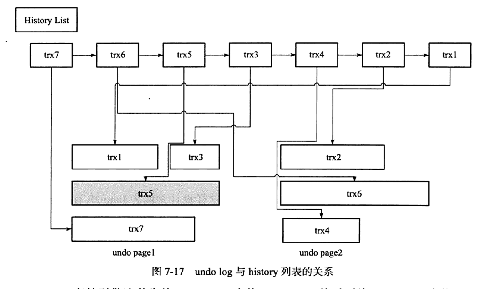
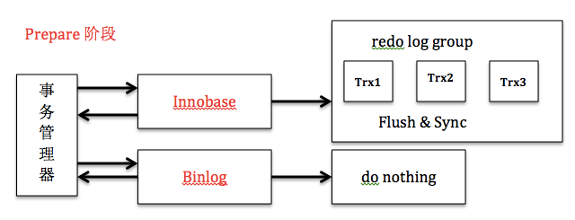
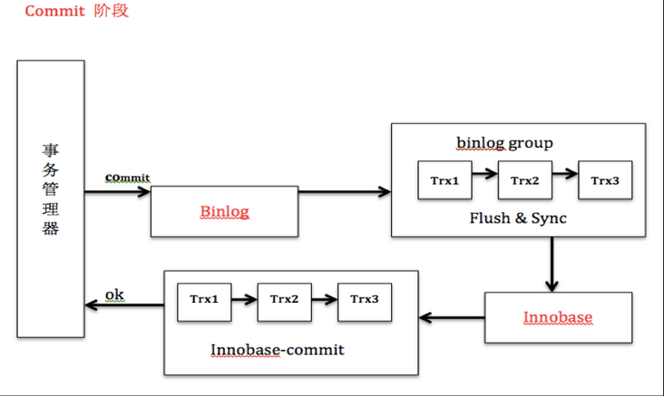

# Chapter 07 事务

## 7.1 认识事务

ACID:
- 原子性(Atomicity): 要么做, 要么不做, 不能停在中间状态
- 一致性(Consistency): 总是从一个一致状态转移到另一个一致状态. 完整性约束(如唯一性)不会被破坏
- 隔离性(Isolation): 事务不会看到其它事务的中间状态
    - 反例: 脏读
- 持久性(Durability): 只要提交了的事务, 其数据一定不会消失
    - 反例: 写缓冲后未fsync, 宕机后丢数据

### 7.1.2 分类

事务分类
- **扁平事务**
- **带保存点的扁平事务**
- **链事务**
- 嵌套事务
- **分布式事务**

带保存点的扁平事务: 
- 保存点: 
    - 事务回滚时不一定要回滚到最开始, 可以回滚到最近一个保存点及之前的保存点
    - 保存点是**易失**的, 在事务中间宕机, 保存点会丢失
        - 即是说保存点的设计初衷不是为了分阶段保存, 而是为了**定点回滚**

链事务: 多个事务相连, 一个事务结束时, 立即开始下一个事务
- T1结束-T2开始的过程是**原子**的
- 与保存点的区别在于, **只能回滚当前事务**


## 7.2 事务的实现 

事务实现:
- 隔离性: 由锁和MVCC实现
- 原子性 & 持久性 & 一致性: 由redo log和undo log实现

### 7.2.1 redo

#### 1.基本概念

持久性实现: redo log
- Force Log at Commit: 必须等redo log写入后, 才能算提交成功
- `innodb_flush_log_at_trx_commit`选项
    - 0: 提交时redo log只写到缓冲, 不写到文件, 由Master Thread写入
    - 1: 提交时redo log写入文件, 并fsync
    - 2: 提交时redo log写入文件, 不fsync
    - *只有1真正实现了持久性*

<br/>

undo log与redo log比较
- undo log是逻辑日志, redo log是物理日志
- undo log要支持随机读取(实现MVCC), redo log是顺序读写的

bin log与redo log比较
- bin log是MySQL层面的, redo log是innodb层面的
- bin log是逻辑日志, 写语句或者对row的修改; redo log是物理日志, 记录对页的修改
- bin log以事务为单位写入, redo log每条语句都要写(可能只是写缓冲).
- bin log在设置为statement-base的时候不是幂等(insert), redo log是幂等

<br/>

#### 2. log block

redo log block: redo log写磁盘时的基本单位
- 大小: 512 byte
    - 与扇区大小相同, 因此写到磁盘上是原子的, 不用double write
- 结构:
    ```yml
    log block header:
        header no:           4 byte      # 循环递增
        data length:         2 byte      # 数据长度, 最大为512字节
        fisrt rec group:     2 byte      # 指向第一个事务的记录组
        checkpoint no:       4 byte      # 检查点号

    data: []
    log block tailer:        4 byte      # 值为header no, 用于校验信息是否完整
    ```
<br/>

#### 3. log group

重做日志组: 
- 每个组里有一组N个日志文件, 写重写日志时轮询(round-robin)这些文件, 写完一个写下一个
- 一个组的N个文件分别与另一个组的N个文件完全相同, 是副本
- 不同日志组存在不同存储设备上, 保证安全
<br/>


Log file的头
- 每个组只有第一个文件需要记录这些信息(因为只需要一份), 其它文件前2KB留空
- 前2KB
    - Log File Header (512 byte)
    - check point 1   (512 byte)
    - 空              (512 byte)
    - check point 2   (512 byte)
- *为什么要有两个check point, 还要占整个块*
    - 两个check point交替写, 以防单个check point失效后无法恢复
    - 两个check point的话, 新的失效了, 旧的还可以用
    - 不放在一个块是因为扇区的写入是原子的, 如果放一起, 一旦损坏可能一起损坏
<br/>

#### 4. 重做日志格式

相关话题
- [ch02-InnoDB存储引擎.md#3重做日志缓冲](./ch02-InnoDB存储引擎.md#3重做日志缓冲)

重写日志格式:
- redo_log_type: 操作类型
- space: 所在空间
- page_no: 页号
- offset: 偏移
- redo_log_body: 与具体操作相关的数据

<br/>

#### 5. LSN

**LSN**
- 含义
    - checkpoint序号
    - 重写日志的写入量: 已经写到了哪个版本
    - 页的版本(FIL_PAGE_LSN): 最后一次刷新时的LSN
- 自增方式: 不是+1, 而是增加写入的**字节数**
- 指标:
    - Log Sequence Number: 最新的LSN, 即redo log写到的点(写到缓存)
    - Log flushed up to: flush到redo log文件的LSN
    - Log checkpoint at: 刷新到磁盘的LSN

### 7.2.2 undo
#### 1. 基本概念

参考:
- 

回滚实现: undo log
- 是**逻辑日志**: 记录的是操作而不是页修改
    - *因为页中往往有其它事务的修改*
- 实现方法: 互补语句 (`update -> update, insert -> delete, delete -> insert`)
- 与其它功能的关系: 
    - **MVCC**: MVCC通过undo log实现
    - redo log: undo段分配undo页并写入undo log的过程也要记录redo log
        - `提交要具有持久性, 那回滚也要有持久性`
<br/>

#### 2. undo存储管理

回滚页的存储:
- 结构:
    - 共享空间第5页(0, 5)(系统页): 记录所有rollback segment header的位置
    - **回滚段(rollback segment)**: 1024个undo segment
        - **undo段(undo log segment)**
            - **undo页(undo page)**
- 相关设置:
    - `innodb_undo_directory`: 可以把回滚段放在指定目录下, 独立表空间
    - `innodb_undo_logs`: 回滚段的个数, 默认128
    - `innodb_undo_tablespaces`: 回滚段表空间个数, 可以平均地放到多个文件中

<br/>

事务提交时, undo页的处理
- 放入等待purge的列表  
    - *purge过程涉及很多离散的IO操作, 因此需要独立的线程*
- 判断是否能交给下一个事务进行**重用**  
    - 条件: undo的空间小于3/4
    - *如果不能重用, 事务多的时, 内存开销很大*

#### 3. undo log格式

undo log:
- insert undo log
    - 用完可以直接删除, 对其它事务不可见, 因此无影响
- update undo log
    - 不能直接删除, 要加入purge列表, 其它事务可能要读取旧的值

insert undo log数据结构:
- `next`: 下一条记录的偏移
- `type_coml`: 操作类型
- `undo_no`: 操作序号(事务ID)
- `table_id`: 表ID(哪个表)
- 列数据
    - `n_unique_index`: 唯一索引, 定位记录时用到

update undo log数据结构:
- `next`: 下一条记录的偏移
- `type_coml`: 操作类型
- `undo_no`: 操作序号(事务ID)
- `table_id`: 表ID(哪个表)
- **`DATA_TRX_ID`**: 数据更新前的事务ID
- **`DATA_ROLL_PTR`**: 数据回滚指针
- 列数据
    - `n_unique_index`: 唯一索引, 定位记录时用到
    - `n_update_field`: 旧的列数据, MVCC时用到
    - `n_byte_field`: 新的列数据


#### 4. 查看undo信息

update/delele实现
- update: 插入`TRX_UNDO_INSERT_REC`类型的undo记录
- update主键列: 先删除后插入
    1. 插入`TRX_UNDO_DEL_MARK_REC`类型的undo记录
    2. 插入`TRX_UNDO_INSERT_MARK_REC`类型的undo记录
- delete: 插入`TRX_UNDO_DEL_MARK_REC`类型的undo记录
    - 执行删除时没有真正删除, 而是记在undo log中, 等purge线程处理完才真正删除
- update: 插入`TRX_UNDO_UPDATE_EXISTE_REC`类型的undo记录

### 7.2.3 purge

purge的事务处理顺序
- history list记录事务的提交顺序, 先到的事务先处理(不能让先到的等更久)
- purge线程扫描history list
    1. 找到一个事务t1所在的页
    2. 对该页上的事务进行purge处理
        - 被其它事务引用的事务不能清理
        - 对同一页上的事务, 也要按history list上的顺序
    3. 清理完达到重用要求(使用空间 < 3/4)的可以给新的事务重用


为什么按页的顺序清理?
- 减少IO次数




`innodb_max_purge_lag`: history list过长的时候, 需要延缓DML的执行
- delay = ((historyList.length - purgeLag) * 10) - 5
- delay时间是以行为单位的


### 7.2.4 group commit

参考
- [MySQL · 源码分析 · 内部 XA 和组提交](http://mysql.taobao.org/monthly/2020/05/07/)
- [MySQL 2PC & Group Commit](https://segmentfault.com/a/1190000014810628)


redo log组提交: 单个事务的redo log的flush和fsync必须串行, 但是不同事务的两个过程可以并发, 并且可以一次fsync多个redo log, 减少IO开销

XA内部事务: 实现commit操作原子性 (写redo log & bin log)
- 配置
    - `innodb_support_xa=ON`
- 实现
    - 2PC
    - BLGC(Bin Log Group Commit): mysql层面实现的组提交


2PC (<5.6)
1. prepare阶段: 
    1. 引擎层(innodb): 回滚段设置为prepare)(也会产生redo log); flush redo log, 并fsync
2. commit阶段: 
    1. MySQL层: flush bin log 并 fsync; 
    2. 引擎层: 回滚段设置为commit 
        - *此时bin log已持久化, 即使commit状态没被写到redo log也可以恢复*
- 引擎层需要上锁(`prepare_commit_mutex`), 而上锁则导致commit只能串行, group commit失效



<br/>


BLGC (5.6)
1. prepare 阶段: 
    1. 引擎层: 依次flush多个事务的redo log
2. flush 阶段:  
    1. MySQL层: 依次flush多个事务的bin log
3. sync 阶段: 
    1. MySQL层: 一次性fsync多个事务的bin log (group commit)
4. commit 阶段
    1. 引擎层: 依次fsync多个事务的redo log

<br/>

BLGC (5.7)
1. prepare 阶段: 
    1. 引擎层: 
2. flush 阶段:  
    1. 引擎层: 线程先竞争出一个Leader
        - Leader 收集flush队列, 负责flush多个事务的redo log, 并一次性fsync (group commit)
        - Foller 只做等待
    2. MySQL层: 依次flush多个事务的bin log
3. sync 阶段: 
    1. MySQL层: 一次性fsync多个事务的bin log (group commit)
4. commit 阶段
    1.  引擎层: 线程先竞争出一个Leader
        - Leader 收集commit队列, 一次性commit所有事务
        - Foller 只做等待 
    - *此时bin log已持久化, 即使commit状态没被写到redo log也可以恢复*
    

## 7.6 事务隔离级别

statement-base bin log与`ISOLATION LEVEL=READ COMMITTED`一起可能造成的主从复制不一致的问题
- 场景:
    ```
    1 事务A查询 key=x 的数据
    2 事务B更新 key=x 的记录, 然后提交, 事务B被同步到binlog
    3 事务A用 key=x 的数据去更新其它行, 事务A被同步到binlog
    4 从机先重放事务B, 再重放事务A, 造成主从事务A中查到 key=x 的数据不一致
    ```