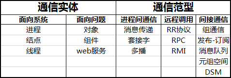
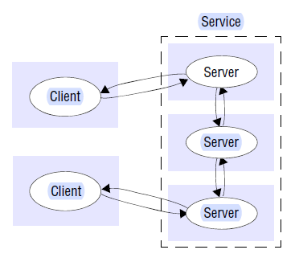
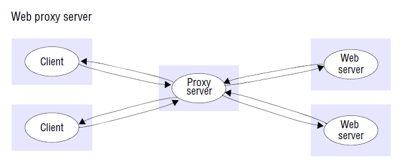
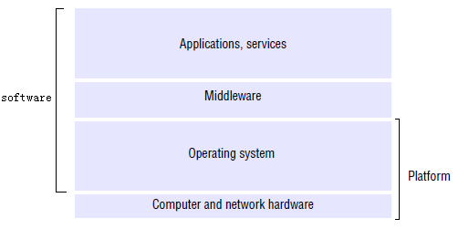
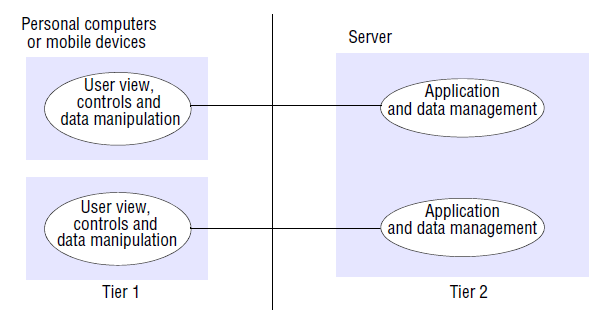
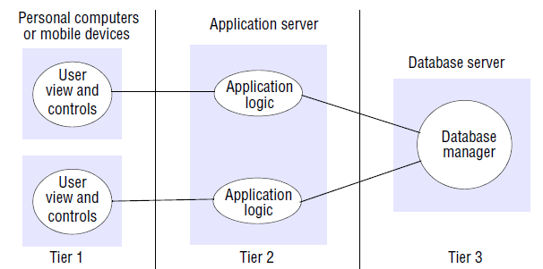

# chapter 02 系统模型

**物理模型**: 

## 2.3 体系结构模型

### 2.3.1 体系结构元素

体系结构元素:
* 通信实体: 
    * 进程, 对象, 组件, Web服务
* 通信范型: 实体之间的通信方式
    * 进程间通信, 远程调用, 间接通信 
* 角色和责任: 实体在体系结构中, 特定时刻的角色
    * C/S, P2P
* 放置: 实体如何映射到底层的物理分布式基础设施上 
    * 将服务映射到多个服务器 (服务)
    * 缓存 (对象)
    * 移动代码 (服务)
    * 移动代理 (服务)
    

#### 2.3.1.x 通信实体

注意:
* 对于一些原始的不提供进程抽象的设备, 通信实体实际为**结点**
* 在支持线程的操作系统中, 实际通信实体是**线程**

对象: 
* 对象是分解给定 **问题领域** 的自然单元 (面向问题)
* 对于分布式对象, 由接口定义语言(IDL)定义规约

组件: 
* 用于解决分布式对象的问题 ?
* **依赖显式化**

Web服务
* 基于 **互联网的协议**
* 由 **URI** 来标识服务
* 通过 **XML** 来传递消息 
  

#### 2.3.1.x 通信范型

进程间通信: 系统提供的进程间通信的 **底层** 的支持
* 类型:
    * 消息传递原语send, recv
    * 套接字编程
    * 组播
    * 覆盖网络

远程调用: 通常利用 **Request-Reply protocol** 模式, 基于底层的支持(进程间通信实现)
* 特点: 通信只涉及 **发送方** 和 **接收方** 两方
* 类型:
    * RPC(Remote Procedure Call)
        * 对调用者隐藏细节, 包括编解码, 消息传递等, 使得调用像是在本地发生的
        * 提供 **访问透明** 和 **位置透明** (**网络透明**)
    * RMI(Remote Method Invocation) : 一个对象可以调用远程对象的方法
        * 对调用者隐藏细节
        * 与RPC的区别在于支持 **对象标识符**, 体现 **面向对象** 的思想

间接通信: 由 **第三方实体** 来协调发送方和接收方的通信
* 特点:
    * 空间解耦合: 发送方不知道发给哪个接收方
    * 时间解耦合: 发送方和接收方可以不同时存在
* 类型:
    * 组通信: 一种 **一对多** 通信
        * 接收方通过加入组, 来接收发送给组的消息
        * 发送方通过 **组标识符** 作为参数来发送消息给组
    * 发布-订阅系统: 
        * 大量消息的 **消费者** 和 **生产者** 
        * 由一个 **中间服务** 负责消息的路由
    * 消息队列:
        * **点对点**
        * **队列** 是生产者和消费者的中介
    * 元组空间 ?
    * 分布式共享内存: 
        * 提供抽象的对于内存地址空间的读写的支持, 但实际上物理内存可能不在同一台主机上

#### 2.3.1.x 角色和责任

体系结构风格:
* C/S
    * C/S一般是集中地提供服务, 伸缩性较差
* 对等体系结构 (P2P)
    * 不同主机的进程 **对等**
    * 每个主机保存一小部分数据对象
    * 数据对象被大量复制, 共享
    * 伸缩性强
    * 要考虑的问题更多

#### 2.3.1.x 放置

放置: 对象, 服务等如果映射到底层物理基础设施中 (*以下主要考虑层次化体系结构*)

将服务映射到多个服务器:
* **数据分区**: 将服务所基于的 **对象集** 进行分区, 
    * 如web服务
* 基于 **数据复制** 的服务: 多个主机维护复制的对象集
* **集群**: 比数据分区的耦合度更高
    

缓存: 缓存数据对象, 提高性能
* 

移动代码: applet, js脚本等
* 服务不受网络带宽的影响
* 潜在的安全威胁
    

移动代理: 从一台计算机移动到另一台计算机, 收集数据 (可能是对用户透明的)
* 潜在的安全威胁

### 2.3.2 体系结构模式

体系结构模式: 由特定 **体系结构元素** 组成的体系结构的解决方案
* 分层体系结构
* 层次化体系结构
* 瘦客户

#### 2.3.2.x 分层体系结构

分层 (layer): 把分布式系统 **垂直** 划分成服务层, 每层服务调用下层服务来实现, 向上层提供服务 (*考虑OSI*)
* 应用, 服务
* **中间件**: 屏蔽**异构性**, 为上层提供 **远程调用** 等支持
* 操作系统: 屏蔽**硬件细节**, 为上层提供 **进程间通信** 等支持
* 计算机和网络硬件
    

软件层与硬件层:
* 软件层: 应用/服务, 中间件, 操作系统
* 硬件层: 计算机与网络硬件

平台: 包括**硬件**和**操作系统**

#### 2.3.2.x 层次化体系结构

层次化(tier)体系结构: 把分布式系统的某一个垂直的服务层次 (如服务) **水平** 划分
* 与分层体系结构互补
* 考虑划分服务的功能, 以及怎样映射到物理基础设施中 (与 **放置** 的问题相关)

应用功能分解:
* 表示逻辑: 负责用户交互与数据的表示
* 业务逻辑/应用逻辑: 负责数据的处理
* 数据逻辑: 负责数据的持久化, 一般被包含在数据库管理系统中

两层划分:
* 逻辑划分:
    * 表示逻辑在客户端
    * 业务逻辑在客户端和服务器都有
    * 数据逻辑在服务器
* 问题: 两边的业务逻辑不能直接通信
    
    

三层划分: 逻辑元素与物理服务器一一对应
* 逻辑划分:
    * 第一层 (表示逻辑) 在客户端
    * 第二层 (业务逻辑) 在一个服务器
    * 第三层 (数据逻辑) 在另一个服务器
    
    
    

#### 2.3.2.x 瘦客户
瘦客户: 客户端的功能尽可能简单, 服务尽可能网络化
* 缺点:
    * 对于交互性强的场景, 可能因为带宽限制而降低用户体验

#### 2.3.2.x 其它模式

其它模式
* 代理模式: **本地代理** 负责代理用户进行远程调用, 对用户隐藏远程调用
* 业务代理: 类型代理模式, 差别在于通信实体为web服务
* 反射模式: 在反射系统中, 标准的服务接口可供使用, **元层接口** 可提供对涉及服务实现的组件和组件参数的访问
    * 拦截消息或者调用
    * 动态发现对象提供的接口 (类加载)
    * 发现和适应系统底层体系结构的能力 ?

 
## 2.4 基础模型

基础模型: 仅包含我们要考虑的实质性成分
* 交互模型: 描述进程间的通信, 关注通信带来的**延迟**
* 故障模型: 对故障进行定义和分类, 分析体系结构中可能的故障
* 安全模型: 对安全威胁进行定义和分类, 分析体系结构中可能受到的攻击

### 2.4.1 交互模型

分布式算法: 
* 定义 **每个** 进程在每一步采取的步骤
* 考虑进程之间 **传递消息** 的过程
* 考虑 **故障**: 进程故障, 消息故障

影响进程交互的因素:
* 通信性能
    * 延时: 从一个进程发出消息到另一个进程收到消息的延迟
    * 带宽: 单位时间内传递的信息问题
    * 抖动: 信息传递时间的变化值
* 无全局时钟
    * 时钟漂移率: 各结点时钟偏离绝对参考时间的比率

 
两种交互模型:
* 同步分步式系统
    * 进程时间有确定范围
    * 消息传递时间有确定范围
    * 时钟漂移率有确定范围
* 异步分步式系统
    * 进程时间不确定
    * 消息传递时间不确定
    * 各结点时钟不确定

对异步分布式系统有效的方案, 对于同步分布式系统也有效

事件排序:
* 对于 **异步分布式系统**, 虽然没有精确的时钟, 但可以给事件定序
* 逻辑时间:
    

### 2.4.2 故障模型

#### 2.4.2.x 故障分类
遗漏故障: **通道** 或 **进程** 无法正常完成工作
* 进程遗漏故障: 
    * 崩溃: 一方进程崩溃, 另一方无法检测
    * 故障-停止: 一方进程崩溃, 另一方可能检测
* 通信遗漏故障: 
    * 发送遗漏故障: 发送方的故障, 如发送缓冲区溢出造成
    * 通道遗漏故障: 通道的故障
    * 接收遗漏故障: 接收方的故障, 如接收缓冲区溢出造成

随机(拜占庭)故障: 
* 进程随机故障: 
    * 省略步骤
    * 增加步骤  
* 通道随机故障: 
    * 损坏
    * 缺失
    * 重复
    * 无中生有

时序故障:
* 时钟故障: 漂移率过大
* 性能故障: 
    * 进程: 进程处理时间过长 
    * 通道: 消息传递时间过长

解决方法
* 故障-停止: 同步系统中可以通过超时检测
* 通道遗漏故障: 重传
* 通道随机故障: **检验和+序号** 将故障转为遗漏故障, 然后重发

#### 2.4.2.x 故障屏蔽

### 2.4.3 安全模型 (未完成)

