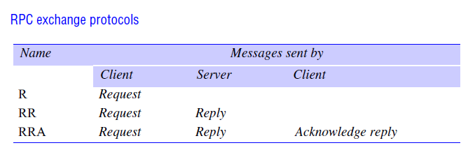
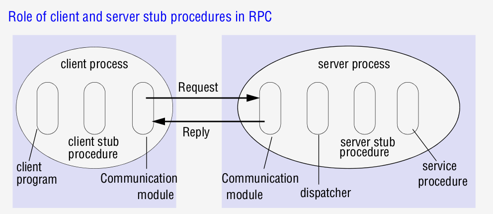

# chapter 05 远程调用

远程过程调用(Remote Procedure Call): 
* 将过程调用的概念扩展到分布式系统

远程方法调用(Remote Method Invocation): 
* 将面向对象的概念(包括对象引用等)扩展到分布式系统


## 5.2 **请求-应答协议**

适用: **C/S场景**

特点:
* **可靠**: **确认机制**保证
* 同步或异步

#### 5.2.x.x 用**UDP**实现请求-应答协议

适用: 参数和结果的 **数据比较少**

优点: 与TCP相比, 节省开销:
* **确认**开销: 将确认放在应答中
* **流控制**开销: 在参数和结果比较少的情况下, 流控制不必要
* **连接**开销: 除了一对请求-应答以外, 建立连接还需要两对消息(建立与断开连接时交换的数据)


请求原语:
* doOperation
* getRequest
* sendReply

操作原语
* 参数:
    ```java
    
    // 请求方的接口
    //  1. 同步方法, 阻塞直到得到结果
    //  2. 调用者要负责对参数的编码, 和对结果的解码
    byte []                     // 返回: 包含应答内容的字节数 
    doOperation(
        RemoteRef ref,          // 远程引用: 包含了主机地址(IP 端口), 可能有对象标识等信息
        int operationId,        // 操作类型: 如增删改查等
        byte [] arguments,      // 参数: 编码为字节数组
    );
    
    // 接收方接口
    byte [] getRequest();       // 获取一个请求

    // 请求中的信息
    Class Message{
        // doOperation负责生成的字段, 可看作RR协议字段
        int messageType;        // 0=请求, 1=响应
        int requestId;          // 对请求方来说唯一的请求标识    

        // doOperation的参数
        RemoteRef ref;          // 远程调用请求
        int operationId;        // 操作类型
        byte [] arguments,      // 参数: 编码为字节数组
    }

    //接收方接口
    void sendReply( 
        byte[]reply,            // 应答结果
        InetAddress clientHost, // 请求方主机
        int clientPort          // 请求方端口
    );
    
    ```
* 请求标识符:
    * requestId: 对请求端是唯一的 (时间上唯一)
    * requestId + 请求方IP:端口: 对整个分布式系统是唯一的 (时空中唯一)
  
故障模型:
* 故障类型:
    * 通道遗漏故障: 请求丢失, 应答丢失
    * 进程遗漏故障: 故障停止
    * 失序
    * 随机故障-重复
* 应对机制:
    * 通道遗漏故障: 请求方 **超时机制** 检测, **重传** 实现故障屏蔽
    * 进程故障: 超时机制检测+计数重传, 确认是进程故障后将结果上报
    * 失序: 通过序号检测
    * 随机故障-重复:
        * 请求重复: 
            * 支持幂等操作: 重新操作, 重新返回结果
            * 不支持幂等操作: 应答方记录 **历史**, 重新返回结果
        * 应答重复:
            * 直接丢弃
    
历史机制的开销: 请求多时, 历史占用较多内存
* 优化: 把下个请求作为请求方对于上一个应答的确认, 确认后清除上个结果
    * 新问题: 如果有大量客户, 每个客户发少量请求时, 仍然会很占内存

#### 5.2.x.x 交互协议类型

交互协议类型:
* R协议 (Request Protocol)
    * 无结果且无须确认时可使用
* RR协议 (Request-Reply Protocol)
* RRA协议 (Request-Reply-Acknowledge Protocol)
    * 与RR协议相比, 多一个客户确认
    * 因为一个确认序号(n)隐含着对于前续所有序号(n-1, n-2)的确认, 所以 **确认丢失损失较小**
  



基于TCP流的请求-应答协议实现:
* 面向字节流, 可以传递任意长的信息，避免实现多包协议
* 实现协议时没有必要考虑重传, 重复, 发送等, TCP协议已保证可靠性
* 建立一次连接可以传输多次请求和应答


HTTP与请求-应答协议中消息的对应关系
* messageType -- 请求头与响应头
* requestId -- 无对应参数, 但可以自定义HTTP首部或HTTP实体
* remoteRef -- URL (主机+端口+相对URL)
* operationId -- 请求头的HTTP方法
* arguments -- HTTP首部 / HTTP实体


## 5.3 RPC

RPC相关问题:
* **接口编程**
* 调用语义
* 透明性

### 5.3.1 RPC的设计问题

#### 5.3.1.x 接口编程

接口编程: 
* 模块通信方法:
    * 过程调用
    * 变量访问
* **接口**: 定义模块能被调用的过程及其参数


服务接口: 
* 特征: 模块可**跨进程调用**, **跨平台(语言)调用**
    * 另一个模块的**地址空间**不能使用
        * 模块成员变量不能访问 (但可以动态生成getter和setter)
        * 参数传递机制(值传递, 引用传递)不能使用
* 优点:
    * 抽象
    * 不用了解平台底层
    
接口定义语言(IDL): 允许**不同语言**实现的过程相互调用
* 参数类型:
    * 输入型参数
    * 输出型参数


#### 5.3.1.x RPC调用语义

容错措施 / 传输保证:
* 重发请求
* 过滤重复请求
* 重新执行/重传结果

调用语义:
* 或许执行语义: 仅适合能接收偶然错误的应用
    * 遗漏故障: 请求或结果丢失
    * 系统崩溃: 服务器崩溃
* 至少执行一次语义: 服务器的操作必须是幂等 
    * 随机故障: 重复执行导致错误
    * 系统崩溃
* 至多执行一次语义

|**语义**|**重发请求**|**过滤重复请求**-**重新执行**-**重传结果**|故障|场景|
|:-:|:-:|:-:|:-:|:-:|
|或许执行|N|-|遗漏, 崩溃|可接受偶然错误|
|至少一次|Y|N-Y-N|随机, 崩溃|服务器操作幂等|
|至多一次|Y|Y-N-Y|崩溃||


#### 5.3.2 RPC的实现

RPC中的角色:
* 客户进程
* 服务器进程

客户进程:
1. 客户程序
2. 客户存根过程: *可根据接口定义动态生成*
    1. 把参数与过程标识**编码**成请求
    2. 通过**通信模块**发送请求并接收
    3. **解码**结果
3. 通信模块: 根据特定协议, 发送请求, 接收应答

服务器进程:
1. 分发器: 通过**通信模块**接收请求并解析, 分发给特定存根过程
2. 服务器存根过程: *可根据接口定义动态生成*
    1. **解码**过程标识符和参数
    2. 根据过程标识符选择过程, 输入参数调用过程
    3. **编码**结果, 并通过通信模块返回应答
3. 服务过程
4. 通信模块: 根据特定协议, 接收请求, 发送应答




### 5.3.3 实例研究: Sun RPC
Sun RPC中的表示方法: 
* 程序唯一标识符: **程序号 + 版本号**
* 过程唯一标识符: **程序号 + 版本号 + 过程号**
    * 程序号: 由授权中心分发
    * 过程号: 标识过程在程序中的编号
    * 版本号: 随 **过程签名** 发生改变而增加
        * **过程签名**: 返回类型 + 过程名 + 参数类型, 如``int fun(int a, int b);``
* 过程定义: 过程号 + 方法签名
* 单个参数, 单个返回值
* e.g.:
    ```c
    // 结果只能有一个, 定义在一个结构体中
    struct Data{
        int length;
        char buffer[MAX];
    };

    // 参数只能有一个, 定义在一个结构体中
    struct writeargs{
        FileIdentifier f;
        FilePointer p;
        Data data;
    };
    struct readargs{
        FileIdentifier f;
        FilePointer p;
        Length length;
    };

    program FILEREADWRITE{
        version VERSION{
            // 过程定义 = 过程签名 + 过程号 = (返回类型 + 过程名 + 参数类型) + 过程号
            void WRITE(writeargs)=1;    // 过程号
            Data READ(readargs)=2;      // 过程号
        } = 2;                          // 程序版本号
    } = 9999;                           // 程序号
    ```

Sun RPC的其它功能:
* 端口映射器: 记录 **(程序号+版本号)-->端口** 的映射关系, 来将请求交给对应端口
    * 端口映射器可用于实现本机中的组播
        * 用户将RPC请求通过UDP组播到各主机, 主机内通过端口映射器组播到各端口
* 认证方式:
    * 没有认证
    * UNIX风格认证: uid+gid
    * 共享密钥的风格 ?
    * kerberos ?


## 5.4 RMI

RMI与RPC比较:
|功能/特点|RMI|RPC|
|:-|:-:|:-:|
|接口编程|Y|Y|
|调用语义|或许, 至少, 至多|或许, 至少, 至多|
|透明性|Y(但可支持远程异常)|Y|
|面向对象|N|Y|
|对象引用|N|Y(在分布式系统中唯一)|

RMI相关问题:
* 对象模型

### 5.4.1 RMI的设计问题
#### 5.4.1.x 对象模型 *

**对象模型**相关概念:
* 对象引用: 要调用对象方法必须拥有对象引用
* 接口: 定义方法的参数类型, 返回值, 异常类型
* 调用动作: 可产生不同结果
    * 对象状态改变
    * 产生新对象: 引发新对象的实例化
    * 间接调用: 触发一系统间接的方法调用
* 异常: 可以捕获异常并处理, 或者抛出
* 无用单元收集/垃圾收集

#### 5.4.1.x 分布式对象与体系

分布式对象与体系结构
* C/S体系结构: 对象放在服务器中, 客户端通过RMI来调用对象的方法
    * 面向对象的程序是从逻辑上划分的, 可以方便地分到不同服务器中
    * 将客户端对象与服务器对象通过进程来分隔可提高**封装性**
* 复制服务: 提高性能, 增强容错能力
* 迁移对象: 提高性能, 提高可用性

#### 5.4.1.x 分布式对象模型
**分布式对象模型** 对于对象模型的扩展
* 方法调用:
    * 远程方法调用: 不同 **进程** 的对象方法调用 (不管进程是否在同一服务器)
    * 本地方法调用: 同一 **进程** 的对象方法调用
* 对象引用: 
    * 可跨进程
    * **远程对象引用** 在整个分布式系统中唯一 (时间和空间)
* 接口: **远程接口** 可通过 **跨语言** 的IDL来定义
* 调用动作: 
    * 产生新对象:
        * 构造函数不能远程调用, 但是可以通过普通方法实现 (如工厂), 
        * 对象生命周期: 取决于实例化该对象的进程
    * 间接调用: 触发一系列的RMI动作
* 异常:
    * 除对象声明的异常以外, 还要处理**分布式带来的异常**, 如超时异常
* 无用单元收集/垃圾收集:
    * 分布式垃圾回收模块

### 5.4.2 RMI实现

RMI中的角色:
* 客户端进程
* 服务端进程

相关定义: 
* **远程对象引用**: 对象在整个分布式系统的唯一标识符
* **本地对象引用**: 对象(包括代理对象和远程对象)在本地的唯一标识符
* **远程对象**: **本进程**的可**供其它进程调用**的**非代理**对象 (*按书中上下文理解*)
* **代理对象**: **本进程**上的对其它进程的对象的代理, 用于实现分布式对象的*位置透明性*

RMI软件模块
* 通信模块: 传递消息
    * 可选参数: 协议(如RR, RRA), 调用语义(或许调用, 至少一次, 至多一次)
    * 必要的传递参数: messageType, requestId, remoteRef
* 对象引用模块: 
    * 作用: 通过**远程对象表**来记录本地中的 **远程对象** 和 **代理对象**
        * 管理对象的**远程对象引用-本地对象引用**的转换关系
        * 为本进程的远程对象创建, 管理 **远程对象引用**
            * *代理对象对应的**被代理对象**的远程对象引用, 由被代理对象所属的对象引用模块管理*
    * 机制:
        * 将本地中的对象第一次传递(作为参数或结果)给其它机器时, 为其创建 **远程对象引用** 
        * 将收到消息(请求或应答)中的 **远程对象引用** 解析成 **本地对象引用**
            1. 若没有对应的本地对象引用, 则为其创建代理, 并记录该代理对象的本地对象引用
            2. *解析的本地对象引用可能指向远程对象, 也可能指向代理对象*
* 代理: 实现与对象完全一样的接口, 对调用者隐藏参数编码, 消息发送与接收等细节
* 分发器与骨架: 每个类对应一个分发器与一个骨架
    * **分发器** 负责接收来自通信模块的消息, 通过methodId选择骨架中恰当的方法
    * **骨架** 负责解码请求消息中的方法参数, 传给servant执行, 然后将结果编码到应答消息中, 传给发送方的代理

其它服务器与客户端程序
* 初始化部分: 创建并初始化至少一个servant, 其它servant可应当客户请求生成
    * 构造方法不能远程调用, 可通过**工厂方法**实现
* 绑定程序: 提供命名服务, 实现对象文本名字到对象引用的映射
* 服务器线程: 为每个调用创建单独线程

远程对象的激活: *为节省资源 (特别是易失存储器), 可以将对象从**主动对象**转换成**被动对象**, 保存它的**方法实现**与**状态***
* 激活器:
    * 注册可被激活的被动对象, 涉及**服务器名字**
    * 启动特定命名的服务器进程, 并激活特定对象
    * 跟踪已激活对象所在的服务器位置
* 持久对象存储(Persistent object stores): 在非易失存储器中以编码格式持久化被动对象
* 对象定位服务: 根据远程对象引用来定位对象
    * 上文定义的包含{IP:端口}的远程对象引用只适用于对象在生命周期中只存在一个进程的情况
    * 对于可移动的对象的机制:
        * **缓存/广播方案**: 尝试访问缓存中的对象的地址, 当无法访问时, *广播*请求 ?
        * **转发定位指针**: 转发定位指针中含有关于对象新位置的提示 ?

### 5.4.3 分布式无用单元收集

分布式无用单元收集:
* 思想: 只要对象的本地对象引用或者远程对象引用没有被使用, 就可以收集
* 机制:
    * B.holders集合: 在*服务器*中, 保存持有某个远程对象B的远程对象引用的所有远程进程名
    * addRef(B): 调用者第一次调用B时, 调用该方法, 请求将自己的进程加入B.holders
    * removeRef(B): 调用者不再需要B时, 调用该方法, 请求将自己的进程从B.holders中移除
    * B.holders为空 && 不存在B的本地对象引用持有者时, 可回收

可能的问题: addRef(B)请求到达时, B.holders刚好为空而被删除
* 解决方法: 调用者在接收到B的远程对象引用后才调用addRef(B), 因此, 服务器在发送远程对象引用后, 可以在B.holders中增加一个临时条目, 用于占位, 在addRef(B)请求到达后才删除临时条目
* **jini的租借**: 对象维护者提供有限的对于远程对象的租期, 由调用者在租期内定时续租

## 5.5 实例研究: Java JMI

