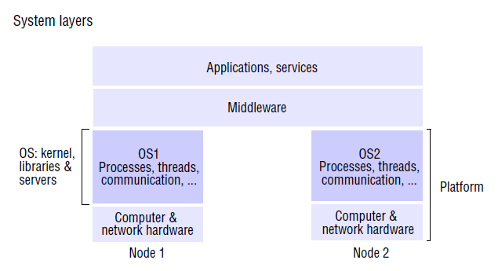
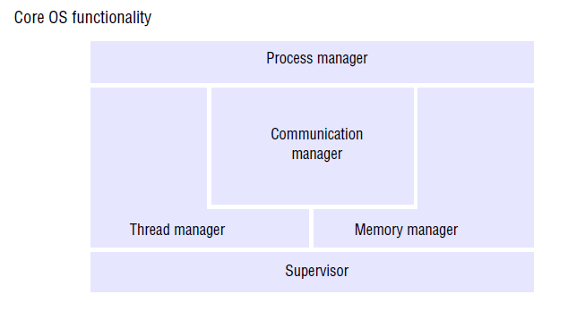
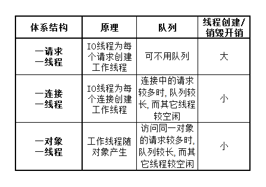

# chapter 07 操作系统支持

操作系统的任务: 
* 提供一个在物理层(处理器, 内存, 存储介质, 网络设备)之上的抽象层
    * **文件** 作为存储介质的抽象
    * **套接字** 作为网络的抽象
* 在分布式系统中, 接管单个结点的物理资源, 并提供系统调用接口 (资源抽象)

网络操作系统与分布式操作系统: *主要区别在于远程对 **资源** 和 **进程** 管理对用户是否透明* 
* 网络操作系统: 
    * 系统映像: 多个, 每个能独立管理自己的资源和进程
    * 资源管理方面: 提供远程访问资源的接口, **不是所有资源都能透明地远程访问**
        * *分布式文件系统如NFS(Network File System)可提供网络透明的文件访问接口*
    * 进程管理方面: 提供远程调用进程的接口, 不能远程管理其它结点的进程, 
* 分布式操作系统: 
    * 系统映像: **单一**
    * 资源管理方面: 操作系统能控制所有结点的资源, 并隐藏资源所在的位置 (**透明**)
    * 进程管理方面: 可按照一定的调度算法把进程分配特定结点, 并隐藏进程运行所在的结点

中间件+网络操作系统
* 分布式操作系统的问题:
    * 主流的网络操作系统的软件生态能满足大多数分布式系统能实现的功能
    * 对用户来说, 独立控制结点执行程序时, 性能和体验会下降 (可能存在后台的全局性的任务)
* 中间件+网络操作系统的优势: 在 **自治性需求** 和 **网络透明** 之间折中
    * 网络操作系统使用户可以运行独立的程序
    * 中间件提供网络透明的服务

## 7.2 操作系统层

中间层:
* 建立于多种**OS-硬件**之上, 解决 **异构性** 问题
    * *中间层依靠每个操作系统提供的对处理, 存储, 通信的抽象, 实现远程调用*

#### 7.2.x.x 内核 & 服务器进程

调用机制: 访问资源的手段
* 远程调用
* 本地调用

内核 & 服务器进程基于 **通信** 和 **调度** 来实现不同调用机制, 并向用户隐藏细节
* 通信: 接收 **操作参数** (来自本地或者远程), 返回结果
* 调用: 接收 **调用** 请求 (本地或者远程), 并根据请求做相应的处理

内核 & 服务器进程应该具备的特点:
* 封装: 对用户隐藏内存管理, 处理器调度, 设备管理等细节
* 保护: 防止非法请求破坏系统或者资源
* 并发: 处理用户并发的访问, 使并发对于用户透明

核心操作系统组件:
* 进程管理器: 进程创建与管理
    * 进程包括一个 **地址空间** 和多个 **线程**
* 线程管理器: 负责线程的创建, 调度和同步
* 通信管理器: 管理本地(或远程)线程的通信
* 内存管理器: 管理物理内存和虚拟内存
* 监视器: 处理 **中断**, **异常** 和系统调用trap等

## 保护

非法访问:
* 无权限的访问 --> 通过加密保护
* 不合法的操作 --> 用类型安全的语言开发, 防止非法操作

保护手段:
* 硬件保护
* 内核

内核: 所有用户的程序的需要使用设备时, 都要经过内核
* 内核进程能在 **管理/特权** 模式下执行, 用户进程在 **用户/非特权** 模式下执行
* 地址空间: 为不同进程设置不同的地址空间, 隔离进程
* 模式切换: 用户程序可以通过中断和陷阱指令进入管理模式, 调用内核提供的函数, 但会产生开销

## 7.4 进程和线程

进程:
* 执行环境
    * 地址空间
    * 资源
        * 线程同步资源: 信号量
        * 通信资源: 端口
        * 高级资源: 文件
* 线程: 一个或多个

### 7.4.1 地址空间

地址空间: 管理一个进程的 **虚拟内存** 的基本单元, 由多个 **区域** 组成

区域:
* 性质:
    * 范围
    * 读写权限
    * 能否向上/向下扩展

地址空间中的主要区域:
* 堆
* 栈
* 正文
* ...

影响区域数目的因素
* 为线程分配栈的方式
    * 为每个线程分配一个栈空间
    * 为线程在堆上分配栈 (**无法检查溢出**)
* 映射文件: 
    * 将文件映射到虚拟内存空间, 使得文件可以像数组一样被访问
    * 对虚拟文件的操作会反映到文件存储中
* 共享区域
    * 库
    * 内核函数: 被映射到不同进程的地址空间的同一位置, 减少地址空间转化带来的开销
* 数据共享和通信: 通过内存共享实现进程间通信

### 7.4.2 分布式系统中进程创建

进程创建过程
* 主机选择
* 创建执行环境

#### 7.4.2.x 主机选择

主机选择
* 两类策略:
    * 定位策略: 选择一个结点中创建
    * 转移策略: 在本机中创建还是在其它结点创建
    
定位策略分类:
* 静态: 基于 **数学统计** 的方法计算要选择的结点, 可能是 **确定** 的或者带有 **随机** 成分的
* 自适应: 根据当前的状态来选择

负载共享系统:
* 集中式: 有一个统一的 **负载管理器**
* 层次化: 
    * 分层次的负载管理器, 按照树状组织
    * 父级负载管理器尽可能将分配进程的决定权交给子级
    * 一个结点也可以通过与其父结点及兄弟结点协调决定
* 离散的: 
    * 没有一个足以的负载管理器, 结点间通过交换信息来协调

转移算法:
* 发送方启动: 一个结点的负载达到阈值时, 将启动进程的任务交给其它结点
* 接收方启动: 一个结点的负载低于阈值时, 告诉其它结点自己可以接任务

#### 7.4.2.x 创建执行环境

创建方法:
* 为每一个进程都创建一个新的地址空间, 并初始化
* 根据从一个已有的地址空间进行创建
    * 适用于父进程创建子进程的场景
    * copy-on-write可减少内存的复制

### 7.4.3 线程

工作池体系结构 (CORBA的实现)
* **IO线程**
    * 从端口接收请求
    * 把请求放入请求队列

工作池体系结构的不同实现
* 一请求一线程: IO线程为每个请求创建一个线程
    * 请求直接交给工作线程, 不用竞争队列
    * 创建, 销毁线程的开销大
* 一连接一线程: 一个连接对应一个线程, 该连接的请求加入线程对应的队列
    * 一个连接请求比较多时, 连接对应的队列比较长, 同时其它线程比较闲
    * 创建, 销毁线程的开销小
* 一对象一线程: 一个对象对应一个线程, IO线程把请求加入对象对应的队列
    * 多个请求访问同一个对象时, 对象的队列比较长, 同时其它线程比较闲
    * 创建, 销毁线程的开销较小

客户线程
* 发送线程和接收线程:
    * 发送线程: 远程方法调用时, 阻塞直到**缓冲区可写**, 但不用等待响应, 可继续执行
    * 接收线程: 远程方法调用时, 阻塞直到**对象已被接收并且在写入缓冲区**
* 优点:
    * 减少在远程方法调用上阻塞的时间, 可以在等待结果时处理用户的其它请求

#### 7.4.3.x 进程线程对比

维护信息对比:
* 进程: 地址空间, 信号量, 通信端口, 文件, 线程标识符列表
* 线程: 执行环境标识符, 寄存器状态, 优先级, 执行状态, 中断/异常处理信息

创建开销对比:
* 线程:
    * 分配栈
    * 寄存器状态初始化
    * 优先级初始化
    * 线程状态初始化
    * 指向执行环境
* 进程:
    * 执行环境创建等

线程的优势:
* 创建开销小
    * 进程的创建可能发生页失配, 而进程创建时, 由于局部性原理, 缓存命中率更高
* 切换开销小
    * 上下文切换: 
        * 保存当前寄存器状态, 加载下个线程的寄存器状态
        * 保护域转换: 逻辑地址到物理地址映射关系的切换
            * **不涉及内核切换** 且 **共享执行** 环境的线程切换开销最小
            * **内核被线程共享**时, 线程切换的开销仍然比较小
            * **跨执行环境** 或者涉及内核切换时, 开销大

线程调度:
* 非抢占式调度
* 抢占式调度
    * 线程需要显式yield()防止线程长时间占用处理机, 其它线程饥饿
    * 竞争少
    * 不适用对 **实时性** 要求高的场景

在不支持多线程进程的内核中实现多线程进程 (**多个用户级线程对应一个进程(内核线程)**)
* 实现方法: 由 **多线程过程库** 实现线程创建与调度:
    * 通过阻塞型的系统调用来阻塞线程
    * 通过内核提供的 **软中断** 和 **定时器** 来实现 **时间片**
* 特点:
    * 用户级线程对于内核是透明的, 调度由库实现
    * 缺点:
        * 一个进程内的某个线程被阻塞时, 其它线程也不能被调度
        * 一个进程的多个线程不能分到不同的处理机, 只能在同一个
        * 不同进程中的线程的优先级不统一, 与进程的优先级有关
    * 优点:
        * 切换开销小
        * 可定制
        * 能突破内核对于线程数的限制

#### 7.4.3.x 快速线程包

[1] [Scheduler Activations: Effective Kernel Support for the User-Level Management of Parallelism](http://bnrg.cs.berkeley.edu/~adj/cs262/papers/Scheduler.pdf)

特点: 
* 进程可以知道线程被调度的情况, 内核可以知道进程的需求
* 基于 **事件**: SA的 **上调**
* 层次化: 用户级调度器, 内核, 上行调用

模型元素:
* 虚拟处理机: 对用户级线程和用户调度器提供物理处理机的抽象
    * 线程分配到的虚拟处理机的数量与物理处理机的数量相等, 但不知道具体是哪个处理机, 运行过程中, 虚拟处理机与物理处理机的对应关系可能发生变化
* 用户调度器: 负责将进程中的对于 **虚拟处理机** 的需求告诉内核
* 内核: 负责物理处理机的分配, 并且通知用户调度器分配情况
* 调度器激活SA: 一个从内核到线程的调用 (**上调**)
    * 上调时, 在物理处理机中载入用户调度器指定的上下文, 即线程的代码, 这样一个SA即被创建
    * SA是线程执行的基本单位
    * SA除了用来执行线程以外, 还负责通知用户调度器有事件发生
    * SA的最大数量不超过物理处理机的数量

机制
* 用户级调度器请求:
    * 请求虚拟处理机 (P needed): 告诉内核, 需要一个虚拟处理机, 把需要执行的线程放入READY队列
    * 虚拟处理机空闲 (P idle): 告诉内核, 某个虚拟处理机使用完毕, 把执行完的线程移出READY队列
* 内核:
    * SA已分配 (SA added): 
        1. 有足够的物理处理机, 内核将一个虚拟处理机分配给调度器
        2. 调度器将READY队列中的一个线程上下文载入SA
    * SA被抢占 (SA preempted): 
        1. 一个线程的SA被抢占
        2. 调度器将被抢占线程放回READY队列, 换个线程, 在SA中载入上下文
    * SA被阻塞 (SA blocked): 
        1. SA执行的线程发生阻塞, 此时可以空出一个处理机, 内核通过 **通知** SA告诉调度器
        2. 调度器将线程状态改成BLOCKED, 然后从READY队列中取一个线程, 将上下文载入SA
    * SA解除阻塞 (SA unblocked):
        1. 线程解除阻塞, 内核创建新的 **通知SA** 告知调度器 (通知SA的创建可能发生抢占)
        2. 调度器将解除阻塞的线程放回READY队列
    
