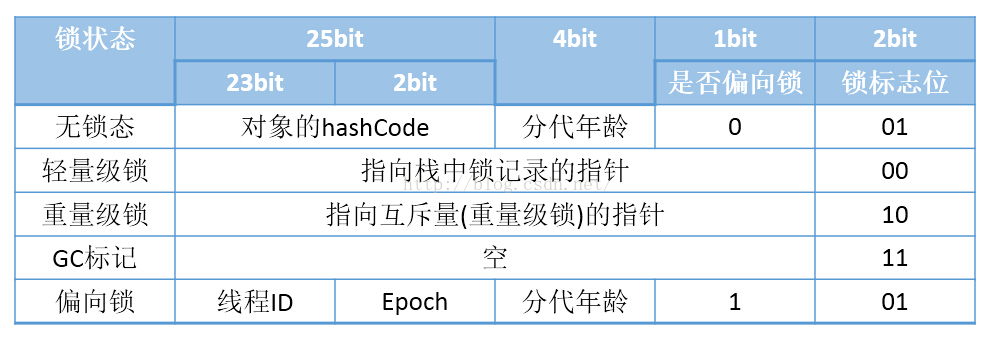

# Chapter 02 java 内存区域与内存溢出异常

## 2.2 运行时数据区域

运行时数据区域
* 程序计数器
* java虚拟机栈 / java栈
* 本地方法栈
* java 堆

### 2.2.1 程序计数器
**程序计数器** : **线程**所执行的字节码的行号指示器; **字节码解释器**通过程序计数器控制分支, 循环, 跳转, 异常处理, 线程恢复等
* 特点
    * *线程私有*
    * *这个数据区域不会出现**OutOfMemoryError**情况*
* 机制
    * 对于Java方法, 计数器记录正在执行的虚拟机**字节码指令地址**
    * 对于native方法, 计数器的值为Undefined 
        
## 2.2.2 java虚拟机栈
**java虚拟机栈 / java栈 (VM Stack)** : 
* 特点 :
    * *线程私有*
    * 生命周期与线程相同
    * 异常类型 :
        * StackOverflowError
        * OutOfMemoryError
* 机制 :
    * **栈帧**为方法运行时的基础数据结构:
        * 局部变量表 : 
            * 保存类型:
                * 8个基本类型
                * **对象引用(reference)**
                * **返回地址(returnAddress)**
            * 可通过索引访问
            * *内存空间在编译期间完成分配*
        * 操作数栈 : 用来处理加减乘除等, 只能后进先出(LIFO)
        * 动态链接 : ?
        * 方法出口 : ?
    * *一个栈帧的入栈到出栈的过程对应一个方法从调用到执行完成的过程*

### 2.2.3 本地方法栈
**本地方法栈(Native Method Stack)**
* 特点 : 
    * *线程私有*
    * 生命周期与线程相同
    * 异常类型
        * StackOverflowError
        * OutOfMemoryError

### 2.2.4 java堆
**java 堆** : 存放大多数对象实例与数组
* 特点 :
    * *线程共享*
    * 在虚拟机启动时创建
    * 物理上可不连续, 只要逻辑上连续
    * 异常类型 :
        * OutOfMemoryError
* 机制 :
    * 垃圾收集器
    * 可选 : * 
        * **线程私有的分配缓冲区(TLAB, Thread Local Allocation Buffer)**
        * // 逃逸分析
        * // 标量替换

### 2.2.5 方法区
* **方法区(Method Area / Non-Heap)**  : 存储被虚拟机加载的类信息, 常量, 静态变量, 即时编译器编译的代码
* 特点 : 
    * *线程共享*
    * 可以不做垃圾收集
    * 异常类型 : 
        * OutOfMemory 类型
* 机制 :
    * 运行时常量池

### 2.2.6 运行时常量池
// Class 文件保存的数据 : 类的版本, 字段, 方法, 接口, **运行时常量池**等.

**运行时常量池** : 存放编译期生成的**字面量**与**符号引用**.
* 特点 : 
    * *但Class文件的格式有严格规定*, 但不规定运行时常量池内存分配的具体实现.
    * 常量也可以是动态生成的(e.g., String的intern()方法)

### 2.2.7 直接内存
**直接内存**
* 不属于虚拟机运行时数据区
* NIO类的**基于通道与缓冲区的IO方式**用到了直接内存

### 2.2.x 纵向总结

* 与线程的关系
    |线程私有    |线程共享    |
    |:--:       |:--:       |
    |程序计数器  |java堆     |
    |java虚拟机栈|方法区     |
    |本地方法栈  |           |

* 异常类型
    |OutOfMemoryError   |StackOverflow  |无         |
    |:--:               |:--:           |:--:       |
    |虚拟机栈           |虚拟机栈        |程序计数器  |
    |本地方法栈         |本地方法栈       |           |
    |java堆             |                |          |
    |方法区             |                |           |
    |直接内存           |                |           |

## 2.3 虚拟机对象探秘

### 2.3.1 对象的创建

对象创建过程:
1. check : 是否能定位到对象的符号引用
2. check : 类是否已加载, 解析并初始化
3. 分配内存 :
    * 分配算法 : 
        * **指针碰撞(Bump the Pointer)** & **压缩整理功能(Compact)** : 内存分配规整
            * Serial, ParNew ...
        * **空闲列表(Free List)** & **Mark-Sweep** : 内存分配不规整
            * CMS
    * 保证并发安全 :
        * CAS 指令
        * TLAB
4. 将分配到的内存空间初始化为零值(除对象头)
5. 对象设置
    * 对象头设置
6. init
...

### 2.3.2 对象的内存布局 ?

对象内存布局 : 
* 对象头(Header)
* 实例数据(Instance Data)
* 对齐填充(Padding)

对象头
* Mark Word
    * hash code
    * GC分代
    * 锁状态flag
    * 线程持有的锁
    * 偏向线程ID
    * 偏向时间戳
    ...
    
* 类型指针 : 指向类元数据的指针 (*实现时不一定在此保留类型指针*)
* 数组长度(对于数组)

对象的长度必须为8字节的整数倍

### 2.3.3 对象的访问定位

对象访问方式 :
* 句柄访问 : 
    * 特点 : 
        * **句柄池**位于java堆
        * **句柄**保存**对象实例数据的指针**与**对象类型数据的指针**, 
        * 对象实例数据保存在java堆的实例池
        * 对象类型数据保存在方法区
    * 优点 : 
        * 对象移动时只改变句柄中的对象实例数据的指针, 不用改reference
* 直接指针访问 (Sun Hotspot 采用) :
    * 特点 :  
        * 对象(包括对象类型数据指针与对象实例数据)保存在java堆
        * 对象类型数据保存在方法区
    * 优点 : 
        * 访问速度比较快

## 2.4 异常

### 2.4.1 java堆溢出
java堆容量 : 
* 参数 : 
    * -Xms10m //最小值
    * -Xmx20m //最大值
* 溢出原因 :
    * 内存泄露
    * 内存溢出

### 2.4.2 虚拟机栈和本地方法栈溢出

栈内存容量 : 
* 参数 : -Xss128k
* 过小 : 容易出现StackOverflowError (虚拟机栈或本地方法栈溢出)
* 过大 : 能建立的线程较少, 容易OutOfMemoryError

### 2.4.3 方法区与运行时常量池溢出 
方法区大小 : 
* 参数 : 
    * -XX:PermSize=10M 
    * -XX:MaxPermSize=10M

### 2.4.4 直接内存异常
直接内存容量 : 
* 参数 : 
    * - XX : MaxDirectMemorySize=10M, 不指定时与java堆最大值一样