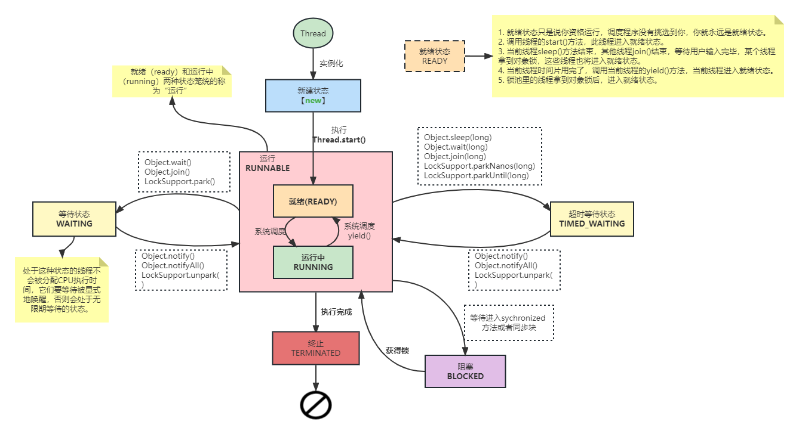

# Thread

## 线程状态

状态
- `NEW`: 刚创建, 还没`start()`
- `RUNNABLE`: 调了`start()`, 运行中或者待调度(READY), 未阻塞, 未等待
- `BLOCKED`: 抢不到锁; 其它线程释放了锁但还没唤醒当前线程
- `WAITING`: 进入等待
    - `Object.wait()`
    - `Thread.join()`
    - `Unsafe.park()`
- `TIMEE_WAITING`: 进入等待
    - `Thread.sleep(millis)`
    - `Object.wait(millis)`
    - `Thread.join(millis)`
    - `Locksupport.parkNanos(millis)`
    - `Locksupport.parkUntil()`
- `TERMINATED`: 运行结束

## 常见问题
- 线程状态
  - Q: 如果对线程调用两次start()会怎样? 出现`IllegalThreadStateException`
  - Q: 如果直接调用wait()会出现什么情况? 
    - 出现`IllegalMonitorStateException`
    - 之所以要求上锁后才能入等待队列, 是为了防止直接wait()错过notify()消息, 导致永久陷入等待
- 中断:
  - Q: 为什么Thread.sleep()被中断不用读`Thread.interrupted()`标志位
    - 线程sleep被中断时, 会收到`InterruptedException`, 这个异常就代表被中断了 