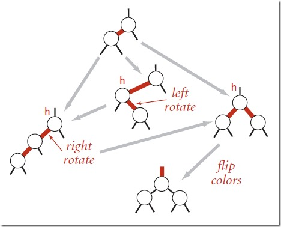

参考:
参考
- [HashMap多线程死循环问题](https://blog.csdn.net/xuefeng0707/article/details/40797085)

HashMap17与18差别
* 17将新结点加在链表头, 18加在链表尾
* 17先检查扩容再加入新结点, 18先加入新结点再扩容

HashMap
* 特点:
    * key/value都可以是null
* 默认值:
    * loadFactor: 0.75
    * initCapacity: 16
    * threshold: 0.75*16 = 12
* hash算法
    * (key == null) ? 0 : (h = key.hashCode()) ^ (h >>> 16);
    * 将高位传播到低位
* 构造器
    ```java
    public HashMap(int initialCapacity, float loadFactor) {
        if (initialCapacity < 0)
            throw new IllegalArgumentException("Illegal initial capacity: " +
                                               initialCapacity);

        // 最大容量不超过1<<30
        if (initialCapacity > MAXIMUM_CAPACITY)
            initialCapacity = MAXIMUM_CAPACITY;
        if (loadFactor <= 0 || Float.isNaN(loadFactor))
            throw new IllegalArgumentException("Illegal load factor: " +
                                               loadFactor);
        this.loadFactor = loadFactor;

        // 此时threshold的语义不是阈值, 只是暂时保存初始化容量
        this.threshold = tableSizeFor(initialCapacity);
    }
    ```
* put
    ```JAVA
    final V putVal(int hash, K key, V value, boolean onlyIfAbsent,
                   boolean evict) {
        Node<K,V>[] tab; Node<K,V> p; int n, i;

        // 检查表的初始化
        if ((tab = table) == null || (n = tab.length) == 0)
            n = (tab = resize()).length;

        // 计算hash, 如果桶中为空, 那就直接新建
        if ((p = tab[i = (n - 1) & hash]) == null)
            tab[i] = newNode(hash, key, value, null);
        else {
            Node<K,V> e; K k;
            // 先判断是不是桶中第一个结点
            // (这个快速判断有利于多次连续put同一个key的场景)
            if (p.hash == hash &&
                ((k = p.key) == key || (key != null && key.equals(k))))
                e = p;
            // 如果是红黑树, 按红黑树的方法加入节点
            else if (p instanceof TreeNode)
                e = ((TreeNode<K,V>)p).putTreeVal(this, tab, hash, key, value);
            else {
                // 在链表中查找, 直到找到key或者确认没找到
                for (int binCount = 0; ; ++binCount) {
                    if ((e = p.next) == null) {
                        // 找不到则加入新结点
                        p.next = newNode(hash, key, value, null);
                        //检查要不要treeify
                        if (binCount >= TREEIFY_THRESHOLD - 1) // -1 for 1st
                            treeifyBin(tab, hash);
                        break;
                    }
                    // 找到
                    if (e.hash == hash &&
                        ((k = e.key) == key || (key != null && key.equals(k))))
                        break;
                    p = e;
                }
            }
            // e!=null 说明找到了, 更新值并返回旧值
            if (e != null) { // existing mapping for key
                V oldValue = e.value;
                if (!onlyIfAbsent || oldValue == null)
                    e.value = value;
                afterNodeAccess(e);
                return oldValue;
            }
        }
        // 更新修改次数
        ++modCount;
        // 如果超过阈值, 要进行resize()
        if (++size > threshold)
            resize();
        afterNodeInsertion(evict);
        return null;
    }
    ```
* 重hash方法
    ```java
    final Node<K,V>[] resize() {
        Node<K,V>[] oldTab = table;
        int oldCap = (oldTab == null) ? 0 : oldTab.length;
        int oldThr = threshold;
        int newCap, newThr = 0;
        if (oldCap > 0) {
            if (oldCap >= MAXIMUM_CAPACITY) {
                threshold = Integer.MAX_VALUE;
                return oldTab;
            }
            else if ((newCap = oldCap << 1) < MAXIMUM_CAPACITY &&
                     oldCap >= DEFAULT_INITIAL_CAPACITY)
                newThr = oldThr << 1; // double threshold
        }
        else if (oldThr > 0) // initial capacity was placed in threshold
            newCap = oldThr;
        else {               // zero initial threshold signifies using defaults
            newCap = DEFAULT_INITIAL_CAPACITY;
            newThr = (int)(DEFAULT_LOAD_FACTOR * DEFAULT_INITIAL_CAPACITY);
        }
        if (newThr == 0) {
            float ft = (float)newCap * loadFactor;
            newThr = (newCap < MAXIMUM_CAPACITY && ft < (float)MAXIMUM_CAPACITY ?
                      (int)ft : Integer.MAX_VALUE);
        }
        threshold = newThr;
        @SuppressWarnings({"rawtypes","unchecked"})
            Node<K,V>[] newTab = (Node<K,V>[])new Node[newCap];
        table = newTab;
        if (oldTab != null) {
            for (int j = 0; j < oldCap; ++j) {
                Node<K,V> e;
                if ((e = oldTab[j]) != null) {
                    oldTab[j] = null;
                    if (e.next == null)
                        newTab[e.hash & (newCap - 1)] = e;

                    // 如果是TreeNode, 则按TreeNode的方法进行拆分
                    else if (e instanceof TreeNode)
                        ((TreeNode<K,V>)e).split(this, newTab, j, oldCap);

                    // 把index不同的结点拆分到不同的链表中
                    else { // preserve order
                        Node<K,V> loHead = null, loTail = null;
                        Node<K,V> hiHead = null, hiTail = null;
                        Node<K,V> next;
                        do {
                            next = e.next;
                            if ((e.hash & oldCap) == 0) {
                                if (loTail == null)
                                    loHead = e;
                                else
                                    loTail.next = e;
                                loTail = e;
                            }
                            else {
                                if (hiTail == null)
                                    hiHead = e;
                                else
                                    hiTail.next = e;
                                hiTail = e;
                            }
                        } while ((e = next) != null);
                        // 把子链表放到新表的对应位置
                        if (loTail != null) {
                            loTail.next = null;
                            newTab[j] = loHead;
                        }
                        if (hiTail != null) {
                            hiTail.next = null;
                            newTab[j + oldCap] = hiHead;
                        }
                    }
                }
            }
        }
        return newTab;
    }
    ```
* treeifyBin方法
    ```java
    final void treeifyBin(Node<K,V>[] tab, int hash) {
        int n, index; Node<K,V> e;

        // 容量小于MIN_TREEIFY_CAPACITY = 64时, 只做resize()
        if (tab == null || (n = tab.length) < MIN_TREEIFY_CAPACITY)
            resize();

        
        else if ((e = tab[index = (n - 1) & hash]) != null) {
            TreeNode<K,V> hd = null, tl = null;                    // hd保存头结点, tl保存上一次处理的结点
            // 复制链表, 
            // 新链表的Node为TreeNode
            // TreeNode是双链表结点 (便于遍历, 以及后面复原成链表)
            do {
                TreeNode<K,V> p = replacementTreeNode(e, null);
                if (tl == null)
                    hd = p;
                else {
                    p.prev = tl;
                    tl.next = p;
                }
                tl = p;
            } while ((e = e.next) != null);
            // 按红黑树的规则依次把每个结点加入红黑树并且重新平衡
            if ((tab[index] = hd) != null)
                hd.treeify(tab);
        }
    }

    /** 
        把链表的每个结点放到红黑树中, 并平衡, 最后把根结点放到桶表头
    */
    final void treeify(Node<K,V>[] tab) {
        TreeNode<K,V> root = null;
        // 依次把每个结点加入到红黑树中, 并重新平衡
        for (TreeNode<K,V> x = this, next; x != null; x = next) {
            next = (TreeNode<K,V>)x.next;
            x.left = x.right = null;
            if (root == null) {
                x.parent = null;
                x.red = false;
                root = x;
            }
            else {
                K k = x.key;
                int h = x.hash;
                Class<?> kc = null;
                // 寻找插入结点的位置, 插入结点
                for (TreeNode<K,V> p = root;;) {
                    int dir, ph;
                    K pk = p.key;
                    if ((ph = p.hash) > h)
                        dir = -1;
                    else if (ph < h)
                        dir = 1;
                    else if ((kc == null &&
                                (kc = comparableClassFor(k)) == null) ||
                                (dir = compareComparables(kc, k, pk)) == 0)
                        dir = tieBreakOrder(k, pk);

                    TreeNode<K,V> xp = p;
                    if ((p = (dir <= 0) ? p.left : p.right) == null) {
                        x.parent = xp;
                        if (dir <= 0)
                            xp.left = x;
                        else
                            xp.right = x;
                        root = balanceInsertion(root, x);
                        break;
                    }
                }
            }
        }
        // 把根结点放到桶表头
        moveRootToFront(tab, root);
    }
    ```
* putTreeVal
    ```java
    final TreeNode<K,V> putTreeVal(HashMap<K,V> map, Node<K,V>[] tab,
                                       int h, K k, V v) {
        Class<?> kc = null;
        boolean searched = false;
        
        //找到根结点
        TreeNode<K,V> root = (parent != null) ? root() : this;          // [1]
        for (TreeNode<K,V> p = root;;) {
            int dir, ph; K pk;
            
            // 结点hash大于hash, 向左
            if ((ph = p.hash) > h)
                dir = -1;
            
            // 结点hash小于hash, 向右
            else if (ph < h)
                dir = 1;
            
            // 快速比较, 找到就返回
            else if ((pk = p.key) == k || (k != null && k.equals(pk)))
                return p;
            
            // 用Comparable方法比较
            else if ((kc == null &&
                        (kc = comparableClassFor(k)) == null) ||        // [2]
                        (dir = compareComparables(kc, k, pk)) == 0) {

                // 在子结点中搜索. 
                // 只搜一次, 搜不到就没有了
                if (!searched) {
                    TreeNode<K,V> q, ch;
                    searched = true;
                    if (((ch = p.left) != null &&
                            (q = ch.find(h, k, kc)) != null) ||
                        ((ch = p.right) != null &&
                            (q = ch.find(h, k, kc)) != null))
                        return q;
                }

                // 只能通过 System.identityHashCode(key) (根据内存地址计算的hashCode)
                dir = tieBreakOrder(k, pk);
            }

            // 往左或右结点找, 直到找到叶子结点
            // 用xp保存前一个结点
            TreeNode<K,V> xp = p;
            if ((p = (dir <= 0) ? p.left : p.right) == null) {

                // 加入新结点
                // next 和 pre 在遍历二叉树时有用
                Node<K,V> xpn = xp.next;
                TreeNode<K,V> x = map.newTreeNode(h, k, v, xpn);
                if (dir <= 0)
                    xp.left = x;
                else
                    xp.right = x;
                xp.next = x;
                x.parent = x.prev = xp;
                if (xpn != null)
                    ((TreeNode<K,V>)xpn).prev = x;

                // 调整平衡, 把最新的根结点放到桶表头 (平衡后根结点可能不是桶表头的结点)
                moveRootToFront(tab, balanceInsertion(root, x));
                return null;
            }
        }
    }
    // [2] Returns x's Class if it is of the form "class C implements Comparable<C>", else null.

    /**
        插入后进行平衡
        x: 新插入的结点    
        return: 最新的根结点
    */
    static <K,V> TreeNode<K,V> balanceInsertion(TreeNode<K,V> root,
                                                    TreeNode<K,V> x) {
        x.red = true;
        for (TreeNode<K,V> xp, xpp, xppl, xppr;;) {
            // 没有父结点, 改成黑结点返回
            if ((xp = x.parent) == null) {
                x.red = false;
                return x;
            }
            // 父结点为黑或者没有祖结点, 直接返回
            else if (!xp.red || (xpp = xp.parent) == null)
                return root;

            // 父结点为左支
            if (xp == (xppl = xpp.left)) {
                // 叔结点为红, 则祖, 父, 叔结点都反色, 继续检查祖结点
                if ((xppr = xpp.right) != null && xppr.red) {
                    xppr.red = false;
                    xp.red = false;
                    xpp.red = true;
                    x = xpp;
                }
                // 无叔结点或者叔结点为黑
                else {
                    // x结点为父结点的右支, 则左旋父结点, 继续调整父结点 
                    if (x == xp.right) {
                        root = rotateLeft(root, x = xp);
                        xpp = (xp = x.parent) == null ? null : xp.parent;
                    }
                    if (xp != null) {
                        xp.red = false;
                        if (xpp != null) {
                            xpp.red = true;
                            root = rotateRight(root, xpp);
                        }
                    }
                }
            }
            else {
                if (xppl != null && xppl.red) {
                    xppl.red = false;
                    xp.red = false;
                    xpp.red = true;
                    x = xpp;
                }
                else {
                    if (x == xp.left) {
                        root = rotateRight(root, x = xp);
                        xpp = (xp = x.parent) == null ? null : xp.parent;
                    }
                    if (xp != null) {
                        xp.red = false;
                        if (xpp != null) {
                            xpp.red = true;
                            root = rotateLeft(root, xpp);
                        }
                    }
                }
            }
        }
    }

    /**
        把root结点与当前的table[(tab.length - 1) & root.hash]上的首结点交换, 保持root的首结点地位
        意义:
        1. 有利于多次重复put的场景
        2. 在链表/红黑树中进行遍历之前, 要先判断root.next是否为null
    */
    static <K,V> void moveRootToFront(Node<K,V>[] tab, TreeNode<K,V> root) {
        int n;
        if (root != null && tab != null && (n = tab.length) > 0) {
            int index = (n - 1) & root.hash;
            TreeNode<K,V> first = (TreeNode<K,V>)tab[index];

            // 把root当前位置的prev结点和next结点连起来(如果存在)
            if (root != first) {
                Node<K,V> rn;
                tab[index] = root;
                TreeNode<K,V> rp = root.prev;
                if ((rn = root.next) != null)
                    ((TreeNode<K,V>)rn).prev = rp;
                if (rp != null)
                    rp.next = rn;
                // 把root放到原first之前 
                if (first != null)
                    first.prev = root;
                root.next = first;
                root.prev = null;
            }
            assert checkInvariants(root);
        }
    }
    ```
    
* get
    ```java
    final Node<K,V> getNode(int hash, Object key) {
        Node<K,V>[] tab; Node<K,V> first, e; int n; K k;
        // 判断表是否为null, 并判断tab[(table.length-1) & hash]是不是null
        if ((tab = table) != null && (n = tab.length) > 0 &&
            (first = tab[(n - 1) & hash]) != null) {
            
            // 判断第一个的key是否匹配
            if (first.hash == hash && 
                ((k = first.key) == key || (key != null && key.equals(k))))
                return first;
            if ((e = first.next) != null) {
                // 如果是红黑树, 用红黑树的方法
                if (first instanceof TreeNode)
                    return ((TreeNode<K,V>)first).getTreeNode(hash, key);
                do {
                    // 找到则返回结点
                    if (e.hash == hash &&
                        ((k = e.key) == key || (key != null && key.equals(k))))
                        return e;
                } while ((e = e.next) != null);
            }
        }
        return null;
    }
    ```
* remove
    ```java
    final Node<K,V> removeNode(int hash, Object key, Object value,
                               boolean matchValue, boolean movable) {
        Node<K,V>[] tab; Node<K,V> p; int n, index;
        // 先检查table存不存在, 以及table[(table.length-1)&hash]是否存在
        // 在则查找结点
        if ((tab = table) != null && (n = tab.length) > 0 &&
            (p = tab[index = (n - 1) & hash]) != null) {
            Node<K,V> node = null, e; K k; V v;

            // 判断第一个结点
            if (p.hash == hash &&
                ((k = p.key) == key || (key != null && key.equals(k))))
                node = p;
            // 第一个结点不是, 且存在下一个结点
            else if ((e = p.next) != null) {
                // 如果是红黑树, 在红黑树中查找
                if (p instanceof TreeNode)
                    node = ((TreeNode<K,V>)p).getTreeNode(hash, key);
                // 遍历链表, 直到找到或者确认找不到
                else {
                    do {
                        if (e.hash == hash &&
                            ((k = e.key) == key ||
                             (key != null && key.equals(k)))) {
                            node = e;
                            break;
                        }
                        p = e;                                  // p为上一个处理的结点
                    } while ((e = e.next) != null);
                }
            }
            // 找到结点
            if (node != null && (!matchValue || (v = node.value) == value ||
                                 (value != null && value.equals(v)))) {
                // 如果是红黑树, 在红黑树中删除
                if (node instanceof TreeNode)
                    ((TreeNode<K,V>)node).removeTreeNode(this, tab, movable);
                // 在链表中删除
                else if (node == p)
                    tab[index] = node.next;
                else
                    p.next = node.next;
                // 更新modCount 和 size 
                ++modCount;
                --size;
                afterNodeRemoval(node);
                return node;
            }
        }
        return null;
    }

    /**
        通过红黑树结点的next指针来遍历所有结点, 复制成一条单链表
    */
    final Node<K,V> untreeify(HashMap<K,V> map) {
        Node<K,V> hd = null, tl = null;
        for (Node<K,V> q = this; q != null; q = q.next) {
            Node<K,V> p = map.replacementNode(q, null);
            if (tl == null)
                hd = p;
            else
                tl.next = p;
            tl = p;
        }
        return hd;
    }
    ```
