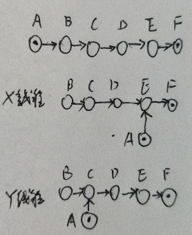

[](http://www.importnew.com/25286.html)


## 先验知识

`Unsafe.putOrderedObject()`: 
- 参考[知乎 - ConcurrentHashMap大量使用Unsafe的putOrderedObject出于什么考虑?](https://www.zhihu.com/question/60888757)
> putOrderedObject是putObjectVolatile的内存非立即可见版本；lazySet是使用Unsafe.putOrderedObject方法，这个方法在对低延迟代码是很有用的，它能够实现非堵塞的写入，这些写入不会被Java的JIT重新排序指令(instruction reordering)，这样它使用快速的存储-存储(store-store) barrier, 而不是较慢的存储-加载(store-load) barrier, 后者总是用在volatile的写操作上，这种性能提升是有代价的，虽然便宜，也就是写后结果并不会被其他线程看到，甚至是自己的线程，通常是几纳秒后被其他线程看到，这个时间比较短，所以代价可以忍受。
- store-store屏障: 第一个store命令可能未被写到内存, 但当第二个store到来时, 第一个store必须被写入内存

### 相关接口
参考[相关接口](./相关接口.md)

## FutureTask

状态
- 状态(带ING的都是**过渡状态**, 时间比较短)
    - `0-NEW`: 创建未运行, 或者运行中 (两个子状态由runner是否为null来区分)
    - `1-COMPLETING`: 运行结束, 结果/异常尚未保存
    - `2-NORMAL`: 结果保存到了outcome
    - `3-EXCEPTIONAL`: 异常保存到了outcome
    - `4-CANCELLED`: 用户调用cancel(false)
    - `5-INTERRUPTING`: 用户调用cancel(true), 但任务还未被中断
    - `6-INTERRUPTED`: 用户调用cancel(true), 并且任务已经被中断
- 可能的转移状态
    - run(): 
        - set(): `NEW-> COMPLETING -> NORMAL`
        - setException(): `NEW-> COMPLETING -> EXCEPTIONAL`
    - cancel():
        - cancel(false): `NEW -> CANCELLED`
        - cancel(true): `NEW -> INTERRUPTING -> INTERRUPTED`
- 问题:
    - 为什么要区分`INTERRUPTING`和`INTERRUPTED`? 
        - 假设只有一种`INTERRUPTED`
            1. run()线程通过`cas(runner)`抢到执行机会
            2. cancel()线程把状态`INTERRUPTED`
            3. run()线程看到`INTERRUPTED`, 便退出了
            4. cancel()中断了run()线程, run()线程处于RUNNABLE状态, 完全不知道自己被中断了
        - 分成两个状态后
            1. cancel线程可以保证在中断了run()线程后再设置`INTERRUPTED`
            2. run()线程在看到`INTERRUPTED`时, 再退出


并发问题
- 被竞争变量
    - **volatile** int state: 状态
        - 作为互斥量用来控制对callable, outcome的读写
    - **volatile** Thread runner: 运行callable的线程
        - 执行`run()`的线程通过尝试把`runner`设为自己, 来竞争执行机会
    - **volatile** WaitNode waitNode: 保存等待结果的线程的队列
- 竞争关系:
    - `run()`之间: 通过乐观锁`CAS(runner)`来保证安全, 谁把`runner`设为自己谁就抢到锁
        - `set()`和`setException()`之间没有竞争关系, 是`run()`线程的不同分支
    - `set()`/`setException()`与`cancel()`: 
        - 通过乐观锁`CAS(state)`来保证结果(outcome)与状态的一致
        - 通过乐观锁`CAS(waiter)`队列竞争唤醒等待者的机会
    - `awaitDone()`与`run()`/`set()`/`setException()`: 通过`cas(waiter)`保证不会有结点被遗漏, 以致永远无法被唤醒
        

### FutureTask源码解析

- 执行: `run()`
    ```java
    public void run() {
        // 对runner做CAS, 保证只有一个线程能运行run()
            // 成功则进入临界区
        if (state != NEW ||
            !UNSAFE.compareAndSwapObject(this, runnerOffset,                
                                         null, Thread.currentThread()))
            return;
        try {
            Callable<V> c = callable;
            if (c != null && state == NEW) {        // 进临界区第一步, 先重检查状态
                V result;
                boolean ran;
                try {
                    result = c.call();              // if...do操作不是原子的, 因此可能会有白跑一趟的问题
                    ran = true;
                } catch (Throwable ex) {
                    result = null;
                    ran = false;
                    setException(ex);               // 尝试设置异常
                }
                if (ran) set(result);               // 尝试设置结果
            }
        } finally {
            
            // 释放runner锁
            runner = null;
            
            // 有线程做了带中断的cancel, 则要yield()到中断处理结束
                // 如果run()没有发生过sleep()/wait(), 可能没法发现中断, 没有InterruptedException
            int s = state;
            if (s >= INTERRUPTING) handlePossibleCancellationInterrupt(s); // while (INTERRUPTING) yield();
        }
    }
    
    
    protected void set(V v) {
        // 尝试把状态变成COMPLETING, 同时判断是否已Cancel, 是的话就退出
        if (UNSAFE.compareAndSwapInt(this, stateOffset, NEW, COMPLETING)) {
            outcome = v;
            UNSAFE.putOrderedInt(this, stateOffset, NORMAL); 

            // 如果成功的话, 就要通知所有的等待者
            finishCompletion();
        }
    }

    protected void setException(Throwable t) {
        // CAS尝试把状态变成COMPLETING
            // 尝试失败, 则说明有另一个线程抢到了cancel机会
        if (UNSAFE.compareAndSwapInt(this, stateOffset, NEW, COMPLETING)) {
            outcome = t;
            UNSAFE.putOrderedInt(this, stateOffset, EXCEPTIONAL); // final state

            // 异常也要通知所有的等待者
            finishCompletion();
        }
    }
    ```
- 通知等待者: `finishCompletion()`
    ```java

    /**
        将waiters队列中所有等待结果的非null线程全部唤醒
    */
    private void finishCompletion() {
        
        // 自旋锁竞争通知的机会, 抢不到(变成null)直接退出
        for (WaitNode q; (q = waiters) != null;) {

            // 头结点一定要用cas, 防止某个新结点加入后, 永远获取不到通知
            if (UNSAFE.compareAndSwapObject(this, waitersOffset, q, null)) {

                // 逐一唤醒等待者线程, 并清理已通知的结点
                for (;;) {
                    Thread t = q.thread;
                    if (t != null) {
                        q.thread = null;
                        LockSupport.unpark(t);
                    }
                    WaitNode next = q.next;
                    if (next == null)
                        break;
                    q.next = null; // unlink to help gc
                    q = next;
                }
                break;
            }
        }

        done();                 // hook方法
        callable = null;        // help gc
    }
    ```
* `runAndReset()`
    ```java
    /**
        与run()相比, runAndReset()运行完不保存结果, 并且会在成功时重置状态为NEW
        失败/取消后不可复用
    */
    protected boolean runAndReset() {
        // 注意一旦状态出现过异常或中断, 就永远不能再复用了
        if (state != NEW ||
            !UNSAFE.compareAndSwapObject(this, runnerOffset,
                                         null, Thread.currentThread()))
            return false;
        boolean ran = false;
        int s = state;
        try {
            Callable<V> c = callable;
            if (c != null && s == NEW) {
                try {
                    c.call();               // 跑完重置, 不保存结果            
                    ran = true; 
                } catch (Throwable ex) {
                    setException(ex);       // 异常后不可复用, 因此可以保存
                }
            }
        } finally {
            // runner设为null后, 其它线程才能运行
            runner = null;
            // 被中断时, 循环yield()直到达到INTERRUPTED
            s = state;
            if (s >= INTERRUPTING) handlePossibleCancellationInterrupt(s);
        }
        // 只有不出异常, 不被中断才能算成功
        return ran && s == NEW; 
    }
    ```
* `boolean cancel(boolean mayInterruptIfRunning)`
    ```java
    public boolean cancel(boolean mayInterruptIfRunning) {
        // 非NEW状态
        // 或者没有抢到cancel的机会, 返回false
        if (!(state == NEW &&
              UNSAFE.compareAndSwapInt(this, stateOffset, NEW,
                  mayInterruptIfRunning ? INTERRUPTING : CANCELLED)))  // 不用中断run()则只把状态设成CANCELLED
            return false;
        // 
        try {    
            // 需要中断run()则给run()的线程发出中断信号
            // 此时当前线程已经抢到state, 不用竞争, run()只需要等待cancel()结束
            if (mayInterruptIfRunning) {
                try {
                    Thread t = runner;
                    if (t != null)
                        t.interrupt();      
                } finally { 
                    // 把状态设置为interrupted (此时其它线程调用set()或者setException()都抢不到机会)
                    UNSAFE.putOrderedInt(this, stateOffset, INTERRUPTED); 
                }
            }
        } finally {
            finishCompletion();         // 唤醒所有等待的线程
        }
        // 中断成功
        return true;
    }
    ```
* `V get()`
    ```java
    /**
     * get()线程在自己被中断时会抛中断异常
     * 如果是run()线程被中断, 则run()线程收到中断异常, 而get()线程收到Cancelled异常
     */
    public V get() throws InterruptedException, ExecutionException {
        // 先等到状态达到NORMAL, EXCEPTIONAL或者INTERRUPTING, INTERRUPTED
        int s = state;
        // 还未完成, 则循环阻塞等待, 直到正常(NORMAL)或者异常结束(EXCEPTIONAL)
        if (s <= COMPLETING) s = awaitDone(false, 0L);
        
        // 根据执行结果, 决定返回结果还是抛异常
        return report(s);
    }
    
    /**
     * 根据执行结果, 决定以下分支: 
     *      1. 返回结果; 
     *      2. 抛Cancelled异常(被取消); 
     *      3. 抛ExecutionException(其它异常)
     */
    private V report(int s) throws ExecutionException {
        Object x = outcome;
        if (s == NORMAL)
            return (V)x;
        if (s >= CANCELLED)
            throw new CancellationException();
        throw new ExecutionException((Throwable)x);
    }

    private int awaitDone(boolean timed, long nanos)
        throws InterruptedException {
        final long deadline = timed ? System.nanoTime() + nanos : 0L;
        WaitNode q = null;
        boolean queued = false;

        // 循环(1. 检查中断; 2. 检查状态; 3. 尝试入队; 4. 检查超时; 5. 都未发生则进入阻塞)
        for (;;) {
            // 1. 检查中断标志, 发生中断则出队
            if (Thread.interrupted()) {
                removeWaiter(q);
                throw new InterruptedException();
            }

            // 2. 检查状态. 如果结束了, 只要清理q.thread, 队列有其它线程清理
            int s = state;
            if (s > COMPLETING) {
                if (q != null)
                    q.thread = null;
                return s;
            }
            // 如果接近完成, 则yield()等待
            else if (s == COMPLETING) 
                Thread.yield();
            // 3. CAS尝试入队
            else if (q == null)
                q = new WaitNode();
            else if (!queued)
                queued = UNSAFE.compareAndSwapObject(this, waitersOffset,
                                                     q.next = waiters, q);
            
            // 4. 检查超时
            else if (timed) {
                nanos = deadline - System.nanoTime();
                if (nanos <= 0L) {
                    removeWaiter(q);                    // 把q的线程设为null, 然后把队列中线程为null的结点都清理掉
                    return state;
                }
                LockSupport.parkNanos(this, nanos);
            }
            
            // 5. 阻塞等待
            else
                LockSupport.park(this);                 // 此时如果发生中中断, 只会被置位, 不会抛异常
        }
    }

    /**
        把指定结点清理掉, 顺便清理已被中断或者超时的结点
        实现方法: 先把指定结点的线程设为null, 然后把线程为null的结点清理掉
    */
    private void removeWaiter(WaitNode node) {
        if (node != null) {
            node.thread = null;
            retry:
            for (;;) {          // restart on removeWaiter race
                for (WaitNode pred = null, q = waiters, s; q != null; q = s) {
                    s = q.next;

                    // 当前结点线程不为空, 找下个结点
                    if (q.thread != null)
                        pred = q;

                    // 可能会造成重复清理, 但不会有遗漏
                    else if (pred != null) {
                        pred.next = s;
                        if (pred.thread == null) // pred状态发生变化, 要重试
                            continue retry;
                    }
                    // 第一个结点线程为null, 通过cas(waiters)来清理
                    else if (!UNSAFE.compareAndSwapObject(this, waitersOffset, q, s))
                        continue retry;
                }
                break;
            }
        }
    }
    ```
    - 重复清理的例子: 
        1. X和Y线程同时拿到`pred=A`, `p=B`
        2. X线程拿着`pred=A`, 将其next指针改到E的时候, 切换到线程Y
        3. Y线程拿着`pred=A`, 从`p=B`开始, 重新开始遍历`C-D-E-F`的过程
    
* 超时get
    ```java
    public V get(long timeout, TimeUnit unit)
        throws InterruptedException, ExecutionException, TimeoutException {
        if (unit == null)
            throw new NullPointerException();
        int s = state;
        // 状态<=COMPLETING说明超时, 抛超时异常
        if (s <= COMPLETING &&
            (s = awaitDone(true, unit.toNanos(timeout))) <= COMPLETING) 
            throw new TimeoutException();
        return report(s);
    }
    ```