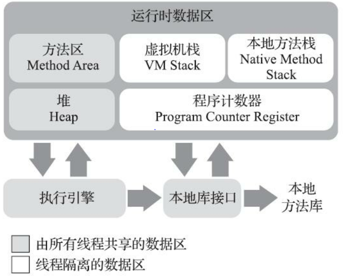

# Chapter 02 Java内存区域与内存溢出异常

## 2.2 运行时内存区域

运行时内存区域:
- 程序计数器
- 虚拟机栈
- 本地方法栈
- 方法区
- 堆

线程私有的区域:
- 程序计数器
- 虚拟机栈
- 本地方法栈
    
可能出现StackOverflowError的区域:
- 虚拟机栈
- 本地方法栈

可能出现OutOfMemoryError的区域
- 方法区
- 虚拟机栈
- 本地方法栈
- 堆
- *直接内存*

### 2.2.1 程序计数器

 程序计数器: 当前线程所执行的字节码的行号计数器
 - 控制分支, 循环, 方法跳转, 异常, 线程恢复

### 2.2.2 Java虚拟机栈

Java虚拟机栈: 存放**方法**执行时的**线程**内存模型
- 线程私有: 与线程同生命周期
- 栈帧: 每发生一次方法调用时, 生成一个新的栈帧, 加在栈顶上
    - 保存: 
        - 局部变量表
            - 保存: 8大基本类型, 对象引用reference, returnAddress
            - 在编译时即可确定占用的空间大小
        - 动态链接
        - 方法出口
        - **栈上分配**的对象

### 2.2.3 本地方法栈
