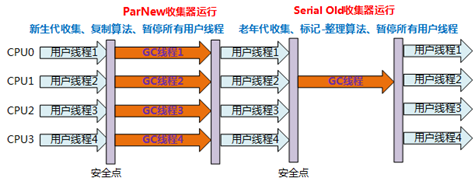
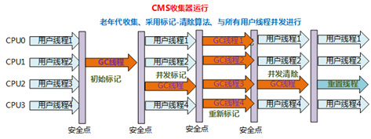

# Chapter 03 垃圾收集器与内存分配策略

内存区域能否提前确定内存大小
- 能确定的: 程序计数器, Java虚拟机栈, Native方法栈
    - *Java虚拟机栈只是大致确定*, 因为涉及到栈上分配, 标量替换等优化
- 不能确定: 堆, 方法区

## 3.2 对象已死?
引用计数法: 给对象的引用计数
- *使用场景*: redis
- 问题: 循环引用

### 3.2.2 可达性分析算法

从GC Root出发:
- 虚拟机栈的参数, 局部变量, 临时变量
- Native栈中的引用
- 方法区中类的静态属性
- 常量池中的常量
- Java虚拟机中常驻的Class对象(NullPointException, OutOfMemoryError等)
- 被synchronized的对象
- 反映虚拟机内部的JMXBean, JVMTI中的回调, 本地代码缓存等

### 3.2.3 再谈引用

引用类型:
- 强引用: 所有"="赋值的都是强引用
- 软引用: 在内存快溢出时, 会把软引用回收掉
- 弱引用: 只要GC扫描到, 就会回收
- 虚引用: 无法通过虚引用拿到对象引用, 但是被回收时会加到一个队列, 回收以后能从队列中找到, 从而知道被回收了
    - *应用场景*: 清理`DirectBuffer`用的`Cleaner`

### 3.2.4 生存还是死亡?

`Finalizer`类
- 有两个阻塞队列:
    1. 保存`finalize()`方法被覆写过的对象
    2. (阻塞队列)保存被GC标记过的对象
- 对象的`finalize()`执行过程
    1. 第一次被GC后, 对象被标记, 从队列1加到队列2
    2. 有个低优先级的Finalizer线程会不断从阻塞队列拿对象执行其`finalize()`方法, 并移除掉
    3. 第二次被GC后, 对象就真的被回收了

### 3.2.5 回收方法区

被回收对象
- 常量
- 类: 可回收条件
    - 所有实例被回收
    - 其ClassLoader也被回收
    - 没有对其Class对象的引用, 也无法通过反射获得对其的引用

相关命令: 
- `-verbos:class`
- `-XX:+TraceClassLoading`
- `-XX:+TraceClassUnLoading`

## 3.3 垃圾回收算法

分代假说
1. 弱分代假说: 对象大多数是朝生夕灭
2. 强分代假说: 撑过越多代的对象越难消亡
3. 跨代引用假说: 跨代引用相对同代引用占极少数
    - 记忆集 

GC范围
- Full GC
- Partial GC
    - Minor / Young GC
    - Major / Old GC
    - Mixed GC

算法
- 标记-清除(Mark-Sweep): 
    - 问题: 要把可回收的区域都找出来, 开销大; 内存碎片
- 标记-复制(Copying)
    - 问题: 
        - 空间利用率低 -> 优化: Eden-Survivor
        - Survivor不能保证存下所有剩余对象 -> 优化: 由老年代做担保
- 标记-整理(Mark-Compact)
    - 问题:
        - STW: 该算法会与用户线程竞争空闲区域, 因此要暂停用户线程

## 3.4 HotSpot的算法细节实现

参考
- [浅析OopMap](https://blog.csdn.net/asdasd3418/article/details/77686653)
    > 在HotSpot中，对象的类型信息里有记录自己的OopMap，记录了在该类型的对象内什么偏移量上是什么类型的数据。所以从对象开始向外的扫描可以是准确的；这些数据是在类加载过程中计算得到的。 
      
    > 可以把oopMap简单理解成是调试信息。 在源代码里面每个变量都是有类型的，但是编译之后的代码就只有变量在栈上的位置了。oopMap就是一个附加的信息，告诉你栈上哪个位置本来是个什么东西。 这个信息是在JIT编译时跟机器码一起产生的。因为只有编译器知道源代码跟产生的代码的对应关系。 每个方法可能会有好几个oopMap，就是根据safepoint把一个方法的代码分成几段，每一段代码一个oopMap，作用域自然也仅限于这一段代码。 循环中引用多个对象，肯定会有多个变量，编译后占据栈上的多个位置。那这段代码的oopMap就会包含多条记录。  

    > 每个被JIT编译过后的方法也会在一些特定的位置记录下OopMap，记录了执行到该方法的某条指令的时候，栈上和寄存器里哪些位置是引用。这样GC在扫描栈的时候就会查询这些OopMap就知道哪里是引用了。这些特定的位置主要在： 
    > 1、循环的末尾 
    > 2、方法临返回前 / 调用方法的call指令后 
    > 3、可能抛异常的位置
    > 这种位置被称为“安全点”（safepoint）

### 3.4.1 根节点枚举 - OopMap & 安全点

OopMap
- 解决的问题: 枚举开销大, 而OopMap可以减少STW时间
- OopMap: 记录栈中哪个位置是什么类型数据, 加快枚举过程
    - 问题: 更新OopMap本身要开销, 不能一发生修改就更新

### 3.4.2 安全点
 
SafePoint: 放OopMap的地方; 可以进行GC的点
- 作用:
    - 统一在SafePoint处更新OopMap
    - 在SafePoint处执行GC
- 选取原则: 在可能发生长时间执行的地方, 如*循环结尾*, *方法返回前, call指令后*, *可能抛异常的地方*等. 
    - 为什么?:
        1. 放在这些地方, 线程可以比较频繁地"踩"到这些点上, 而不会在需要进行GC时, 要运行很久才到点上
        2. 安全点的数量又会比较少(跟方法块/循环块的数量成正比), 同时OopMap的尺寸也很小(跟方法块/循环块中的局部变量数成正比)
        3. 单个方法不会因为指令太多而长时间执行(再长也长不到哪去).

### 3.4.3 安全区域

SafePoint中断方法
- 抢占式中断: 由jvm暂停所有线程, 并让没跑到安全点的线程跑到安全点
- 主动式中断: jvm在要gc时, 设置一个标志. 线程在到达安全点时检查该标志位, 有就挂起
    - HotSpot实现: trap异常信号触发中断

SafeRegion
- SafePoint的缺点: 线程可能SLEEP/BLOCKED了
- SafeRegion原理
    - jvm在需要进行GC时设置标志, 并且不管SLEEP/BLOCKED状态的线程(已经进入了安全区)
    - SLEEP/BLOCKED状态的线程被唤醒后, 会检查标志, 并且直到GC完成才离开安全区

### 3.4.4 记忆集与卡表

记忆集: 记录非收集区域指向收集区域的指针集合
- 精度:
    - 字长精度: 某个字(32/64 bit)有指向收集区域的指针
    - 对象精度: 某个对象有指向收集区域的指针
    - 卡精度: 某个内存区域有指向收集区域的指针

卡表(卡精度): 用位数组来标识某个内存区域(card)是否有指向收集区域的指针

### 3.4.5 写屏障

写屏障: 可看作通过指令实现的针对写操作的切面
- 问题: 缓存行的伪共享. 解决方法: 只有变脏(0->1)时才去更新卡表的标志
    - -XX:+UseCondCardMark
- 作用:
    - 在写屏障中做更新卡表的操作
    - 在写屏障中做增量更新&原始快照记录

### 3.4.6 并发的可达性分析

并发条件下进行可达性分析的方法
- 三色标记法
    - 黑色: 扫描完成的对象
    - 灰度: 正在扫描的对象, 其引用还未遍历完
    - 白色: 未被扫描的对象
- "消失问题"的必备条件
    1. 在黑色对象中新增引用
    2. 在灰色对象中删除引用
- 三色标记法与并发
    - 增量更新(Incremental Update): 用户线程在黑色对象中新增引用时, 要记录下来, 在并发扫描结束后再次扫描
    - 原始快照(SATB, Snapshot At The Beginning): 用户线程在灰色对象中删除引用时, 要记录原来的指针, 在并发扫描结束后再次扫描
        - *从并发的角度看, 原始快照算法可能开销更低, 毕竟对象处于灰色的时间比较短*

## 3.5 经典垃圾收集器

推荐组合
- Parallel Scavenge (PS): 
    - PS + Serial Old: `-XX:+UseParallelGC`  
    - PS + Parrelel Old(`>=JDK6`): `-XX:+UseParallelOldGC`  
- CMS(`>=JDK5`): `-XX:+UseConcMarkSweepGC` 
    - ParNew + CMS + Serial Old(后备): `-XX:+UseParNewGC`(默认)
    - Serial + CMS + Serial Old(后备): `-XX:-UseParNewGC`

其它组合:
- Serial + Serial Old: `-XX: +UseSerialGC`: 客户端默认
    - 
- ParNew + Serial Old: `-XX: +UseParNewGC`
    - 

 

辅助收集器: 
- *单核并行的可能比串行的开销更大*
- 这些收集器在整个收集过程都会**STW**
- 类别:
    - 与CMS配合:
        - Serial: 客户端模式默认收集器
        - ParNew
            - `-XX:ParallelGCThreads`: 并发线程数
    - 与Parralel Scavenge配合
        - Serial Old: 可作为CMS失败时的备选
        - Parralel Old(`>=JDK6`)

### 3.5.3 Parallel Scavenge

**Parallel Scavenge**: 以控制吞吐率为主, 适于对实时性有要求的场景
- 需要**STW**
- 参数
    - `-XX:MaxGCPauseMillis`: 最大停顿时间
        - 调太小会造成频繁GC
    - `-XX:GCTimeRatio`: `userTime / gcTime`的最低界限
        - 调太大会导致来不及清理
    - -`XX:+UseAdaptiveSizePolicy`: 自适应地调整以下参数而无须调整
        - `-XX:Xmn`: 新生代大小
        - `-XX:SurvivorRatio`: Eden/Survivor比例
        - `-XX:PretenureSizeThreshold`: 提前晋升对象大小

### 3.5.6 CMS收集器

**Concurrent Mark Sweep(CMS)** 执行过程: 
1. 初始标记(CMS init mark): **STW**, **快速**找到GC Roots
2. 并发标记(CMS concurrent mark): 与用户线程一起并发, 时间相对较长
3. 重新标记(CMS remark): **STW**, 重新标记一些2阶段产生的新对象, 时间较慢于1, 但远小于2
4. 并发清理(CMS concurrent sweep): 与用户线程一起并发, 执行清理

**增量更新**
- 并发标记时, 黑色对象中的新引用会通过**写屏障**被记录起来
- 重新标记时, 对被记录起来的增量更新引用进行重新扫描

CMS的缺点
- 占CPU: 对于单核系统, 需要跟用户线程竞争处理器资源
- 浮动垃圾: 并发标记和并发清理时总有些新垃圾没标记上, 只能等下次清理
- 预留内存: 防止用户线程在清理期间不够内存用, 而触发Serial Old
    - `-XX:CMSInitiatingOccu-pancyFraction`: CMS触发百分比
- 内存碎片: 找不到连续空间分配大对象时容易出现Full GC
    - `-XX:+UseCMSCompactAtFullCollection`: CMS不得不Full GC时, 对内存碎片进行整理
    - `-XX:CMSFullGCsBeforeCompaction`: 多少次Full GC后进行整理

### 3.5.7 Garbage First收集器

Garbage First(G1)
- 特点:
    - **控制吞吐量**: 停顿时间模型: 指定在一个长度为M的时长片段内, 消耗在垃圾收集上的时间不超过N
    - **Region**: Region的角色不是固定的(老年代/Eden/Survivor/Humongous Region)
        - 大对象: 超时region一半便可认为是大对象. 可以分配在连续的Region上
    - **垃圾回收价值优先** (Garbage First): 优先处理回收价值大的Region
- 参数:
    - -`XX:G1HeapRegionSize`: 1MB-32MB
    - -`XX:MaxGCPauseMillis`

关键问题
- 跨Region引用: 每个region都用**记忆集**来记录其它Region对自己的引用
    - 记忆集结构为: `Map: region->{ref1, ref2, ...}`, 表示region的这些卡页对自己区域对象的引用
    - **内存开销更大**
- 并发标记(**原始快照**实现): 
    - TAMS(Top at Mark Start): 用一个指针划定一个区域, 专门在并发标记时, 用来保存新对象, 这些对象不纳入标记
        - 也会有并发失败导致Full GC
- 保证**停顿预测模型**: 衰减均值: 统计回收时间, 记忆集中脏卡数量等, 分析平均值/标准差/置信度等, 用于后续决策
    - 衰减均值: $x_t = x_{t-1} \cdot a + v_t \cdot (1 - a)$

G1收集步骤
1. **初始标记**: **短暂STW**, 标记一下GC Roots中能关联到的对象, 并修改一下TAMS指针
    - 耗时极短, 借用Minor GC时同步完成
2. **并发标记**: 进行可达性分析, 记录SATB记录
3. **最终标记**: **短暂STW**, 处理少量的原始快照(SATB)记录,
4. **筛选回收**: **STW**
    1. 更新Region统计数据, 记算衰减均值, 对Region进行排序
    2. 根据用户期望的停顿时间来挑选Region组成回收集, 将存活对象复制到空Region, 然后清理掉旧Region

G1与CMS对比
- 内存占用: G1需要更多内存占用
    - 卡表: CMS只需要记录老年代到新生代的引用 
- 执行负载: G1的执行负载更高
    - G1的写屏障更复杂, 以至于需要使用类似于消息队列的方式处理SATB
- 小内存的场景下CMS效率可能更高, 大内存场景下G1更适合

## 3.6.1 Shenandoah收集器

Shenandoah与G1相比
- 前者在筛选回收阶段可以与用户线程并行
- 前者默认不使用分代收集
- 通过**连接矩阵**实现卡表
- **Brooker指针**

Shenandoah回收过程
1. 初始标记: 与G1相似, **短暂STW**, 找到GC Roots
2. 并发标记: 与G1相似, 可达性分析, 并记录SATB
3. 最终标记: 与G1相似, **短暂STW**, 处理SATB
4. 清理
    1. **并发清理**: 清理一个对象都没有的区域
    2. **并发回收**: 复制对象到空闲Region
        - 问题: 复制对象要修改引用, 而用户线程要访问对象
        - 解决方法: **读屏障** + **转发指针** (Brooks Pointers)
            - *类似ConcurrentHashMap中的ForwardingNode*
    3. 引用更新
        1. **初始引用更新**: 线程集合点
        2. **并发引用更新**: 遍历对象, 根据其类型判断是不是刚移动过的, 然后把引用改成新的
        3. **最终引用更新**: **短暂STW**, 修正完堆中的引用后, 修正GC Roots中的引用
    4. **并发清理**: *跟前面的一样*

Brooks Pointer: 在原有对象头上加个指针
- 不回收时指向自己
- 回收时, 旧对象的指针指向新对象

问题
- 写并发问题: 用户线程改了旧对象的域, 然后回收线程改了旧对象的Brooks Pointer
    - 通过CAS解决
- 读屏障开销大
    - 优化: 引用访问屏障: 只对引用类型的读取操作加屏障

### 3.6.2 ZGC

特点:
- **动态Region**
    - 小Region(`2MB`): 保存对象`<256KB`
    - 中Region(`32MB`): 保存对象`256KB~4MB`
    - 大Region(`2^N`): 保存对象`>4MB`
- **染色指针**: 在指针上携带标记信息
    - 缺点: 
        - 只能在64位系统用
        - 指针寻址段长度42bit, 寻址最大4TB
- 移动完对象就能清理
    - Shenadoah的对象是批量复制, 然后批量改引用, 即是说改引用之前要留着
- **无记忆集**: 直接全表扫描

问题
- 重定义指针中的某些bit是否被机器所支持?
    - Solaris/SPARC: 虚拟地址掩码
    - x86: 多重映射(多个虚拟地址到一个物理地址的**虚拟内存映射**)

过程
1. **标记**: 初始标记, 并发标记, 最终标记
2. **并发预备重分配**: **全堆扫描**, 得到重分配集
    - 重分配集的region中的对象会被移到其它region, 然后region被清理掉
3. **并发重分配**: 将对象复制到新region, 并登记到**转发表**
    - 自愈: 用户线程访问到被标记已移动的对象时, 在写/读屏障中能通过染色指针发现, 然后通过转发表转发到新引用, 同时把旧引用改掉
        - *Shenandoah中用户线程每次访问都得转发*
4. **并发重映射**: 修正所有引用. 该过程并不急迫:
    1. 一方面引用会自愈
    2. 另一方面下次回收时会再次扫描全堆, 而这个过程可以顺便修正指针
## 3.7 选择合适的垃圾收集器

### 3.7.4 垃圾收集器参数总结

垃圾收集器参数总结
- Use*GC系列:
    - UseSerialGC: 客户端模式默认值, Serial + Serial Old
    - UseParNewGC: ParNew + Serial Old
    - UseConcMarkSweepGC: ParNew + CMS + Serial Old
    - UseParallelGC: Paralled Scavenge + Serial Old
    - UseParallelOldGC: Paralled Scavenge + Parallel Old
- 新老年代
    - PretenureThreshold: 提前进入老年代的大小
    - MaxTenuringThreshold: 进入老年代的年龄
    - HandlePromotionFailure: 老年代是否对Minor GC做担保
- Eden/Suvivor
    - UseAdaptiveSizePolicy: 动态调整Eden/Survivor的比例
    - SuvivorRatio: 默认为8
...
//TODO 补全

## 3.8 实战: 内存分配与回收策略

分配策略
- 优先分配在Eden, 不够空间时发生Minor GC
- 大对象直接进入老年代: `+XX:PretenureSizeThreshold`
    - 应避免短命大对象
- 新生代年龄记录在对象Header, 每次Minor GC都会使年龄+1
    - 过大的对象直接进入老年代
    - 年龄够大的对象进入老年代(`-XX:MaxTenuringThreshold`)
    - 同龄对象占用Suvivor大于一半时, 大于该年龄的对象进入老年代

空间分配担保:`+XX:HandlePromotionFailure`
- 老年代为新生代担保, 如果没把握担保(剩余空间小于历史平均晋升对象大小), 则担保失败, 进行Full GC

