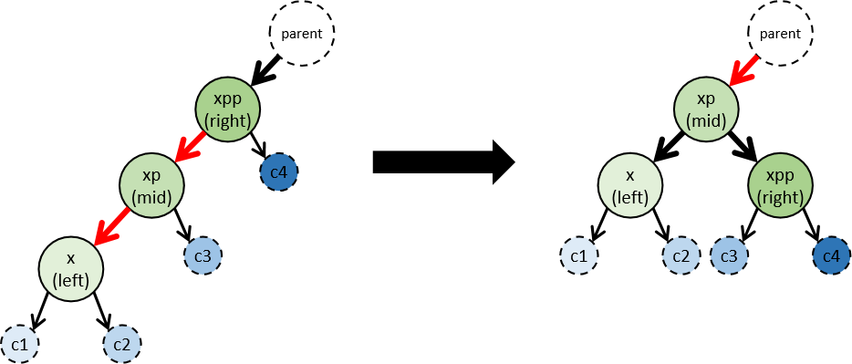
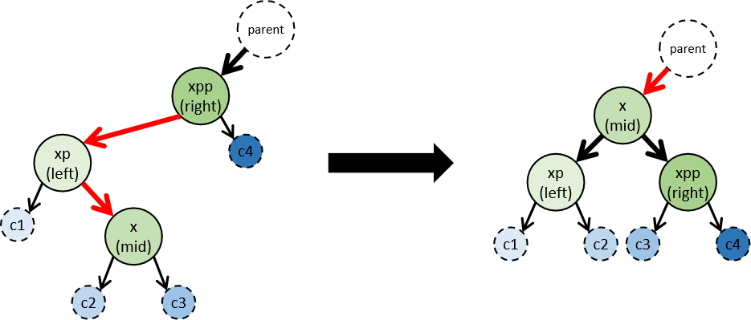
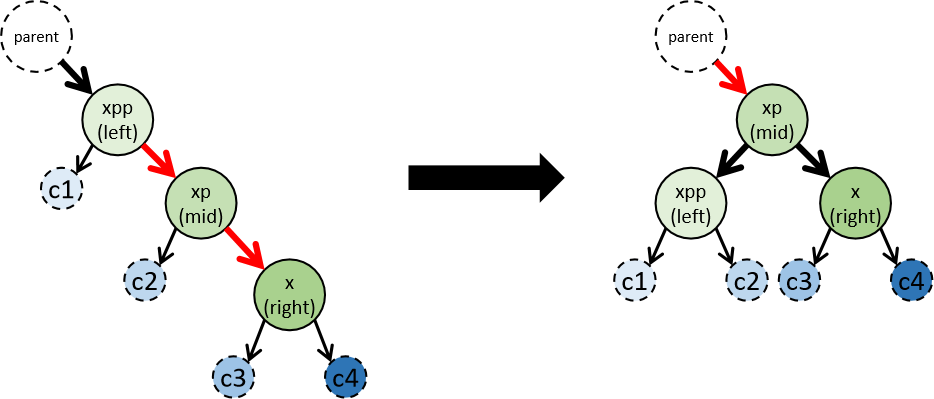
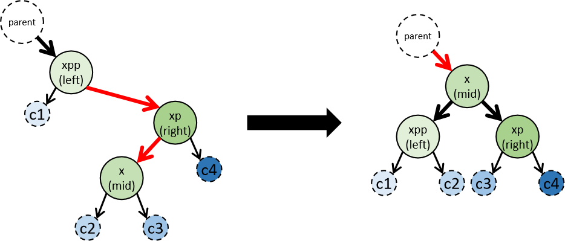

# 手撕红黑树 - 非旋转地实现插入红黑树结点

红黑树的特性:
1. 每个节点或者是黑色，或者是红色。
2. 根节点是黑色。
3. 每个叶子节点（NIL）是黑色。 [注意：这里叶子节点，是指为空(NIL或NULL)的叶子节点！]
4. **红结点的子结点都是黑色**
5. 从一个节点到该节点的子孙节点的所有路径上包含相同数目的黑节点。


## 非旋转地转换

在红黑树中插入新结点后, 需要重新进行平衡, 其转换过程可以通过一张很简单的图来总结. 其中结点上面的指针的颜色即代表了结点的颜色:


可以发现, 上图中插入新结点后只有两种情况是(`S1`, `S2`)需要平衡的. 加上镜像的情况, 总共有4种情况


这张图虽然状态很简单, 但是从插入结点到最后平衡结束, 可能需要至少旋转两次, 而旋转的代码写起来特别复杂. 那有没有**不旋转的转换方法**呢? 

我们把上图中两种插入新点的情况记为`S1`和`S2`, 然后把镜像的情况记为`S3`和`S4`. 

图中只涉及到要旋转的结点, 而我们把最上面结点的父结点及3个结点的子树也用变量标记:
- **`x, xp, xpp`**: xp是x的父结点, xpp是xp的父结点
    - 转换后的结点按左中右标记为`left, mid, right`
- **`parent`**: xpp的父结点
- **`c1, c2, c3, c4`**: `x, xp, xpp`的4颗子树

**注意**: 在不同情况下子树`c*`与结点`x*`的父子关系不同, 而`x*`与`left`/`mid`/`right`的对应关系也不同.

转换关系可以简化如下: 
`S1->T`: 


`S2->T`: 


`S3->T`: 


`S4->T`: 


我们给`{x, xp, xpp}`及`{c1, c2, c3, c4}`按照从左到右的顺序标上了颜色(这个顺序与结点key的偏序关系一致). 可以发现, 在转换后, 由浅到深的结点还是按从左到右的顺序排列, 而不会有某个浅色结点跑到深色结点的右边. 因此可以通过简单地按照颜色把对应结点联结在一起, 即可避免旋转.

上述四个转换过程只要通过一个方法就能实现:
```java
    private void rotations(TreeNode<K, V> parent,
                           TreeNode<K,V> left, TreeNode<K,V> mid, TreeNode<K,V> right,
                           TreeNode<K,V> c1, TreeNode<K,V> c2, TreeNode<K,V> c3, TreeNode<K,V> c4) {
        if (parent != null) {
            // 联结 mid 和 parent
            if (parent.left == left || parent.left == right) {
                parent.left = mid;
            } else {
                parent.right = mid;
            }
            mid.parent = parent;
            mid.red = true;
        } else {

            // parent为null, 则mid自己就是根结点
            root = mid;
            mid.parent = null;
            mid.red = false; // 根结点一定是黑的
        }

        // 联结 mid 和 left
        mid.left = left;
        left.parent = mid;

        // 联结 mid 和 right
        mid.right = right;
        right.parent = mid;

        // 将4个子树联结到正确的位置上
        left.left = c1; if (c1 != null) c1.parent = left;
        left.right = c2; if (c2 != null) c2.parent = left;
        right.left = c3; if (c2 != null) c3.parent = right;
        right.right = c4; if (c4 != null) c4.parent = right;

        // left 和 right 都变成黑结点
        left.red = right.red = false;
    }
```
通过这种方法就可以避免复杂的旋转. 

## 整体实现

结点: 
```java
    private static class TreeNode<K, V> {
        private final K key;            // key不可变
        private V value;
        private boolean red = true;     // 初始为红结点
        private TreeNode<K, V> parent;  // 方便改parent的指针

        private TreeNode<K, V> left;
        private TreeNode<K, V> right;

        public TreeNode(TreeNode<K, V> parent, K key, V value) {
            this.parent = parent;
            this.key = key;
            this.value = value;
        }
    }
```

红黑树
```java
public class RBTree<K, V> {

    private final Comparator<K> comparator;

    private TreeNode<K, V> root;

    public RBTree(Comparator<K> comparator) {
        this.comparator = comparator;
    }

    public void put(K key, V value) {

        // 根结点不存在, 直接建根结点
        if (root == null) {
            createRoot(key, value);
            return;
        }

        // 二分法找已存在结点, 或者是插入点所在的结点
        int c;
        TreeNode<K, V> p = this.root;
        while ((c = cmp.compare(key, p.key)) != 0) {
            if (c < 0) {
                if (p.left == null) break;
                p = p.left;
            } else{
                if (p.right == null) break;
                p = p.right;
            }
        }

        // 找到了已存在的结点, 更改后返回
        if (c == 0) {
            p.value = value;
            return;
        }

        // 插入新结点
        TreeNode<K, V> node = new TreeNode<>(p, key, value);
        if (c < 0) {
            p.left = node;
        } else {
            p.right = node;
        }

        // 从新结点自下而上平衡
        rebalance(node);
    }

    private void rebalance(TreeNode<K,V> x) {

        // x和x.parent都必须是红结点, 否则不用平衡
        if (x == null || !x.red) return;
        TreeNode<K, V> xp = x.parent;
        if (xp == null || !xp.red) return;

        // 
        TreeNode<K, V> xpp = xp.parent;     // 红结点xp一定有父结点, 因此xpp不可能为null
        TreeNode<K, V> xppp = xpp.parent;   // 这一行一定不会NullPointerException

        if (xpp.left == xp) {
            if (xp.right == x) {
                // 情况 - S1
                rotations(xppp, xp, x, xpp, xp.left, x.left, x.right, xpp.right);
            } else {
                // 情况 - S2
                rotations(xppp, x, xp, xpp, x.left, x.right, xp.right, xpp.right);
            }
        } else {
            if (xp.left == x) {
                // 情况 - S3
                rotations(xppp, xpp, x, xp, xpp.left, x.left, x.right, xp.right);
            } else {
                // 情况 - S4
                rotations(xppp, xpp, xp, x, xpp.left, xp.left, x.left, x.right);
            }
        }

        // 递归平衡父结点
        rebalance(x.parent);
    }

    private void rotations(TreeNode<K, V> parent,
                           TreeNode<K,V> left, TreeNode<K,V> mid, TreeNode<K,V> right,
                           TreeNode<K,V> c1, TreeNode<K,V> c2, TreeNode<K,V> c3, TreeNode<K,V> c4) {
        if (parent != null) {
            // 联结 mid 和 parent
            if (parent.left == left || parent.left == right) {
                parent.left = mid;
            } else {
                parent.right = mid;
            }
            mid.parent = parent;
            mid.red = true;
        } else {

            // parent为null, 则mid自己就是根结点
            root = mid;
            mid.parent = null;
            mid.red = false; // 根结点一定是黑的
        }

        // 联结 mid 和 left
        mid.left = left;
        left.parent = mid;

        // 联结 mid 和 right
        mid.right = right;
        right.parent = mid;

        // 将4个子树联结到正确的位置上
        left.left = c1; if (c1 != null) c1.parent = left;
        left.right = c2; if (c2 != null) c2.parent = left;
        right.left = c3; if (c2 != null) c3.parent = right;
        right.right = c4; if (c4 != null) c4.parent = right;

        // left 和 right 都变成黑结点
        left.red = right.red = false;
    }

    private void createRoot(K key, V value) {
        root = new TreeNode<>(null, key, value);
        root.parent = null;
        root.red = false;
    }

    
}

```