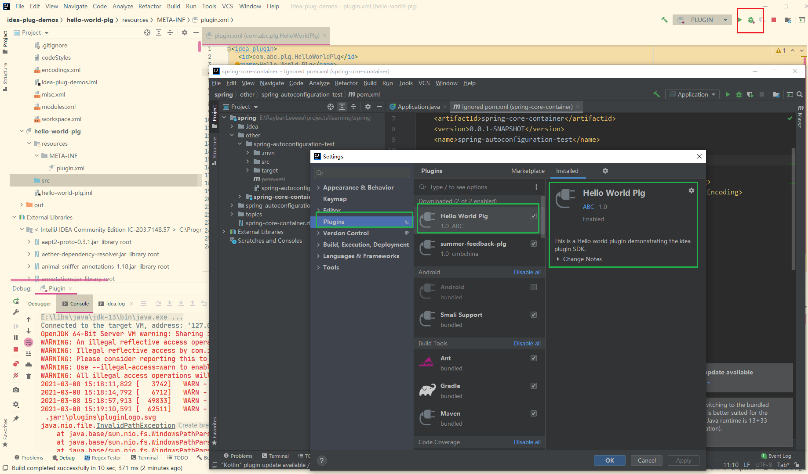

## 1. 启动第一个IDEA插件项目

按照惯例, 我们以"hello world"项目作为第一个项目

### 1.1 新建IDEA插件开发模块
1. **新建空项目**: 在文件管理器中新建一个名为"idea-plug-demos"的项目根目录, 右键-"Open Folder as Intellij IDEA Community/Ultimate Edition Project".
    - 
2. **新建IDEA插件开发模块**: 在IDEA中点"File-New-Module", 选择"IntelliJ Platform Plugin"
    - 以前未开发过SDK的话, 会提示无SDK, 点击Module SDK多选框, 选择"Add IntelliJ Platform Plugin SDK", 然后找到某个版本的IDEA目录(*可以选与当前IDEA不同的版本*).
        - 
    - 输入插件名"hello-world-plg", 点"Finish"
        - 

### 1.2 IDEA插件配置文件plugin.xml
在新建IDEA插件模块后, 会默认生成一个``META/plugin.xml``文件, 用于记录一些**插件元信息**, 并且配置插件的一些**组件bean**, 其作用类似于maven的pom.xml与Spring的xml配置文件的结合体.

<br/>

各tag的作用/语义如下
- **id**: 插件的ID,  类似于groupId + artifactId的作用. 在整个IDEA plugin的生态中, 每个插件的id是唯一的.
- **name**: 插件名. 插件发布后, 该插件将以该属性命名, 呈现在MarketPlace中, 如"Material Theme UI", "Maven Helper"等.
- **version**: 插件版本
- **vender**: 你所在的公司信息.
- **description**: 插件功能描述. 插件发布后, 该描述会呈现在MarketPlace上该插件的主页.
- **change-notes**: 当前版本的更新点.
- **idea-versions**: 适用的IDEA版本. 以"203.0"为例, 20代表2020年, 3代表2020年的第3版, 即对应2020.3.
- **depends**: 该插件依赖的其它. 
    - 其中``com.intellij.modules.platform``包括了IDEA中默认的一些插件和组件. //TODO
- **extensions**: 对已有插件(当前插件依赖的其它插件)的扩展. 可以在插件中定义一些扩展点, 当别的插件引用自己的插件时可以进行扩展.
- **actions**: Action表示由IDEA用户进行某个操作时产生的一个动作. 从插件开发者的角度来看, Action就是插件程序的入口, 类似于Controller. 

填充完"hello-world-plg"一些基本信息后得到
- 
- ``plugin.xml``的详细用法可以参考官方文档[Plugin Configuration File - plugin.xml](plugin-configuration-file)

### 1.3 编译和调试

完成上一步以后, 便可以编译和调试该插件(尽管该插件没有任何功能, 只是一个空的插件). 点击DEBUG按钮后, 会通过新建模块时指定的SDK启动一个IDEA实例(后面称为沙盒实例). 按下``Ctrl-Alt-S``或者点"File-Settings", 可以在plugins-Installed下找到当前插件.
-  

<br/>

该实例是在一个沙盒中运行的, 与开启插件用的IDEA实例是隔离的. 每个沙盒有一个单独的目录, 用于存放沙盒实例产生的缓存文件/持久化的配置文件等. 按下快捷键``Ctrl+Alt+Shift+S``或点"File-Project Structure", 在SDKs-下可以看到沙盒目录的设置.
- 

<br/>

开启调试的过程中, SDK将插件编译并打包, 然后将打包好的插件安装到一个模拟的IDEA沙盒中, 最后以该沙盒启动一个实例.

### 1.4 添加第一个Action

上述过程中启动的IDEA插件是没有任何功能的. 我们可以从一个``Action``开始开发. 

<br/>

在插件模块的src目录右键"New-Plugin DevKit-Action", 弹出以下窗口
- 

各选项含义如下:
- **Action ID**: 每个Action有唯一的ID, 因此建议直接用类名
- **Class Name**: Action的全限定类名.
- **Name**: 该属性会呈现在使用Action的地方
- **Description**: Action描述
- **Groups**: 该Action将会加到哪些Groups中. **该选项决定了Action可以在哪里触发**.
- **Keyboard Shortcuts**: 快捷键. 只有当你有足够的把握, 觉得自己开发的插件会有很多用户, 或者自用时才设置快捷键, 否则不建议.

<br>

此处将Action添加到Group "EditorPopupMenu" 中, Anchor设置为last, 表示放到该分组的最后一个.  

<br/>

点击OK后, 可以看到:
1. src目录下新建了一个名为``HelloWorldAction``的类, 并且继承``AnAction``接口
2. 在``plugin.xml``文件的``<actions>``下多了一个``<action>``, 在窗口中输入的选项都生成到该``<action>``的属性或者子结点. 我们也可以自己手动添加Action类和``plugin.xml``的``<action>``设置.
    ```xml
    <actions>
        <!-- Add your actions here -->

        <action id="com.abc.plg.hlw.action.HelloWorldAction" class="com.abc.plg.hlw.action.HelloWorldAction"
                text="HelloWorldAction" description="Hello World Action">
        <add-to-group group-id="EditorPopupMenu" anchor="last"/>
        </action>
    </actions>
    ```

<br/>

实现``HelloWorldAction``的``actionPerformed(AnActionEvent)``方法:
```java
public class HelloWorldAction extends AnAction {

    @Override
    public void actionPerformed(AnActionEvent e) {
        Messages.showInfoMessage("Hello World!", "Hello world");
    }
}
```

<br/>

点击调试. 然后打开任一文本文件, 在编辑器上右键, 可以看到刚刚开发的Action
- 

<br/>

点击"HelloWorldAction", 出现一个弹窗:
- 

### 1.5 添加Service

上面我们演示了Action. Action是IDEA实例的基本组件类型之一. 除了Action以外, 还有一种常见的类型是**Service**. 在IDEA中, Action与Service的关系可以类比Spring Boot Web应用中Controller与Service的关系. Action和Service都作为组件, 通过plugin.xml进行配置和注册, 然后在启动以后加载.

Service可以按层次分为三种类型:
- **ApplicationService**: 作用域为整个IDEA应用, 整个IDEA应用中只有一个单例. 比如, 定义``MyAppService``, 在电脑中同时启动三个IDEA窗口, 分别对应三个项目, 则这三个项目都可以访问到同一个``MyAppService``实例.
- **ProjectService**: 作用域为IDEA项目, 整个项目中只有一个单例. 比如, 定义``MyProjectService``, 在电脑中同时启动三个IDEA窗口, 分别对应三个项目, 则这三个项目分别有一个``MyProjectService``实例.
- **ModuleService**: 作用域为IDEA项目下的一个模块, 每个模块有一个实例. 比如, 定义``MyModuleService``, 在一个IDEA窗口中定义了三个模块, 则每个模块都分别有一个``MyModuleService``实例.


对应的, IDEA应用中有三种不同层次的上下文: ``Application``/``Project``/``Module``, 
- 一个``Application``上下文中可以存在多个``Project``上下文(对应不同的IDEA项目窗口), 一个``Project``上下文中可以有多个``Module``上下文
- 一个``ProjectService``可以访问到自己所在``Project``上下文中的其它``ProjectService``, 但是不能跨``Project``访问, ``ModuleService``也是同理

<br/>

以下图为例:
- ``XModuleService-1-A``可以访问到``XModuleService-1-B``, 也可以访问到所在``Project``(``Project-1``)中的``XProjService-1``, 但是访问不到``Module-1-B``中的``XModuleService-2-B``.
- 

<br/>

##### 1.5.1 创建HelloWorldService

上述``HelloWorldAction``的逻辑可以放到``Service``中, 因此我们再创建一个``HelloWorldService``.
在src目录下创建service包, 在service包右键"New-Plugin DevKit-Project Service", 弹出以下窗口
- 

<br/>

填好类名点OK后, 可以发现:
1. service包下多了一个接口``HelloWorldService``和实现类``HelloWorldServiceImpl``
2. ``plugin.xml``的``extensions``下多了个``projectService``
    ```xml
    <extensions defaultExtensionNs="com.intellij">
    <!-- Add your extensions here -->
    <projectService serviceInterface="com.abc.plg.hlw.service.HelloWorldService"
                    serviceImplementation="com.abc.plg.hlw.service.impl.HelloWorldServiceImpl"/>
  </extensions>
    ```

<br/>

同样, 我们也可以手动修改``plugin.xml``定义``projectService``.

### 1.5.2 实现HelloWorldService

``HelloWorldServiceImpl``实现如下:
-   ```java
    public class HelloWorldServiceImpl implements HelloWorldService {

        private final Project project;

        public HelloWorldServiceImpl(Project project) {
            this.project = project;
        }

        @Override
        public void helloWorld() {
            Messages.showInfoMessage("Hello World!", "Hello world");
        }
    }
    ```

``
<br/>

注意到, 生成的``HelloWorldServiceImpl``类构造器中有一个``Project``参数, 该参数用来传递该``ProjectService``类所属的``Project``上下文. 

<br/>

接口类``HelloWorldService``中也有一个静态方法用于从``Project``上下文中获取该上下文特有的``HelloWorldServiceImpl``单例:
```java
public interface HelloWorldService {
    static HelloWorldService getInstance(@NotNull Project project) {
        return ServiceManager.getService(project, HelloWorldService.class);
    }

    void helloWorld();
}
```

### 1.5.3 修改``HelloWorldAction``实现

``HelloWorldAction``的实现修改如下:
-   ```java
    public class HelloWorldAction extends AnAction {

        @Override
        public void actionPerformed(AnActionEvent e) {
            Project project = e.getProject();

            HelloWorldService hlwService = HelloWorldService.getInstance(project);
            // 或者写成:
            //    HelloWorldService hlwService = project.getService(HelloWorldService.class)

            hlwService.helloWorld();
        }
    }
    ```
然后启动调试, 结果与原来一致.

<br/>

开发第一个IDEA插件就是这么简单! 你可能觉得, 原来开发IDEA插件不过如此. 然而, 无数的坑还在前面等着你. 笔者踩过的坑见下一章.


## 2. 进阶功能 & 踩坑记录

### 2.1 引入插件

IDEA是一个很强大的IDE, 而这归功于IDEA中各种强大的插件功能. 如果我们想要开发一个属于自己的插件, 又注意到IDEA中好像已经有了类似的功能, 只是不太符合自己的需求, 那是不是可以借用IDEA原有插件中的轮子造我们自己的车? 是的, 我们可以引入现有的依赖, 包括IDEA自己提供的插件和第三方的插件. 


笔者开发过一个插件的``Service``中就用到了IDEA自带的git插件(Git4Idea)的功能. 其中``GitUserRegistry``和``GitRepositoryManager``都是Git4Idea插件中定义的组件:
-   ```java
    public class GitUtilServiceImpl implements GitUtilService {

        private final GitUserRegistry gitUserRegistry;
        private final GitRepositoryManager gitRepositoryManager;

        public GitUtilServiceImpl(Project project) {
            gitUserRegistry = GitUserRegistry.getInstance(project);
            gitRepositoryManager = GitRepositoryManager.getInstance(project);
        }

        /**
        * 列出项目下所有git仓库的git用户
        */
        @Override
        public @NotNull List<String> getAllVcsUsers() {
            List<String> gitUsers = new ArrayList<>();
            for (GitRepository repo : gitRepositoryManager.getRepositories()) {
                VcsUser vcsUser = gitUserRegistry.getUser(repo.getRoot());
                if (vcsUser != null) {
                    gitUsers.add(vcsUser.getName());
                }
            }
            return gitUsers;
        }
    }
    ```
  
<br/>

在自己的插件中引入其它插件时, 需要:
1. 将其它插件的jar包引入类路径 
    * **在SDK中加入
2. 在``plugin.xml``中进行配置, 依赖插件
    ```xml
    <depends>com.intellij.modules.platform</depends>
    <depends>Git4Idea</depends>        <!-- 追加要加的插件 -->
    ```
3. 使用插件的组件

<br/>

#### 2.1.1 踩坑记录 - 引入依赖但编译失败

对于第一步, 笔者一开始按照普通java项目引入jar包的方法:
* 按"Ctrl+shift+Alt+S"或点"File-Project Structure"点开项目结构设置, 在"Modules"中找到模块的依赖, 然后点"+"添加IDEA路径下的插件jar包.
* 

<br/>

引入依赖并且配置好plugin.xml后, 点击调试, IDEA正常启动了. 结果触发到``GitUtilServiceImpl``的实例化方法时, 一直报错:  
- 
- ```
  java.lang.ClassCastException: class git4idea.repo.GitRepositoryManager cannot be cast to class git4idea.repo.GitRepositoryManager (git4idea.repo.GitRepositoryManager is in unnamed module of loader com.intellij.ide.plugins.cl.PluginClassLoader @5d460209; git4idea.repo.GitRepositoryManager is in unnamed module of loader com.intellij.ide.plugins.cl.PluginClassLoader @6f67843b)
  ```
- 报错的原因是"``GitRepositoryManager``不能强制转换为``GitRepositoryManager``"!!! 仔细看日志, 发现两个类的全限定名是一模一样的, 但是来自不同的类加载器. 

<br/>

对于该报错, 笔者在百度上找了很久都没找到, 最后在[IDEA官方文档](https://plugins.jetbrains.com/docs/intellij/welcome.html)的[Part I / Plugin Structure / Plugin Dependencies](https://plugins.jetbrains.com/docs/intellij/plugin-dependencies.html#project-setup)下找到了解决方案:
-    
- 翻译过来就是:
    - 不能将插件jar包作为lib加入到类路径, 因为Intellij平台会加载两次.
    - **应该将插件jar包加入到SDK中**
    - 对于IDEA自带的捆绑插件, 路径在IDEA目录的``plugins/<pluginname>``或``plugins/<pluginname>/lib``
    - 对于非绑定的插件, 则放在``config/plugins/<pluginname>``或``config/plugins/<pluginname>/lib``下

因此, 正确引入插件的方法应该是:
- 


### 2.2 Gradle管理依赖
在上面的例子中, 我们通过将第三方插件加入到SDK中进行开发. 但是这种方法会使项目与IDEA耦合, 因为**依赖的管理是由IDE负责的**, 依赖关系是保存在IDE的配置文件中的. 我们会更希望使用maven或gradle来管理项目的依赖, 而不是用IDE管理.

<br/>

IDEA官方是建议使用gradle来管理插件的依赖, 以及对其它非插件类的第三方jar包(如Jackson, lombok等)的依赖.

#### 2.2.1 创建Gradle管理的IDEA插件开发项目

IDEA除了普通的DevKit项目模块, 也提供了由Gradle管理的IDEA插件开发项目模块:
1. 点"File-New-Module", 选择"Gradle", 勾选"Intellij Platform Plugin", 点击Next
    - 
2. 设置项目名, groupId, artifactId等基本信息, 点Finish.
    - 

<br/>
**对于没有Gradle使用经验的开发者来说, 开发IDEA插件时, 一大半的坑都在Gradle上.**

#### 2.2.2 踩坑记录 - IDEA的Gradle插件

经常用IDEA中开发maven项目的开发者应该知道, IDEA中是可以配置maven的一些全局配置(即与特定项目无关的配置), 包括maven根目录, settings.xml, 仓库目录等, 可以在新建或者导入项目之前选择maven的版本. 

<br/>

然而, 在IDEA中使用gradle并不是很友好 -- IDEA默认通过``<module>/gradle/gradle-wrapper.properties``来指定该项目使用的gradle版本, 并且在新建好Gradle项目以后便生成该配置文件, 默认选择一个指定版本的, 并且**立即自动开始下载该版本到``GRADLE_USER_HOME/dist``目录下, 完全不给用户选择的余地**.
- 

<br/>

该机制带来了几个问题:
1. 用户不能默认使用自己安装的Gradle
2. 重复下载Gradle浪费空间
3. 对于墙内的用户, 该下载过程及其慢

<br/>

解决该问题有几个办法:
1. 通过"科学上网"等手段加快下载速度, 然后接受使用IDEA强推的gradle版本.
    - 可以修改``<module>/gradle/gradle-wrapper.properties``中的url, 将gradle版本改成自己指定的版本, 如``.../gradle-6.7-bin.zip``改成``.../gradle-6.8.1.zip``
2. 在创建完gradle项目后, 强制停止加载过程, 然后打开设置("Ctrl+Alt+S")找到Gradle, 将"Use Gradle from"改成"Specified location", 使用自定义的Gradle.
    - 

#### 2.2.3 开发IDEA插件时的Gradle配置

[2.2.1小节](#221-创建gradle管理的idea插件开发项目)中创建的Gradle项目中, 生成了``build.gradle``, 其中对于插件开发SDK和IDEA插件依赖的管理可以在``build.gradle``上进行配置:
- 
- 各配置项的含义如下:
    - ``plugins``: 该``plugins``指的是gradle的插件, 在编译构建gradle项目时用到. 其中``org.jetbrains.intellij``专门用来开发调试IDEA插件
    - ``intellij``: ``org.jetbrains.intellij``定义的属性, 用于指定开发调试IDEA插件时的一些选项, 包括SDK版本, SDK路径, 要引入的插件等
    - ``dependencies``: 要依赖的第三方jar包, 将会引入到类路径中
    - ``patchPluginXml.changeNote``: 版本变更信息

``intellij``中的详细配置可以参考官方github中的[gradle-intellij-plugin](https://github.com/JetBrains/gradle-intellij-plugin#setup-dsl)

#### 2.2.4 踩坑记录 - IDEA SDK下载
使用Gradle管理IDEA插件开发项目时, 如果没有在``intellij.localPath``中指定本地的SDK目录, 则会自动下载指定SDK版本到本地gradle仓库中, 但是这个下载的过程也是很慢, 并且SDK文件也比较大. 

<br/>

笔者在了解了Gradle的本地仓库结构后找到了下列方法:
1. 离线下载指定版本SDK的jar, source, pom文件
    - 仓库地址为[https://www.jetbrains.com/intellij-repository/releases](https://www.jetbrains.com/intellij-repository/releases)
    - 
2. 在``GRADLE_USER_HOME/caches/modules-2/files-2.1``目录下新建文件夹``com.jetbrains.intellij.idea/ideaIC/<version>``, 其中``<version>``如``2020.3.2``
    - gradle本地仓库中, jar包及其源码和pom放在``<groupId>/<artifactId>/<version>``下, 与maven中树状划分的方案不同
3. 计算jar, source, pom文件的sha1, 然后以sha1码在``<groupId>/<artifactId>/<version>``下创建3个文件夹. **如果某个sha1码以0开头, 则要把0给去掉**.
    - 在windows中有自带的校验码生成工具certutil, 可以在cmd中使用certutil, 如:
        ```cmd
        certutil -hashfile ./ideaIC-2019.2.3.zip sha1
        certutil -hashfile ./ideaIC-2019.2.3-sources.jar sha1
        certutil -hashfile ./ideaIC-2019.2.3.pom sha1
        ```
4. 将jar, source, pom文件分别放在对应sha1码的文件夹下
5. 更新idea中的gradle配置, gradle会识别到已下载好的jar, source, pom文件

相比于maven, gradle的本地仓库多了sha1码这一层, 离线下载jar包会比较麻烦.

对于其它依赖的jar包下载速度慢的问题, 可以通过配置国内gradle镜像的方法解决, 具体参考[网上解决方案](https://www.baidu.com/s?wd=gradle%E9%95%9C%E5%83%8F), 此处不再赘述.

#### 2.2.5 插件选择
上述我们提到, 可以依赖现有的插件进行开发, 那么**怎样发现已有的插件功能**, **怎么使用已有插件的功能**? 对于这两个问题, 笔者还没有好的方法, 只能提供几个建议:
1. IDEA自带的插件在IDEA目录下的``plugins``目录中, 文件夹名即是插件名, 如"git4idea", 这些都比较容易使用. 其中有一些是集成在SDK中的, 另一些需要在plugin.xml和gradle.build中显式引入, 如"git4idea".
2. 如果需要用到某个已有功能, 如git插件时, 回想一下在使用IDEA的时候, 从哪里点进去会触发该功能的Action, 然后通过IDEA强大的检索功能, 在``AnAction``的实现类中搜索可能的关键词. 前提是**相关插件已经被引入**, 并且有对应的**source**包. (在存在**source**包的时候, IDEA的索引功能会更强大).
3. 阅读插件包的类的代码注释. 前提是**相关插件已经被引入**, 并且有对应的**source**包.
    - 
3. 没事多去刷刷[官方文档](https://plugins.jetbrains.com/docs/intellij/welcome.html), 说不定能解决你的问题.
## 参考页面

[官方github](https://github.com/JetBrains/gradle-intellij-plugin)  
[IntelliJ Platform Plugin SDK官方文档](https://plugins.jetbrains.com/docs/intellij/welcome.html)  
[SDK仓库](https://www.jetbrains.com/intellij-repository/releases/)  