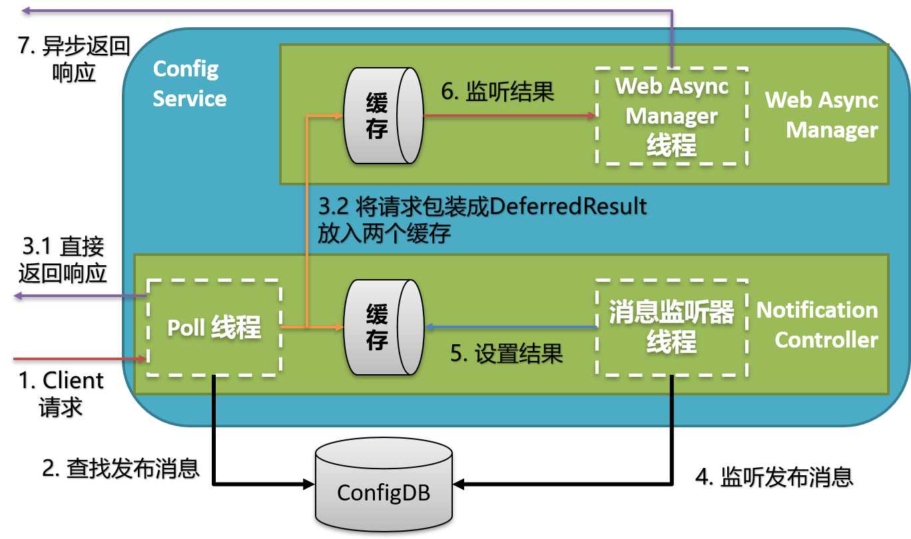

## NotificationControllerV2

作用:
1. 线程1 - controller: 接收客户端long poll请求, 同步或异步返回
    1. 客户端在请求中, 包含多个notification
        * 每个notification对应一个namespace名, 并且带有一个notificationId, 说明客户端手上的该namespace的版本
    2. 根据最近发布的releaseMessage, 判断客户端指定的namespace是否更新, 有则直接同步返回新的notification
    3. 如果无更新, 则将客户请求包装成DeferredResult, 放到cache中, 由**ReleaseMessageListener线程**与**Web Async Manager线程**异步处理
2. 线程2 - ReleaseMessageListener: 监听到数据库中有新的ReleaseMessage时, handleMessage()方法被调用
    1. 根据releaseMessage的内容(即更改的命名空间的标识app > cluster > nmspc), 在cache中找到对应的DeferredResult, 设置其结果
3. 线程3 - Web Async Manager: *该线程由spring框架隐式实现*
    1. 线程1中返回DeferredResult后, 框架判断其返回值类型, 开始监听DeferredResult中的结果
    2. 如果在60s内, DeferredResult中的结果被线程2设置, 则调用完成回调方法(onCompletion()), 从cache中移除当前DeferredResult, 返回新的notification
    3. 如果超时(60s), 则调用DeferredResult的超时回调方法(onTimeout()), 从cache中移除当前DeferredResult, 并返回304


```java

package com.ctrip.framework.apollo.configservice.controller;

// import ...

/**
 * @author Jason Song(song_s@ctrip.com)
 */
@RestController
@RequestMapping("/notifications/v2")
public class NotificationControllerV2 implements ReleaseMessageListener {
  private static final Logger logger = LoggerFactory.getLogger(NotificationControllerV2.class);

  /**
    deferredResult:
    * pollNotification收到用户请求时, 生成deferredResults放到deferredResults中
    * 收到通知配置修改的releaseMessage时, messageHandler()方法从deferredResults从取得DeferredResultWrapper, 将HTTP响应返回给客户端
  */
  private final Multimap<String, DeferredResultWrapper> deferredResults =
      Multimaps.synchronizedSetMultimap(HashMultimap.create());
  private static final Splitter STRING_SPLITTER =
      Splitter.on(ConfigConsts.CLUSTER_NAMESPACE_SEPARATOR).omitEmptyStrings();
  private static final Type notificationsTypeReference =
      new TypeToken<List<ApolloConfigNotification>>() {
      }.getType();

  /**
    该线程池用来在需要返回的HTTP响应较多时, 用来异步批量发送响应
  */
  private final ExecutorService largeNotificationBatchExecutorService;

  private final WatchKeysUtil watchKeysUtil;
  private final ReleaseMessageServiceWithCache releaseMessageService;
  private final EntityManagerUtil entityManagerUtil;
  private final NamespaceUtil namespaceUtil;
  private final Gson gson;
  private final BizConfig bizConfig;


  @Autowired
  public NotificationControllerV2(
      final WatchKeysUtil watchKeysUtil,
      final ReleaseMessageServiceWithCache releaseMessageService,
      final EntityManagerUtil entityManagerUtil,
      final NamespaceUtil namespaceUtil,
      final Gson gson,
      final BizConfig bizConfig) {
    largeNotificationBatchExecutorService = Executors.newSingleThreadExecutor(ApolloThreadFactory.create
        ("NotificationControllerV2", true));
    this.watchKeysUtil = watchKeysUtil;
    this.releaseMessageService = releaseMessageService;
    this.entityManagerUtil = entityManagerUtil;
    this.namespaceUtil = namespaceUtil;
    this.gson = gson;
    this.bizConfig = bizConfig;
  }

  @GetMapping
  public DeferredResult<ResponseEntity<List<ApolloConfigNotification>>> pollNotification(
      @RequestParam(value = "appId") String appId,                              // 客户端的appId
      @RequestParam(value = "cluster") String cluster,                          // 客户端的集群 
      @RequestParam(value = "notifications") String notificationsAsString,      // 一个notification对客户端监听的一个namespace名, 并且有notificationId用于判断是否过期
      @RequestParam(value = "dataCenter", required = false) String dataCenter,  // 客户端的备用数据中心
      @RequestParam(value = "ip", required = false) String clientIp) {          // 客户端IP
    List<ApolloConfigNotification> notifications = null;

    // notifications对象转换, 并检查是否为空
    try {
      notifications =
          gson.fromJson(notificationsAsString, notificationsTypeReference);
    } catch (Throwable ex) {
      Tracer.logError(ex);
    }
    if (CollectionUtils.isEmpty(notifications)) {
      throw new BadRequestException("Invalid format of notifications: " + notificationsAsString);
    }

    // 
    DeferredResultWrapper deferredResultWrapper = new DeferredResultWrapper();
    Set<String> namespaces = Sets.newHashSet();
    Map<String, Long> clientSideNotifications = Maps.newHashMap();

    // 生成映射: namespace名(大小写纠正后的) -> notification
    // * 用户可能把同一个namespace名的不同大小写形式视为不同的namespace,
    //   因此要纠正成原来的namespace名, 并去除重复.
    Map<String, ApolloConfigNotification> filteredNotifications = filterNotifications(appId, notifications);

    // 遍历Entry: namespace名(大小写纠正后的) -> notification
    // * 生成映射: namespace名(大小写纠正后的) -> notificationId
    for (Map.Entry<String, ApolloConfigNotification> notificationEntry : filteredNotifications.entrySet()) {
      String normalizedNamespace = notificationEntry.getKey();
      ApolloConfigNotification notification = notificationEntry.getValue();
      namespaces.add(normalizedNamespace);
      clientSideNotifications.put(normalizedNamespace, notification.getNotificationId());

      // 如果客户端给的namespace名大小写不对, 则要记录 namespaceName(客户端给的) -> namespaceName(纠正后的)
      // * 记录到deferredResultWrapper中, 后续会用到
      if (!Objects.equals(notification.getNamespaceName(), normalizedNamespace)) {
        deferredResultWrapper.recordNamespaceNameNormalizedResult(notification.getNamespaceName(), normalizedNamespace);
      }
    }

    if (CollectionUtils.isEmpty(namespaces)) {
      throw new BadRequestException("Invalid format of notifications: " + notificationsAsString);
    }

    // 生成映射: namespace名(纠正后) -> 客户端监视的 key(即namespace标识: app > cluster > nmspc)
    // * 客户端只给namespace名, 而不知道namespace所在的集群, 
    //         也可能不知道namespace所在的app (对于公有的namespace)
    // * 下面的方法就负责根据客户端信息(clientAppId, clientCluster, dataCenter)
    //         与namespace名, 找到具体的app > cluster > nmspc, 包括
    //     1. app > cluster > nmspc
    //     2. app > default > nmspc
    //     3. app > dataCenter > nmspc
    Multimap<String, String> watchedKeysMap =
        watchKeysUtil.assembleAllWatchKeys(appId, cluster, namespaces, dataCenter);

    // 获取所有watchkeys的与最新版本号(即releaseMessage的消息ID)关联的releaseMessage, 用于刷新notificationId
    Set<String> watchedKeys = Sets.newHashSet(watchedKeysMap.values());
    // findLatestReleaseMessagesGroupByMessages方法输入key集, 输出的releaseMessage集实质上保存了消息ID与消息内容(即key)
    // 该方法的意义在于, 筛选出watchKeys中, 产生了最新消息的部分key
    List<ReleaseMessage> latestReleaseMessages =
        releaseMessageService.findLatestReleaseMessagesGroupByMessages(watchedKeys);

    /**
     * Manually close the entity manager.
     * Since for async request, Spring won't do so until the request is finished,
     * which is unacceptable since we are doing long polling - means the db connection would be hold
     * for a very long time
     */
    // 通过显式关闭EntityManager来关闭数据库连接
    // 对于异步请求, spring只有当request完成时才会关闭数据库连接, 而这里使用长连接
    // 后续用不到数据库, 因此可以提前关闭连接
    entityManagerUtil.closeEntityManager();

    // 根据最新的releaseMessage的消息ID与客户端的notificationId比较, 判断配置(app > cluster > nmspc)是否更新
    // 如果客户端的版本不是最新, 则要:
    //   * 把新的notifications放在newNotifications中
    //   * 通过newNotifications告诉客户端namespace的最新notificationId
    //   * 以及更新过的配置(app > cluster > nmspc)的当前版本
    List<ApolloConfigNotification> newNotifications =
        getApolloConfigNotifications(namespaces, clientSideNotifications, watchedKeysMap,
            latestReleaseMessages);

    // 如果newNotifications不为空, 说明有namespace被更新
    // 直接将newNotifications放到deferredResultWrapper中
    // * deferedResultWrapper被设置结果后, spring会自动执行onCompletion定义的回调函数, 然后返回HTTP响应
    if (!CollectionUtils.isEmpty(newNotifications)) {
      deferredResultWrapper.setResult(newNotifications);
    } else {

      // 定义超时后的处理
      // * deferredResultWrapper中包装了一个DeferredResult 
      // * deferredResultWrapper指定了timeout时间
      // * 以及timeout后的返回的HTTP状态为NOT_MODIFIED
      deferredResultWrapper.onTimeout(() -> 
        logWatchedKeys(watchedKeys, "Apollo.LongPoll.TimeOutKeys")
      );

      // 定义完成后的处理: 从deferredResults中移除 deferredResultWrapper, 防止被重复处理
      // * deferredResultWrapper 是线程案例的Map, remove操作不会造成并发问题
      deferredResultWrapper.onCompletion(() -> {
        //unregister all keys
        for (String key : watchedKeys) {
          deferredResults.remove(key, deferredResultWrapper);
        }
        logWatchedKeys(watchedKeys, "Apollo.LongPoll.CompletedKeys");
      });

      // 这一GET请求中的所有namespace名对应的所有watchedKeys都关联到同一deferredResultWrapper
      // * 只要watchkey中任一key发生变动, handleMessage()方法都能根据key找到deferredResultWrapper
      //          然后返回请求给指定的客户端
      // * 同一个key也可能被多个客户端watch, 所以deferredResultWrapper是多值map
      // * 比如, 请求中有命名空间名nmspc1与nmspc2
      //         则产生消息appId+clusterName+nmspc1或appId+clusterName+nmspc2
      //         对应的结果(新的notifications)都会放到deferredResultWrapper中, 返回响应
      for (String key : watchedKeys) {
        this.deferredResults.put(key, deferredResultWrapper);
      }

      logWatchedKeys(watchedKeys, "Apollo.LongPoll.RegisteredKeys");
      logger.debug("Listening {} from appId: {}, cluster: {}, namespace: {}, datacenter: {}",
          watchedKeys, appId, cluster, namespaces, dataCenter);
    }

    return deferredResultWrapper.getResult();
  }

  /**
    预处理notification中的namespace名, 生成映射: 纠正过大小写的命名空间名(即数据库中读取的命名空间名) -> notification, 作用包括
    1. 去.properties后缀
    2. 大小写转换, 如 FX.apollo <-> fx.apollo
    3. 解决大小写造成的notificationId冲突
      * 如客户端的请求中 ID(FX.appollo) = 1, 而ID(fx.appollo) = 2, 则忽略大的ID

    客户发过来的notifications中的命名空间名可能是重复的(空间名不同, 但忽略大小写后相同)
    该方法主要针对命名空间名, 对notifications进行去重
  */
  private Map<String, ApolloConfigNotification> filterNotifications(String appId,
      List<ApolloConfigNotification> notifications) {
    Map<String, ApolloConfigNotification> filteredNotifications = Maps.newHashMap();
    for (ApolloConfigNotification notification : notifications) {
      if (Strings.isNullOrEmpty(notification.getNamespaceName())) {
        continue;
      }
      // 去掉.properties后缀
      String originalNamespace = namespaceUtil.filterNamespaceName(notification.getNamespaceName());
      notification.setNamespaceName(originalNamespace);

      // fix the character case issue, such as FX.apollo <-> fx.apollo
      // 纠正方法: 在数据库中找到原始的命名空间名进行替换
      // normlizedNamespace: 根据appId与客户端给的originalNamespace查找到的数据库中保存的命名空间名(包含大小写)
      String normalizedNamespace = namespaceUtil.normalizeNamespace(appId, originalNamespace);

      // in case client side namespace name has character case issue and has difference notification ids
      // such as FX.apollo = 1 but fx.apollo = 2, we should let FX.apollo have the chance to update its notification id
      // which means we should record FX.apollo = 1 here and ignore fx.apollo = 2
      // 假设有两个大小写不同, 但忽略大小写后相同的命名空间名. 如果这两个的notificationId不同, 则统一取最小的
      if (filteredNotifications.containsKey(normalizedNamespace) &&
          filteredNotifications.get(normalizedNamespace).getNotificationId() < notification.getNotificationId()) {
        continue;
      }

      filteredNotifications.put(normalizedNamespace, notification);
    }
    return filteredNotifications;
  }

  /**
    根据最新的releaseMessege来判断要不要为namespaces生成新的notifications
  */
  private List<ApolloConfigNotification> getApolloConfigNotifications(Set<String> namespaces,
      Map<String, Long> clientSideNotifications,
      Multimap<String, String> watchedKeysMap,
      List<ReleaseMessage> latestReleaseMessages) {

    // 从releaseMessage中, 将最新的releaseMessage消息ID放到lastestNotifications
    // lastestNotifications: key -> 最新的notificationId
    List<ApolloConfigNotification> newNotifications = Lists.newArrayList();
    if (!CollectionUtils.isEmpty(latestReleaseMessages)) {
      Map<String, Long> latestNotifications = Maps.newHashMap();
      for (ReleaseMessage releaseMessage : latestReleaseMessages) {
        latestNotifications.put(releaseMessage.getMessage(), releaseMessage.getId());
      }

      for (String namespace : namespaces) {
        long clientSideId = clientSideNotifications.get(namespace);

        // namespace对应的多个集群的配置(cluster, default与dataCenter), 其notificationId/releaseId可能不一致
        // 要在其中找到最大的, 即lastetId
        long latestId = ConfigConsts.NOTIFICATION_ID_PLACEHOLDER;
        Collection<String> namespaceWatchedKeys = watchedKeysMap.get(namespace); 
        for (String namespaceWatchedKey : namespaceWatchedKeys) {
          long namespaceNotificationId =
              latestNotifications.getOrDefault(namespaceWatchedKey, ConfigConsts.NOTIFICATION_ID_PLACEHOLDER);
          if (namespaceNotificationId > latestId) {
            latestId = namespaceNotificationId;
          }
        }

        // 如果当前namespace的latestId比客户端给的notificationId更大(即客户端持有的配置已经过期)
        // 则创建新的notification(包含namespace及其latestId), 加入以下信息:
        // * 发生更新的namespace(客户端给定的namespace名, 如果用纠正过的, 客户端可能找不到)
        // * 该namespace的notificationId
        // * notification的消息字段中说明发生变更的, 是具体哪些cluster下的namespace
        if (latestId > clientSideId) {
          ApolloConfigNotification notification = new ApolloConfigNotification(namespace, latestId);
          namespaceWatchedKeys.stream()
              .filter(latestNotifications::containsKey)             // 从namespace对应的watchKeys集中, 选出产生了最新变更的
              .forEach(namespaceWatchedKey -> 
                notification.addMessage(
                  namespaceWatchedKey, 
                  latestNotifications.get(namespaceWatchedKey)      // 在新的notification中, 加入namespace的不同集群的notificationId信息
                )
              );
          newNotifications.add(notification);                       // 一个notification对应一个namespace
        }
      }
    }
    return newNotifications;
  }

  /**
     每当有releaseMessage时, 该方法负责根据releaseMessage的key找到监听该key的客户端请求, 将结果(notifications)放在响应中返回 
  */
  @Override
  public void handleMessage(ReleaseMessage message, String channel) {
    logger.info("message received - channel: {}, message: {}", channel, message);
    // 查找消息内容(即key(appId+clusterName+namespaceName))
    String content = message.getMessage();
    Tracer.logEvent("Apollo.LongPoll.Messages", content);
    if (!Topics.APOLLO_RELEASE_TOPIC.equals(channel) || Strings.isNullOrEmpty(content)) {
      return;
    }

    // 从发布消息中提取被更改的命名空间名
    String changedNamespace = retrieveNamespaceFromReleaseMessage.apply(content);

    if (Strings.isNullOrEmpty(changedNamespace)) {
      logger.error("message format invalid - {}", content);
      return;
    }

    // 如果没有客户端监听该key(appId+cluster+namespace)则返回
    if (!deferredResults.containsKey(content)) {
      return;
    }

    // 原文注释: create a new list to avoid ConcurrentModificationException
    // 取出监视消息key的所有客户端请求对应的deferredResult(可能有多个客户端监视同一个key)
    List<DeferredResultWrapper> results = Lists.newArrayList(deferredResults.get(content));

    // 创建新的notification, 加入以下信息:
    // * 发生更新的namespace(客户端给定的namespace名, 如果用纠正过的, 客户端可能找不到)
    // * 该namespace的notificationId
    // * notification的消息字段中说明发生变更的, 是具体哪个cluster下的namespace
    ApolloConfigNotification configNotification = new ApolloConfigNotification(changedNamespace, message.getId());
    configNotification.addMessage(content, message.getId());

    // 如果notifications太多(大于批次), 则异步发送, 并且隔一段时间(默认100ms)发一批(默认100个)
    if (results.size() > bizConfig.releaseMessageNotificationBatch()) {
      largeNotificationBatchExecutorService.submit(() -> {
        logger.debug("Async notify {} clients for key {} with batch {}", results.size(), content,
            bizConfig.releaseMessageNotificationBatch());
        for (int i = 0; i < results.size(); i++) {
          if (i > 0 && i % bizConfig.releaseMessageNotificationBatch() == 0) {
            try {
              TimeUnit.MILLISECONDS.sleep(bizConfig.releaseMessageNotificationBatchIntervalInMilli());
            } catch (InterruptedException e) {
              //ignore
            }
          }
          logger.debug("Async notify {}", results.get(i));
          results.get(i).setResult(configNotification);
        }
      });
      return;
    }

    logger.debug("Notify {} clients for key {}", results.size(), content);

    // 如果notifications不多, 则直接同步发送
    for (DeferredResultWrapper result : results) {
      result.setResult(configNotification);
    }
    logger.debug("Notification completed");
  }

  /**
    从releaseMessage{appId+cluster+namespace}中提取命名空间名
  */
  private static final Function<String, String> retrieveNamespaceFromReleaseMessage =
      releaseMessage -> {
        if (Strings.isNullOrEmpty(releaseMessage)) {
          return null;
        }
        List<String> keys = STRING_SPLITTER.splitToList(releaseMessage);
        //message should be appId+cluster+namespace
        if (keys.size() != 3) {
          logger.error("message format invalid - {}", releaseMessage);
          return null;
        }
        return keys.get(2);
      };

  private void logWatchedKeys(Set<String> watchedKeys, String eventName) {
    for (String watchedKey : watchedKeys) {
      Tracer.logEvent(eventName, watchedKey);
    }
  }
}


```

## 工具类WatchKeysUtil

WatchKeysUtil
* 全限定名: com.ctrip.framework.apollo.configservice.util.WatchKeysUtil
* 作用: 根据客户端信息(appId, clusterName, dataCenter), 以及客户端给定的namespace名, 找到客户端监视的key(即配置的标识, app > cluster > nmspc)
    * 服务:
        * 根据客户端信息及客户端请求的Namespace名, 生成watchKey集
        * 根据客户端信息及客户端请求的多个namespace名, 生成映射: namespace名 -> watchKey集
* 公有方法:
    ```java
    /**
      为一个命名空间生成watchKey集
    */
    Set<String> assembleAllWatchKeys(
      String appId, 
      String clusterName, 
      String namespace,
      String dataCenter
    )

    /**
      为多个命名空间生成映射 Namespace名 -> watchKey集
    */
    MultiMap<String, String> assembleAllWatchKeys(
      String appId, 
      String clusterName, 
      Set<String> namespaces,
      String dataCenter
    )
    ```
## 工具类DeferredResultWrapper

DeferredResultWrapper
* 全限定名: com.ctrip.framework.apollo.configservice.wrapper.DeferredResultWrapper
* 作用: 包装一个Result, 使其既可以返回List<ApolloConfigNotification>, 也可以返回ApolloConfigNotification, 同时对notification中的命名空间进行转换
```java
package com.ctrip.framework.apollo.configservice.wrapper;

// import ...

/**
 * @author Jason Song(song_s@ctrip.com)
 */
public class DeferredResultWrapper {
    private static final long TIMEOUT = 60 * 1000;//60 seconds
    private static final ResponseEntity<List<ApolloConfigNotification>>
            NOT_MODIFIED_RESPONSE_LIST = new ResponseEntity<>(HttpStatus.NOT_MODIFIED);

    /**
      normalizedNamespaceName -> originalNamespaceName
      小写化的命名空间名 -> 客户端给的原始的命名空间名
    */
    private Map<String, String> normalizedNamespaceNameToOriginalNamespaceName;
    private DeferredResult<ResponseEntity<List<ApolloConfigNotification>>> result;

    public DeferredResultWrapper() {
        result = new DeferredResult<>(TIMEOUT, NOT_MODIFIED_RESPONSE_LIST);
    }

    public void recordNamespaceNameNormalizedResult(String originalNamespaceName, String normalizedNamespaceName) {
        if (normalizedNamespaceNameToOriginalNamespaceName == null) {
            normalizedNamespaceNameToOriginalNamespaceName = Maps.newHashMap();
        }
        normalizedNamespaceNameToOriginalNamespaceName.put(normalizedNamespaceName, originalNamespaceName);
    }

    public void onTimeout(Runnable timeoutCallback) {
        result.onTimeout(timeoutCallback);
    }

    public void onCompletion(Runnable completionCallback) {
        result.onCompletion(completionCallback);
    }


    public void setResult(ApolloConfigNotification notification) {
        setResult(Lists.newArrayList(notification));
    }

    /**
     * The namespace name is used as a key in client side, so we have to return the original one instead of the correct one
     * 将notifications中, 可能有大小写问题的命名空间名, 转成数据库中原始的命名空间名(包含大小写的)
     */
    public void setResult(List<ApolloConfigNotification> notifications) {
        if (normalizedNamespaceNameToOriginalNamespaceName != null) {
            notifications.stream()
              .filter( notification -> 
                normalizedNamespaceNameToOriginalNamespaceName.containsKey(notification.getNamespaceName())
              ).forEach(notification -> 
                notification.setNamespaceName(
                  normalizedNamespaceNameToOriginalNamespaceName.get(notification.getNamespaceName())
                )
              );
        }

        result.setResult(new ResponseEntity<>(notifications, HttpStatus.OK));
    }

    public DeferredResult<ResponseEntity<List<ApolloConfigNotification>>> getResult() {
        return result;
    }
}


```