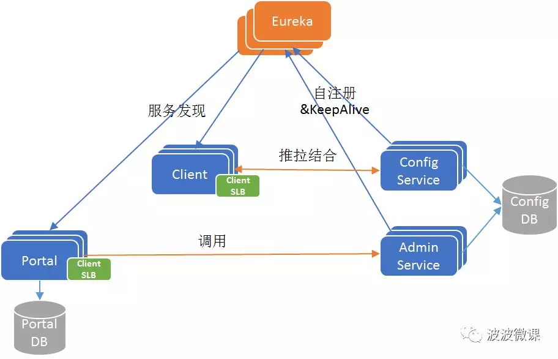
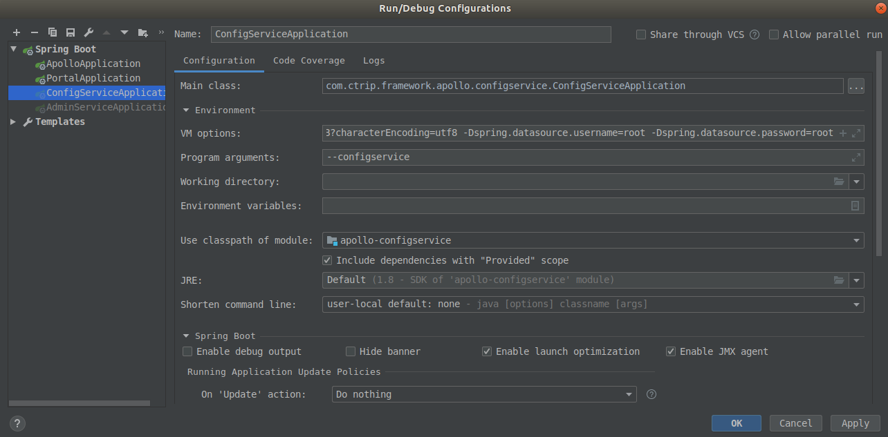
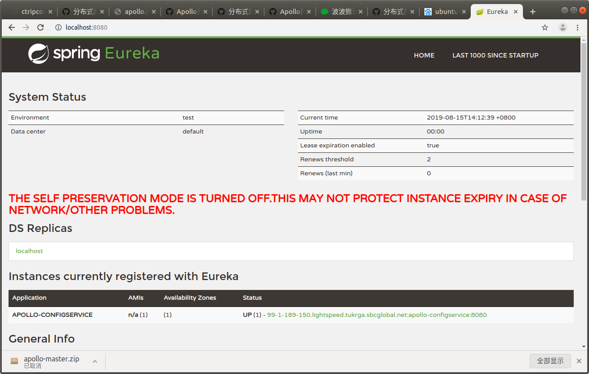
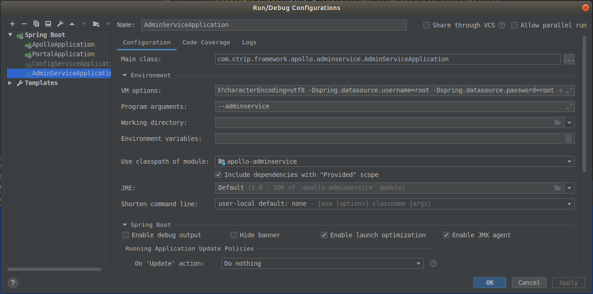
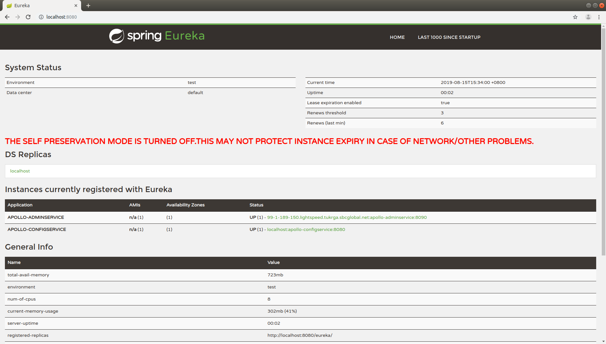
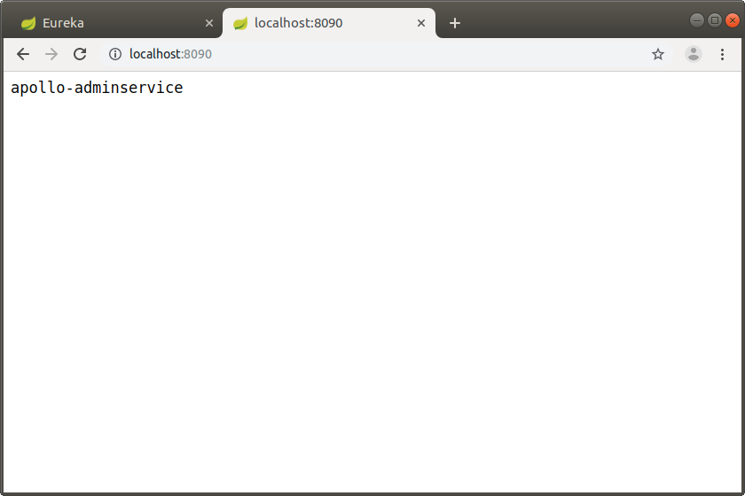
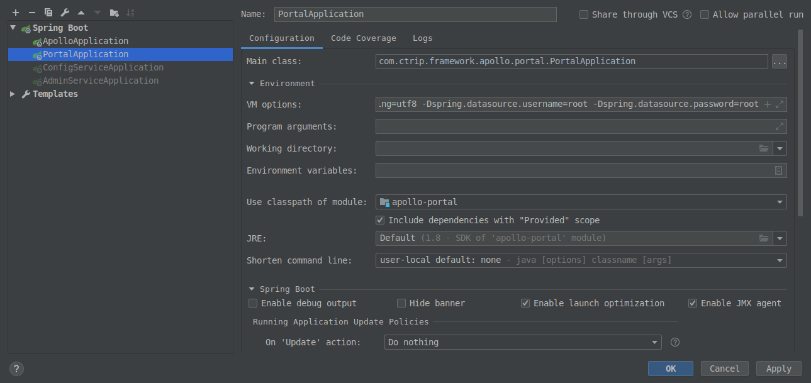
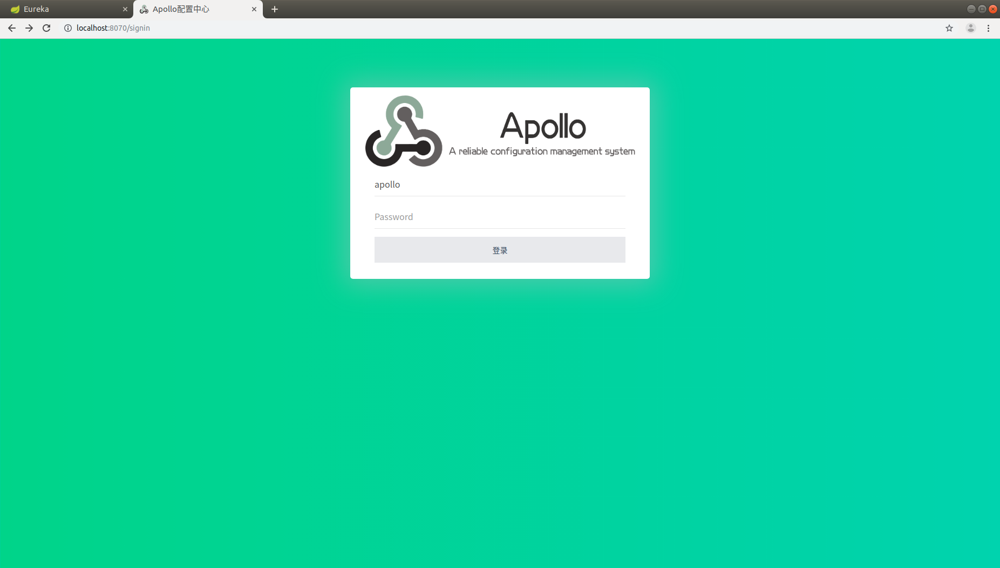

# Apollo项目启动过程与踩坑记录

## 参考文献:
1. [Apollo配置中心设计](https://github.com/ctripcorp/apollo/wiki/Apollo%E9%85%8D%E7%BD%AE%E4%B8%AD%E5%BF%83%E8%AE%BE%E8%AE%A1)
2. [Apollo使用指南](https://github.com/ctripcorp/apollo/wiki/Apollo%E4%BD%BF%E7%94%A8%E6%8C%87%E5%8D%97)
3. [分布式部署指南](https://github.com/ctripcorp/apollo/wiki/%E5%88%86%E5%B8%83%E5%BC%8F%E9%83%A8%E7%BD%B2%E6%8C%87%E5%8D%97)
4. [Java客户端使用指南](https://github.com/ctripcorp/apollo/wiki/Java%E5%AE%A2%E6%88%B7%E7%AB%AF%E4%BD%BF%E7%94%A8%E6%8C%87%E5%8D%97)


## 1. 准备工作

* 项目源代码: [apollo-1.4.0](https://github.com/ctripcorp/apollo/archive/master.zip)
* JDK: 1.8+
* MySQL: 5.6.5+
    * 需要导入以下建表语句:
        * [apolloportaldb.sql](https://github.com/ctripcorp/apollo/blob/master/scripts/db/migration/portaldb/V1.0.0__initialization.sql)
        * [apolloconfigdb.sql](https://github.com/ctripcorp/apollo/blob/master/scripts/db/migration/configdb/V1.0.0__initialization.sql)
    * 参考: [分布式部署指南-2.1创建数据库](https://github.com/ctripcorp/apollo/wiki/%E5%88%86%E5%B8%83%E5%BC%8F%E9%83%A8%E7%BD%B2%E6%8C%87%E5%8D%97#21-%E5%88%9B%E5%BB%BA%E6%95%B0%E6%8D%AE%E5%BA%93)

## 2. 先验知识
参考:
* [微服务架构~携程Apollo配置中心架构剖析](https://mp.weixin.qq.com/s/-hUaQPzfsl9Lm3IqQW3VDQ)


Apollo配置中心主要包括以下角色
* **Config Service**: 提供配置的读取、推送等服务，服务于Client
    * 需要注册到Eureka
* **Admin Service**: 提供配置的修改、发布等服务，服务于Portal
    * 需要注册到Eureka
* **Eureka**: 提供服务注册与发现功能
* **Meta Server**: 封装Eureka的服务发现接口
* **Client**: 通过域名访问Meta Server获取Config Service服务列表（IP+Port），而后直接通过IP+Port访问服务，同时在Client侧会做load balance、错误重试
* **Portal**: 通过域名访问Meta Server获取Admin Service服务列表（IP+Port），而后直接通过IP+Port访问服务，同时在Portal侧会做load balance、错误重试
* 为了简化部署，我们实际上会把Config Service、Eureka和Meta Server三个逻辑角色部署在同一个JVM进程中 
除了以上角色以外, 还包括两个数据库Portal DB与Config DB.




## 3. 启动过程

### 3.1 启动顺序
在项目中, 启动apollo至少需要依次启动以下三个模块:
1. apollo-configservice (默认```http://localhost:8080```):
   * 该模块命名为apollo-configservice, 实际上包含了**Meta Server**, **Eureka**, **Config Server**
   * 因为Eureka在该模块中, 所以该模块要先启动, Admin Service与Portal才能进行服务注册与发现
2. apollo-adminservice (默认```http://localhost:8090```):
   * 依赖于1的启动
3. apollo-portal (默认```http://localhost:8070```):
   * 依赖于1和2的启动
   
### 3.2. 启动apollo-configservice

#### 3.2.1 参数设置


运行模块主类```com.ctrip.framework.apollo.configservice.ConfigServiceApplication```的```main()```之前, 先进行以下参数配置
* 在VM options中设置profile以及数据源:
    ```properties
    # profile
    -Dapollo_profile=github

    # 数据源
    -Dspring.datasource.url=jdbc:mysql://localhost:3306/ApolloConfigDB?characterEncoding=utf8
    -Dspring.datasource.username=root # 数据源用户名
    -Dspring.datasource.password=root # 数据源密码
    ```
* 在Program arguments中输入```--configservce```


#### 3.2.2 检查apollo-configservice
启动成功后在浏览器访问 ```http://localhost:8080```. "Instances currently registered with Eureka"中可看到apollo-configservice已启动并且注册到Eurake.



**Attention**: 启动过程中可能出现以下异常:
* 异常描述: apollo-configservice未成功注册到Eureka.
* 原因猜想: 可能是因为apollo-configservice中的ConfigService早于Eureka启动. 
* 影响: 暂无.
该问题将留到以后再进行深入研究.


```log
2019-08-15 14:22:16.785 ERROR 15333 --- [nfoReplicator-0] c.n.d.s.t.d.RedirectingEurekaHttpClient  : Request execution error

com.sun.jersey.api.client.ClientHandlerException: java.net.ConnectException: 拒绝连接 (Connection refused)
	at com.sun.jersey.client.apache4.ApacheHttpClient4Handler.handle(ApacheHttpClient4Handler.java:187)
	at com.sun.jersey.api.client.filter.GZIPContentEncodingFilter.handle(GZIPContentEncodingFilter.java:123)
	at com.netflix.discovery.EurekaIdentityHeaderFilter.handle(EurekaIdentityHeaderFilter.java:27)
	at com.sun.jersey.api.client.Client.handle(Client.java:652)
	at com.sun.jersey.api.client.WebResource.handle(WebResource.java:682)
	at com.sun.jersey.api.client.WebResource.access$200(WebResource.java:74)
	at com.sun.jersey.api.client.WebResource$Builder.post(WebResource.java:570)
	at com.netflix.discovery.shared.transport.jersey.AbstractJerseyEurekaHttpClient.register(AbstractJerseyEurekaHttpClient.java:56)
	at com.netflix.discovery.shared.transport.decorator.EurekaHttpClientDecorator$1.execute(EurekaHttpClientDecorator.java:59)
	at com.netflix.discovery.shared.transport.decorator.MetricsCollectingEurekaHttpClient.execute(MetricsCollectingEurekaHttpClient.java:73)
	at com.netflix.discovery.shared.transport.decorator.EurekaHttpClientDecorator.register(EurekaHttpClientDecorator.java:56)
	at com.netflix.discovery.shared.transport.decorator.EurekaHttpClientDecorator$1.execute(EurekaHttpClientDecorator.java:59)
	at com.netflix.discovery.shared.transport.decorator.RedirectingEurekaHttpClient.executeOnNewServer(RedirectingEurekaHttpClient.java:118)
	at com.netflix.discovery.shared.transport.decorator.RedirectingEurekaHttpClient.execute(RedirectingEurekaHttpClient.java:79)
	at com.netflix.discovery.shared.transport.decorator.EurekaHttpClientDecorator.register(EurekaHttpClientDecorator.java:56)
	at com.netflix.discovery.shared.transport.decorator.EurekaHttpClientDecorator$1.execute(EurekaHttpClientDecorator.java:59)
	at com.netflix.discovery.shared.transport.decorator.RetryableEurekaHttpClient.execute(RetryableEurekaHttpClient.java:120)
	at com.netflix.discovery.shared.transport.decorator.EurekaHttpClientDecorator.register(EurekaHttpClientDecorator.java:56)
	at com.netflix.discovery.shared.transport.decorator.EurekaHttpClientDecorator$1.execute(EurekaHttpClientDecorator.java:59)
	at com.netflix.discovery.shared.transport.decorator.SessionedEurekaHttpClient.execute(SessionedEurekaHttpClient.java:77)
	at com.netflix.discovery.shared.transport.decorator.EurekaHttpClientDecorator.register(EurekaHttpClientDecorator.java:56)
	at com.netflix.discovery.DiscoveryClient.register(DiscoveryClient.java:829)
	at com.netflix.discovery.InstanceInfoReplicator.run(InstanceInfoReplicator.java:121)
	at com.netflix.discovery.InstanceInfoReplicator$1.run(InstanceInfoReplicator.java:101)
	at java.util.concurrent.Executors$RunnableAdapter.call(Executors.java:511)
	at java.util.concurrent.FutureTask.run(FutureTask.java:266)
	at java.util.concurrent.ScheduledThreadPoolExecutor$ScheduledFutureTask.access$201(ScheduledThreadPoolExecutor.java:180)
	at java.util.concurrent.ScheduledThreadPoolExecutor$ScheduledFutureTask.run(ScheduledThreadPoolExecutor.java:293)
	at java.util.concurrent.ThreadPoolExecutor.runWorker(ThreadPoolExecutor.java:1149)
	at java.util.concurrent.ThreadPoolExecutor$Worker.run(ThreadPoolExecutor.java:624)
	at java.lang.Thread.run(Thread.java:748)
Caused by: java.net.ConnectException: 拒绝连接 (Connection refused)
	at java.net.PlainSocketImpl.socketConnect(Native Method)
	at java.net.AbstractPlainSocketImpl.doConnect(AbstractPlainSocketImpl.java:350)
	at java.net.AbstractPlainSocketImpl.connectToAddress(AbstractPlainSocketImpl.java:206)
	at java.net.AbstractPlainSocketImpl.connect(AbstractPlainSocketImpl.java:188)
	at java.net.SocksSocketImpl.connect(SocksSocketImpl.java:392)
	at java.net.Socket.connect(Socket.java:589)
	at org.apache.http.conn.scheme.PlainSocketFactory.connectSocket(PlainSocketFactory.java:121)
	at org.apache.http.impl.conn.DefaultClientConnectionOperator.openConnection(DefaultClientConnectionOperator.java:180)
	at org.apache.http.impl.conn.AbstractPoolEntry.open(AbstractPoolEntry.java:144)
	at org.apache.http.impl.conn.AbstractPooledConnAdapter.open(AbstractPooledConnAdapter.java:134)
	at org.apache.http.impl.client.DefaultRequestDirector.tryConnect(DefaultRequestDirector.java:610)
	at org.apache.http.impl.client.DefaultRequestDirector.execute(DefaultRequestDirector.java:445)
	at org.apache.http.impl.client.AbstractHttpClient.doExecute(AbstractHttpClient.java:835)
	at org.apache.http.impl.client.CloseableHttpClient.execute(CloseableHttpClient.java:118)
	at org.apache.http.impl.client.CloseableHttpClient.execute(CloseableHttpClient.java:56)
	at com.sun.jersey.client.apache4.ApacheHttpClient4Handler.handle(ApacheHttpClient4Handler.java:173)
	... 30 common frames omitted

2019-08-15 14:22:16.785  WARN 15333 --- [nfoReplicator-0] c.n.d.s.t.d.RetryableEurekaHttpClient    : Request execution failed with message: java.net.ConnectException: 拒绝连接 (Connection refused)
2019-08-15 14:22:16.785  WARN 15333 --- [nfoReplicator-0] com.netflix.discovery.DiscoveryClient    : DiscoveryClient_APOLLO-CONFIGSERVICE/99-1-189-150.lightspeed.tukrga.sbcglobal.net:apollo-configservice:8080 - registration failed Cannot execute request on any known server

com.netflix.discovery.shared.transport.TransportException: Cannot execute request on any known server
	at com.netflix.discovery.shared.transport.decorator.RetryableEurekaHttpClient.execute(RetryableEurekaHttpClient.java:112)
	at com.netflix.discovery.shared.transport.decorator.EurekaHttpClientDecorator.register(EurekaHttpClientDecorator.java:56)
	at com.netflix.discovery.shared.transport.decorator.EurekaHttpClientDecorator$1.execute(EurekaHttpClientDecorator.java:59)
	at com.netflix.discovery.shared.transport.decorator.SessionedEurekaHttpClient.execute(SessionedEurekaHttpClient.java:77)
	at com.netflix.discovery.shared.transport.decorator.EurekaHttpClientDecorator.register(EurekaHttpClientDecorator.java:56)
	at com.netflix.discovery.DiscoveryClient.register(DiscoveryClient.java:829)
	at com.netflix.discovery.InstanceInfoReplicator.run(InstanceInfoReplicator.java:121)
	at com.netflix.discovery.InstanceInfoReplicator$1.run(InstanceInfoReplicator.java:101)
	at java.util.concurrent.Executors$RunnableAdapter.call(Executors.java:511)
	at java.util.concurrent.FutureTask.run(FutureTask.java:266)
	at java.util.concurrent.ScheduledThreadPoolExecutor$ScheduledFutureTask.access$201(ScheduledThreadPoolExecutor.java:180)
	at java.util.concurrent.ScheduledThreadPoolExecutor$ScheduledFutureTask.run(ScheduledThreadPoolExecutor.java:293)
	at java.util.concurrent.ThreadPoolExecutor.runWorker(ThreadPoolExecutor.java:1149)
	at java.util.concurrent.ThreadPoolExecutor$Worker.run(ThreadPoolExecutor.java:624)
	at java.lang.Thread.run(Thread.java:748)

2019-08-15 14:22:16.786  WARN 15333 --- [nfoReplicator-0] c.n.discovery.InstanceInfoReplicator     : There was a problem with the instance info replicator

com.netflix.discovery.shared.transport.TransportException: Cannot execute request on any known server
	at com.netflix.discovery.shared.transport.decorator.RetryableEurekaHttpClient.execute(RetryableEurekaHttpClient.java:112)
	at com.netflix.discovery.shared.transport.decorator.EurekaHttpClientDecorator.register(EurekaHttpClientDecorator.java:56)
	at com.netflix.discovery.shared.transport.decorator.EurekaHttpClientDecorator$1.execute(EurekaHttpClientDecorator.java:59)
	at com.netflix.discovery.shared.transport.decorator.SessionedEurekaHttpClient.execute(SessionedEurekaHttpClient.java:77)
	at com.netflix.discovery.shared.transport.decorator.EurekaHttpClientDecorator.register(EurekaHttpClientDecorator.java:56)
	at com.netflix.discovery.DiscoveryClient.register(DiscoveryClient.java:829)
	at com.netflix.discovery.InstanceInfoReplicator.run(InstanceInfoReplicator.java:121)
	at com.netflix.discovery.InstanceInfoReplicator$1.run(InstanceInfoReplicator.java:101)
	at java.util.concurrent.Executors$RunnableAdapter.call(Executors.java:511)
	at java.util.concurrent.FutureTask.run(FutureTask.java:266)
	at java.util.concurrent.ScheduledThreadPoolExecutor$ScheduledFutureTask.access$201(ScheduledThreadPoolExecutor.java:180)
	at java.util.concurrent.ScheduledThreadPoolExecutor$ScheduledFutureTask.run(ScheduledThreadPoolExecutor.java:293)
	at java.util.concurrent.ThreadPoolExecutor.runWorker(ThreadPoolExecutor.java:1149)
	at java.util.concurrent.ThreadPoolExecutor$Worker.run(ThreadPoolExecutor.java:624)
	at java.lang.Thread.run(Thread.java:748)
```

### 3.3. 启动apollo-adminservice

#### 3.3.1 参数设置



运行模块主类    ```com.ctrip.framework.apollo.adminservice.AdminServiceApplication```的```main()```之前, 先进行以下参数配置
* 在VM options中设置profile以及数据源 (*与configservice相同*):
    ```properties
    # profile
    -Dapollo_profile=github

    # 数据源 (与apollo-configservice一样读取ApolloConfigDB库)
    -Dspring.datasource.url=jdbc:mysql://localhost:3306/ApolloConfigDB?characterEncoding=utf8
    -Dspring.datasource.username=root # 数据源用户名
    -Dspring.datasource.password=root # 数据源密码
    ```
* 在Program arguments中输入```--adminservce```

#### 3.3.2 检查apollo-adminservice
启动成功后在浏览器访问 ```http://localhost:8080```. "Instances currently registered with Eureka"中增加了apollo-adminservice.




在浏览器访问 ```http://localhost:8090```, 显示下图结果



### 3.4 启动apollo-portal



#### 3.4.1 参数设置

运行模块主类    ```com.ctrip.framework.apollo.adminservice.AdminServiceApplication```的```main()```之前, 先进行以下参数配置
* 在VM options中设置profile以及数据源:
    ```properties
    # profile                   
    -Dapollo_profile=github,auth
        # auth表示启用用户验证, 去掉该参数, 则登录portal时无需用户名与密码

    -Ddev_meta=http://localhost:8080/

    # apollo-port的端口
    -Dserver.port=8070

    # 读取ApolloPortalDB库 (与configservice及adminservice不同) 
    -Dspring.datasource.url=jdbc:mysql://localhost:3306/ApolloPortalDB?characterEncoding=utf8
    -Dspring.datasource.username=root
    -Dspring.datasource.password=root
    ```
* 更改src/main/resources/apollo-env.properties (可选配置), 更多玩法参考???
    ```properties
    local.meta=http://localhost:8080 

    dev.meta=${dev_meta} # dev环境下, configservice & meta service & Eureka的地址, dev_meta已从 VM options中传入
    # fat.meta=${fat_meta} # 注释掉
    # uat.meta=${uat_meta} # 注释掉
    # pro.meta=${pro_meta} # 注释掉
    ```

#### 3.4.2 登录apollo-portal

启动成功后在浏览器访问 ```http://localhost:8070```, 显示下图结果,用户名```apollo```,密码```admin```. 至此apollo启动成功.



## 4 可选参数

### 4.1 日志目录更改

上述模块中, 主要在以下目录下设置了apollo文件的位置, 可对apollo的日志路径进行更改.
**Attention**: 不同模块的日志放在不同目录.
```
apollo-configservice
|---src/main
	|---config/apollo-configservice.conf
	|---resources
		|---application.yml
		|---configservice.properties

apollo-configservice
|---src/main
	|---config/apollo-configservice.conf
	|---resources
		|---application.yml
		|---configservice.properties

apollo-portal
|---src/main
	|---config/apollo-portal.conf
	|---resources
		|---application.yml
```

### 4.2 环境配置

在"3.4.1 启动apollo-portal"中, 我们将FAT, UAT与PRO环境注释掉, 如果启用这些环境, 则需要以下步骤:
* 更改src/main/resources/apollo-env.properties
	```properties
	local.meta=http://localhost:8080 

	dev.meta=${dev_meta} # 定义dev_meta或将${dev_meta}替换成DEV环境的Eureka地址(IP+PORT)
	fat.meta=${fat_meta} # 定义fat_meta或将${fat_meta}替换成FAT环境的Eureka地址(IP+PORT)
	uat.meta=${uat_meta} # 定义uat_meta或将${uat_meta}替换成UAT环境的Eureka地址(IP+PORT)
	pro.meta=${pro_meta} # 定义pro_meta或将${pro_meta}替换成PRO环境的Eureka地址(IP+PORT)
	```
如果希望添加自定义的环境名称，具体步骤可以参考[部署&开发遇到的常见问题#42-添加自定义的环境](https://github.com/ctripcorp/apollo/wiki/%E9%83%A8%E7%BD%B2&%E5%BC%80%E5%8F%91%E9%81%87%E5%88%B0%E7%9A%84%E5%B8%B8%E8%A7%81%E9%97%AE%E9%A2%98#42-%E6%B7%BB%E5%8A%A0%E8%87%AA%E5%AE%9A%E4%B9%89%E7%9A%84%E7%8E%AF%E5%A2%83).


## 5 踩过的坑 

## 5.1 无法创建日志文件
启动模块时无法创建时, 可能是由于日志目录权限的问题, 执行
```bash
sudo chmod 777 /opt # 改成自己的日志所在路径
```
添加写权限即可.

```log
ERROR in ch.qos.logback.core.rolling.RollingFileAppender[FILE] - Failed to create parent directories for [/opt/logs/100003173/apollo-portal.log]
ERROR in ch.qos.logback.core.rolling.RollingFileAppender[FILE] - openFile(/opt/logs/100003173/apollo-portal.log,true) call failed. java.io.FileNotFoundException: /opt/logs/100003173/apollo-portal.log (没有那个文件或目录)
	at org.springframework.boot.logging.logback.LogbackLoggingSystem.loadConfiguration(LogbackLoggingSystem.java:169)
	at org.springframework.boot.logging.AbstractLoggingSystem.initializeWithConventions(AbstractLoggingSystem.java:82)
	at org.springframework.boot.logging.AbstractLoggingSystem.initialize(AbstractLoggingSystem.java:60)
	at org.springframework.boot.logging.logback.LogbackLoggingSystem.initialize(LogbackLoggingSystem.java:117)
	at org.springframework.boot.context.logging.LoggingApplicationListener.initializeSystem(LoggingApplicationListener.java:264)
	at org.springframework.boot.context.logging.LoggingApplicationListener.initialize(LoggingApplicationListener.java:237)
	at org.springframework.boot.context.logging.LoggingApplicationListener.onApplicationEnvironmentPreparedEvent(LoggingApplicationListener.java:200)
	at org.springframework.boot.context.logging.LoggingApplicationListener.onApplicationEvent(LoggingApplicationListener.java:173)
	at org.springframework.context.event.SimpleApplicationEventMulticaster.doInvokeListener(SimpleApplicationEventMulticaster.java:172)
	at org.springframework.context.event.SimpleApplicationEventMulticaster.invokeListener(SimpleApplicationEventMulticaster.java:165)
	at org.springframework.context.event.SimpleApplicationEventMulticaster.multicastEvent(SimpleApplicationEventMulticaster.java:139)
	at org.springframework.context.event.SimpleApplicationEventMulticaster.multicastEvent(SimpleApplicationEventMulticaster.java:127)
	at org.springframework.boot.context.event.EventPublishingRunListener.environmentPrepared(EventPublishingRunListener.java:74)
	at org.springframework.boot.SpringApplicationRunListeners.environmentPrepared(SpringApplicationRunListeners.java:54)
	at org.springframework.boot.SpringApplication.prepareEnvironment(SpringApplication.java:364)
	at org.springframework.boot.SpringApplication.run(SpringApplication.java:323)
	at org.springframework.boot.SpringApplication.run(SpringApplication.java:1277)
	at org.springframework.boot.SpringApplication.run(SpringApplication.java:1265)
	at com.ctrip.framework.apollo.portal.PortalApplication.main(PortalApplication.java:21)

	...
Process finished with exit code 1
```

### 5.2 Env health check failed

笔者在启动apollo-portal时出现过此异常, 日志中只说明可能是meta server或admin server宕机, 但此时configservice与adminservice正常启动. 后来检查发现是apollo-portal的数据源设置错误(设置成ApolloConfigDB库), 导致无法读取ApolloPortalDB.ServerConfig表. 在这种情况下, portal主页能访问, 但无法登录(取不到用户名与密码).
```log
2019-08-15 16:43:34.613 ERROR 20876 --- [HealthChecker-1] c.c.f.a.portal.component.PortalSettings  : Env health check failed, maybe because of meta server down or configure wrong meta server address. env: FAT, meta server address: http://apollo.meta

com.ctrip.framework.apollo.common.exception.ServiceException: No available admin server. Maybe because of meta server down or all admin server down. Meta server address: http://apollo.meta
	at com.ctrip.framework.apollo.portal.component.RetryableRestTemplate.getAdminServices(RetryableRestTemplate.java:175)
	at com.ctrip.framework.apollo.portal.component.RetryableRestTemplate.execute(RetryableRestTemplate.java:93)
	at com.ctrip.framework.apollo.portal.component.RetryableRestTemplate.get(RetryableRestTemplate.java:59)
	at com.ctrip.framework.apollo.portal.api.AdminServiceAPI$HealthAPI.health(AdminServiceAPI.java:43)
	at com.ctrip.framework.apollo.portal.component.PortalSettings$HealthCheckTask.isUp(PortalSettings.java:126)
	at com.ctrip.framework.apollo.portal.component.PortalSettings$HealthCheckTask.run(PortalSettings.java:102)
	at java.util.concurrent.Executors$RunnableAdapter.call(Executors.java:511)
	at java.util.concurrent.FutureTask.runAndReset(FutureTask.java:308)
	at java.util.concurrent.ScheduledThreadPoolExecutor$ScheduledFutureTask.access$301(ScheduledThreadPoolExecutor.java:180)
	at java.util.concurrent.ScheduledThreadPoolExecutor$ScheduledFutureTask.run(ScheduledThreadPoolExecutor.java:294)
	at java.util.concurrent.ThreadPoolExecutor.runWorker(ThreadPoolExecutor.java:1149)
	at java.util.concurrent.ThreadPoolExecutor$Worker.run(ThreadPoolExecutor.java:624)
	at java.lang.Thread.run(Thread.java:748)

2019-08-15 16:43:34.613 ERROR 20876 --- [HealthChecker-1] c.c.f.a.portal.component.PortalSettings  : Env health check failed for 1 times which less than down threshold. down threshold:2, env: FAT, meta server address: http://apollo.meta
2019-08-15 16:43:34.613 ERROR 20876 --- [HealthChecker-1] c.c.f.a.portal.component.PortalSettings  : Env health check failed, maybe because of meta server down or configure wrong meta server address. env: UAT, meta server address: http://apollo.meta

com.ctrip.framework.apollo.common.exception.ServiceException: No available admin server. Maybe because of meta server down or all admin server down. Meta server address: http://apollo.meta
	at com.ctrip.framework.apollo.portal.component.RetryableRestTemplate.getAdminServices(RetryableRestTemplate.java:175)
	at com.ctrip.framework.apollo.portal.component.RetryableRestTemplate.execute(RetryableRestTemplate.java:93)
	at com.ctrip.framework.apollo.portal.component.RetryableRestTemplate.get(RetryableRestTemplate.java:59)
	at com.ctrip.framework.apollo.portal.api.AdminServiceAPI$HealthAPI.health(AdminServiceAPI.java:43)
	at com.ctrip.framework.apollo.portal.component.PortalSettings$HealthCheckTask.isUp(PortalSettings.java:126)
	at com.ctrip.framework.apollo.portal.component.PortalSettings$HealthCheckTask.run(PortalSettings.java:102)
	at java.util.concurrent.Executors$RunnableAdapter.call(Executors.java:511)
	at java.util.concurrent.FutureTask.runAndReset(FutureTask.java:308)
	at java.util.concurrent.ScheduledThreadPoolExecutor$ScheduledFutureTask.access$301(ScheduledThreadPoolExecutor.java:180)
	at java.util.concurrent.ScheduledThreadPoolExecutor$ScheduledFutureTask.run(ScheduledThreadPoolExecutor.java:294)
	at java.util.concurrent.ThreadPoolExecutor.runWorker(ThreadPoolExecutor.java:1149)
	at java.util.concurrent.ThreadPoolExecutor$Worker.run(ThreadPoolExecutor.java:624)
	at java.lang.Thread.run(Thread.java:748)

2019-08-15 16:43:34.613 ERROR 20876 --- [HealthChecker-1] c.c.f.a.portal.component.PortalSettings  : Env health check failed for 1 times which less than down threshold. down threshold:2, env: UAT, meta server address: http://apollo.meta
2019-08-15 16:43:34.613 ERROR 20876 --- [HealthChecker-1] c.c.f.a.portal.component.PortalSettings  : Env health check failed, maybe because of meta server down or configure wrong meta server address. env: PRO, meta server address: http://apollo.meta

com.ctrip.framework.apollo.common.exception.ServiceException: No available admin server. Maybe because of meta server down or all admin server down. Meta server address: http://apollo.meta
	at com.ctrip.framework.apollo.portal.component.RetryableRestTemplate.getAdminServices(RetryableRestTemplate.java:175)
	at com.ctrip.framework.apollo.portal.component.RetryableRestTemplate.execute(RetryableRestTemplate.java:93)
	at com.ctrip.framework.apollo.portal.component.RetryableRestTemplate.get(RetryableRestTemplate.java:59)
	at com.ctrip.framework.apollo.portal.api.AdminServiceAPI$HealthAPI.health(AdminServiceAPI.java:43)
	at com.ctrip.framework.apollo.portal.component.PortalSettings$HealthCheckTask.isUp(PortalSettings.java:126)
	at com.ctrip.framework.apollo.portal.component.PortalSettings$HealthCheckTask.run(PortalSettings.java:102)
	at java.util.concurrent.Executors$RunnableAdapter.call(Executors.java:511)
	at java.util.concurrent.FutureTask.runAndReset(FutureTask.java:308)
	at java.util.concurrent.ScheduledThreadPoolExecutor$ScheduledFutureTask.access$301(ScheduledThreadPoolExecutor.java:180)
	at java.util.concurrent.ScheduledThreadPoolExecutor$ScheduledFutureTask.run(ScheduledThreadPoolExecutor.java:294)
	at java.util.concurrent.ThreadPoolExecutor.runWorker(ThreadPoolExecutor.java:1149)
	at java.util.concurrent.ThreadPoolExecutor$Worker.run(ThreadPoolExecutor.java:624)
	at java.lang.Thread.run(Thread.java:748)
```