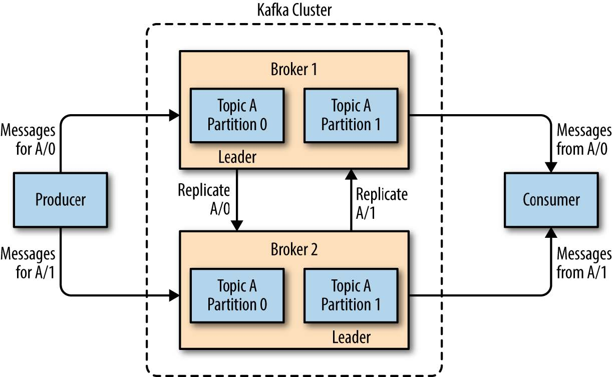
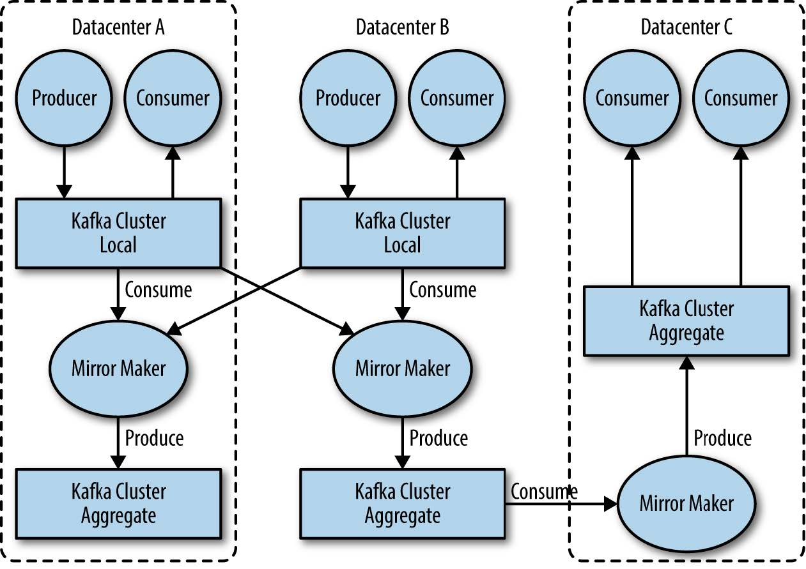

# Chapter 01 初识Kafka

### 1.2.1 消息与批次

消息(Message): 
* 数据结构: 字节数组
* 元数据
    * 键(Key)
* 批次(Batch): 消息按批次被发到分区(Partition)
    * 批次越大, 吞吐量越大, 延迟越高
* 模式(scheme): 定义消息的属性等

### 1.2.3 主题与分区

主题Topic: Consumer将Message发到指定topic
* 分区(Partition): 逻辑结构为提交日志 (FIFO)
    * 可以分配在不同的物理主机上

### 1.2.4 生产者与消费者

生产者(Producer): 创建Message, 发布到指定Topic
* Message分配策略:
    * Message默认被均衡到不同的Partition
    * 可根据Key与Partitioner生成Hash进行分区

消费者(Consumer): 订阅一或多个Topic, 按FIFO顺序消费
* 偏移(offset): 用来判断Message是否被消费
* 消费者群组(Consumer group): 作为一种逻辑消费者, 包含一到多个Consumer实例

### 1.2.5 broker与集群

Broker: 为Consumer提供服务, 为读取Partition的请求作出响应, 是集群的组成部分
* 集群控制器(Cluster controller) /Leader : 
    * 自动被选举出来, 宕机后重新选举
    * 协调集群中其它broker
    * 消息复制(Replication)与多活: 一个broker可以主导一个Partition, 并且保存其它Partition的副本
    

保留消息:
* 保留策略:
    * 到一定**大小**时清理
    * 到一定**时间**清理

### 1.2.6 多集群

使用多集群的原因:
* 分离数据类型
* 安全需求隔离
* 多数据中心(容灾)

*Notice*: 消息复制只能在一个集群内进行
* MirrorMaker: 集群间消息复制的工具
    * 通过Producer与Consumer实现
    

## 1.4 数据生态系统

使用场景:
* 活动跟踪: 
    1. 跟踪用户活动, 如页面访问次数或点击量
    2. 生产Msg到Topic
    3. 后端进行处理, 如机器学习等
* 传递消息(消息公共组件): 通过Stream实现
    * 格式化消息
    * 合并消息
    * 根据配置处理数据后发送
* 系统度量指示及日志
    * 系统监控
    * 将日志发布到指定Topic
* 提交日志:
    * 通过重做(redo)来恢复系统状态
* 流处理: 实时数据流处理