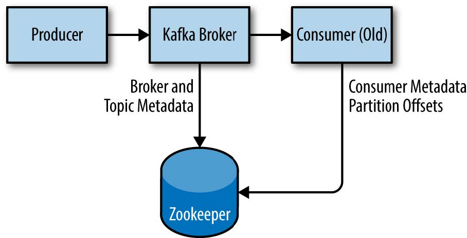

# Chapter 02 安装Kafka

### 2.1.3 安装Zookeeper

Zookeeper: 
* 与kafka的关系: 负责保存集群的元数据信息(Metadata)与消费者信息

* Zookeeper群组:
    * 奇数个结点: 只有大多数结点可用时, Zookeeper才能处理外部请求
    * 结点数配置: 太少: 节点失效风险大; 太多: 降低性能(**一致性协议**)
* 公共配置
    ```properties
    dataDir=/var/lib/zookeeper

    # 单位时间, 单位为ms
    tickTime=2000 
    # 主从结点建立初始化时间的上限, 20*tickTime
    initLimit=20  
    # 主从结点同步时间上限, 5*tickTime
    syncLimit=5   

    # 客户端口
    clientPort=2181 

    server.1=zoo1.example.com:2888:3888
    server.2=zoo2.example.com:2888:3888
    server.3=zoo3.example.com:2888:3888
    # server.X=hostname:peerport:leaderport
        # X: 服务器ID, 整数, 不必连续, 不必从0开始
        #     主机中还要通过*myid文件*指定自己的ID
        # hostname: 主机名/IP
        # peerport: 用于节点间通信
        # leaderport: 用于首领选举

    # 节点间通信要同时用到3个端口
    ```

## 2.3 broker配置

配置: 
* 常规配置:
    ```properties
    broker.id = 0 # broker的集群中的唯一标识符
        # 建议设置成与机器名相关,方便映射

    # 监听请求
    port = 9092 

    zookeeper.connect = localhost:2181/path
    # hostname:port/path
        # hostname: Zookeer主机名
        # port: Zookeer端口
        # path: Zookeer路径(optional) 
            # Zookeeper可同时管理多个应用程序
            # 不同path特定于应用程序

    # ??? 
    # Partition日志片段保存路径
    log.dirs = /kafkf/log 
        # 可以指定多个, 逗号分隔
        # 一个Partition的片段都在一个目录下
        # 最少使用原则: 选择最少数目Partition的路径新增分区

    num.recovery.threads.per.data.dir = 2
    # 默认: 1 (一个目录一个线程)
    # 线程池的线程数, 线程用于
        # 服务器启动时, 加载日志片段
        # 服务器崩溃后重启, 检查与截短分区
        # 服务器关闭时, 保存日志片段
        
    # 自动创建Topic
    auto.create.topics.enable = false
    # 触发自动创建Topic的条件:
        # 生产者写入
        # 消费者消费
        # 客户端向主题发送元数据请求
    ```
* 默认配置:
    ```properties
    # 分区数
    num.partitions = 1
    # 默认: 1
    # 只能增加不能减少
    # 考虑:
        # 消费者吞吐量
        # 生产者吞吐量, 比消费者多估算一点
        # broker管理的分区数, 磁盘空间, 带宽
        # 如果根据Key来分配消息, 则很难增加分区
        # broker对分区个数有限制 (受限于内存等)

    # 日志片段删除周期
    log.retention.hours = 168
    # 默认: 168, 即一周
    # 还有log.retention.ms, log.retention.minutes
    # 通过日志片段的最后修改时间与当前时间来判断
        # 如果改变了最后修改时间(如移动), 则不准确

    # 日志片段大小上限, 超过即删除
    log.retention.bytes = 1024
    # 默认: 1 GB
    # 注意: 是单个分区, 不是总和, 不是分区片段

    # 同时设置 log.retention.hours/minutes/ms/bytes时
        # 满足任意即可删除消息

    # 到达上限时, 保存日志片段文件并创建新片段
    log.segment.bytes = 1024
    # 默认: 1 GB
    # 考虑:
        # 太小: 频繁进行文件操作; 太大: 系统崩溃丢失大量消息
        # 日志片段被保存前, 片段不会因满足log.retention.*而被删除
        # 查找offset时, 会先根据时间戳定位日志片段, 再找具体offset
            # 即日志片段越小, 定位越准确

    # 日志片段定时保存周期
    log.segment.ms = 1000    
    # 同时设置 log.segment.ms/bytes, 满足任一即保存
    # 考虑:
        # 日志片段大小设置过大时
            # 多个日志片段的保存可能在到达log.segment.ms上限时同时发生
            #造成对磁盘性能影响

    # broker接受的最大消息长度(压缩后)
    message.max.bytes = 1024 
    # 默认: 1 000 000
    # 生产者发的消息过大时, broker返回错误
    # 考虑: 
        # 考虑以下参数大小的匹配:
            # 消费者的fetch.message.max.bytes
            # replica.fetch.max.bytes
    ```

## 2.4 硬件选择

硬件选择:
* 磁盘吞吐量
    * 影响: 消息产生速度(消息要持久化到服务器)
* 磁盘大小
    * 影响: 保留消息数量
* 内存大小:
    * 影响: 消费者消费速度(与缓存大小有关) ???
* 网络
    * 影响:
        * 处理的数据流量
        * 集群复制
        * 镜像
* CPU
    * 影响:
        * 压缩

## 2.6 Kafka集群

集群中的broker:
* broker数量
    * 考虑:
        * 数据量: 一个Broker能保存2GB, 则保存10GB数据要5个Broker; 如果replication-factor为2, 则需要10个Broker
        * 处理请求的能力
* **集群中broker.id不能冲突**
* 一个集群由一个zookeeper服务器协调