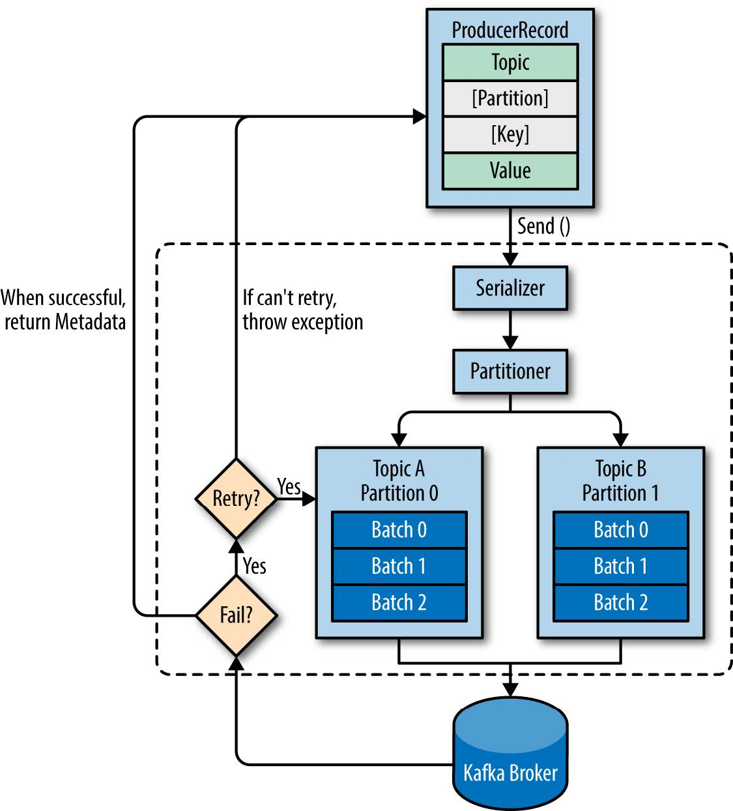

# Chapter 03 Kafka生产者--向Kafka写入数据


## 3.1 生产者概览

消息发送过程
1. 序列化: ProducerRecord对象的Key与Value被序列化, 传到分区器
    * **序列化器** (Serializer): 序列化消息
2. 分区: 
    1. 如果ProducerRecord对象中指定了分区, 则选择该分区
    2. 否则根据Key来计算分区
    3. 记录被添加到一个记录批次(batch), 由一个线程发送
    * **分区器** (Partitioner): 负责决定分区
3. **Broker**返回消息
    * 写入成功: 返回**RecordMetaData**
        * RecordMetaData: 存有消息所在Topic, Partition, offset
    * 写入失败: 返回错误信息, 生产者可能会重试, 重试失败再返回错误 
    


## 3.2 创建Kafka生产者

生产者基本属性:
```properties
# broker地址清单
bootstrap.servers = broker1:9092,broker2:9092
# 考虑:
    # 可多选择几个broker防止其中一些宕机

# 序列化器(全限定名)
key.serializer = org.apache.kafka.common.serialization.StringSerializer
value.serializer = org.apache.kafka.common.serialization.StringSerializer
    # 类型:
        # ByteArraySerializer (默认)
        # IntegerSerializer
        # StringSerializer
        # 用户自定义
```

消息范式: *具体见下一节3.3*
* 发送并忘记
* 同步发送
* 异步发送

## 3.3 发送消息到Kafka

消息范式
```java
    ProducerRecord<String, String>record = 
        new ProducerRecord<>("topicName","key","value");

    // 发送并忘记
    try{
        producer.send(record);
    }catch(Exception e){}

    // 同步发送
    try{
        producer.send(record).get(); // 阻塞至取得结果
    }catch(Exception e){}

    // 异步发送, 回调
    producer.send(
        record, 
        (recordMetadata, e)->{}
    );

// 相关接口
    Future<RecordMetadata> send(ProducerRecord<K, V> record);
    Future<RecordMetadata> send(ProducerRecord<K, V> record, Callback callback);
    // 过程:
        // 把消息放到缓冲区
        // 用单独线程发送ProducerRecord对象
        // 返回关联的Future对象用于查询结果
    // 可能的异常:
        // SerializationException
        // BufferExhaustedException
        // TimeoutException
        // InterruptException

    // org.apache.kafka.clients.producer.Callback
    public interface Callback{
        void onCompletion(RecordMetadata metadata, Exception exception);
    }
```

## 3.4 生产者的配置

配置
```properties
# 生产者要求的消息接收成功条件
acks = 1
# 可选值:
    # 0: 不需要服务器响应
    # 1: 确保首领节点收到消息
        # 新Leader尚未被选出来, 也会丢失, 但可以重发
    # all: 确保所有节点收到消息 (最安全, 但时间成本最高)

# 
buffer.memory = 1
# 超出缓存后
    # 旧版本: 阻塞或异常, 取决于block.on.buffer.full
    # 新版本: 阻塞到 max.block.ms的上限

compression.type = snappy
# 默认: 不压缩
# 可选值:
    # snappy: CPU占用较少
    # gzip: 压缩率高, 占用较多CPU
    # lz4

# 重试次数
retries = 1
# 相关参数: 重试前等待时间 retry.backoff.ms 
# 考虑: 重试次数 * 重试等待时间 应该大于Kafka的崩溃恢复时间

# 批次大小, 单位为byte, 达到则发送
batch.size = 1024
# 考虑:
    # 太大: 占内存; 太小: 频率发送占用网络, 吞吐量小

# ??? 是达到linger.ms就发送(不管batch.size), 还是说达到批次大小后, 发送前的等待时间
linger.ms = 1

# 多少个请求响应一次
max.inflight.requests.per.connection = 3
# "每次连接的请求数量"
# 设为1可保证消息的顺序

# broker同步时等待响应的最大时间
timout.ms
    # 与acks匹配, 响应到达时间超出timeout.ms即视为丢失
# Producer发送Message到Broker时等待响应的最大时间
request.timout.ms
# Producer请求元数据时等待响应的最大时间
metadata.fetch.timeout.ms

```


