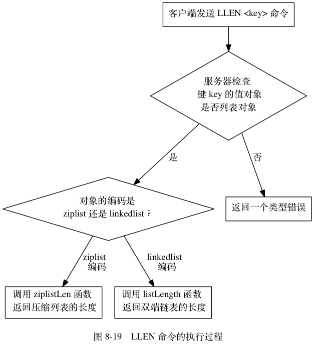

# Chapter 08 对象

## 8.1 对象的类型与编码

redis对象:
- 类型(逻辑结构): list, hash, set, zset, string
    ```c++
    #define OBJ_STRING  0       /* String object. */
    #define OBJ_LIST    1       /* List object. */
    #define OBJ_SET     2       /* Set object. */
    #define OBJ_ZSET    3       /* Sorted set object. */
    #define OBJ_HASH    4       /* Hash object. */
    ```
- 编码(数据结构): 即具体实现
    ```c++
    #define OBJ_ENCODING_RAW        0   // raw SDS
    #define OBJ_ENCODING_INT        1   // 整型
    #define OBJ_ENCODING_HT         2   // 哈希表
    #define OBJ_ENCODING_ZIPMAP     3   /* Encoded as zipmap */
    #define OBJ_ENCODING_LINKEDLIST 4   // 链表
    #define OBJ_ENCODING_ZIPLIST    5   // 压缩列表
    #define OBJ_ENCODING_INTSET     6   // 整数集合
    #define OBJ_ENCODING_SKIPLIST   7   // 跳表
    #define OBJ_ENCODING_EMBSTR     8   // embstr
    #define OBJ_ENCODING_QUICKLIST  9   // quicklist: 以压缩列表为结点的链表
    ```
- `redisObject`
    ```cpp
    typedef struct redisObject {
        unsigned type:4;        // 类型
        unsigned encoding:4;    // 编码
        unsigned lru:LRU_BITS;  //     LRU 时间 (与全局lru_clock相关)
        int refcount;           // 指向该对象的引用个数
        void *ptr;              // 指向实际数据结构的指针
    } robj;
    ```

类型的编码
- string:
    - int: 整数类型
    - embstr: embstr编码的SDS实现的字符串对象
    - raw: SDS实现
- list
    - ziplist: 压缩列表实现
    - linkedlist: 双端链表实现
    - quicklist(新): `quicklist`实现(参考`quicklist.h`)
- set
    - intset: 整数集合
    - hashtable: 哈希表实现
- hash
    - ziplist: 压缩列表实现
    - hashtable: 哈希表实现
- zset
    - ziplist: 压缩列表实现
    - skiplist: 跳表


## 8.2 字符串对象

embstr:
- embstr的数据结构与SDS一样, 只是分配空间时跟着redisObject一起分配
    - 最大长度44byte, 这时加上redisObject刚好64 byte
- 优点:
    - embstr的设计初衷是为了节省分配时的时间, 适合存不可变的小字符串
    - redisObject与embstr连着一起分配, 能利用局部性原理
- 涉及embstr的转换时, 开销会比较大, 都是转成raw/int/浮点再处理再视情况转回

string类型的编码
- **int**: 可以用long表示时 => 创建为int
- **raw**: length > 44 => 创建为SDS
- **embstr**: length <= 44  => 创建为embstr
    
string类型的编码转换
- INCRBYFLOAT: embstr => 浮点(中间状态) => embstr
- 编码原来为int的字符串, 在修改后带了字母, 则会变成embstr


## 8.3 列表对象

list类型的编码:
- ziplist: 元素个数<=64, 元素最大长度<=512
- linkedlist: 不满足ziplist的条件时使用linkedlist. 
    - 升级条件: 元素个数过多, 元素长度过大. 
    - 升级后不再降级
- quicklist(新): //TODO


## 8.4 哈希对象

hash类型的编码:
- ziplist: 要求: 键和值的长度都<=64, 键值对个数小于512
- hashtable: 不满足ziplist的条件时使用hashtable
    - 升级条件: 键值对个数过多, field长度过大, value长度过大
    - 升级后不再降级


## 8.5 集合对象

set类型的编码:
- intset: 要求: 元素都是整数值, 个数<=512
- hashtable: 不满足intset要求时就创建/转换为hashtable


## 8.6 有序集合

zset数据结构
```cpp
typedef struct zset {
    dict *dict;         // 既有哈希表
    zskiplist *zsl;     // 又有跳表
} zset;
```
- **为什么要两种数据结构**?
    - zskiplist
        - 在进行范围查找时效率很高, 复杂度为O(lg(N) + M), N为跳表长度, M为范围长度
        - 但查找`member->score`的复杂度为O(N)
    - hashtable
        - 用来保存映射关系`member->score`, 使查找member的复杂度为O(1)
        - 但范围查找很麻烦

zset类型的编码:
- ziplist: 元素个数小于128, 元素长度小于64


## 8.7 类型检查与多态

类型检查: 检查`redisObject->type`是否匹配


多态命令实现: 根据`redisObject->type`确定类型, 然后根据`redisObject->encoding`确定编码, 然后进行类型转换, 进行具体操作



## 8.8 内存回收

引用计数法: redis服务器中对对象的引用进行计数
- 创建时引用为1
- 有另一个程序使用同一个对象时, 引用+1
- 某个程序不再使用该对象时, 引用-1
- 引用为0时释放

**为什么使用引用计数法?**: 
- 引用计数法进行内存回收实现起来简单
- redis不支持对象的互相引用, 因此不会存在循环引用的问题

## 8.9 共享对象

共享对象: 在字符串/整数值相同的情况下, redis可能不会为键创建新对象, 而是指向已有对象, 然后引用+1
- 静态对象: 
    - redis启动时会为0-9999创建字符串实例
    - 在新版本中, 这些静态对象的引用计数值为`OBJ_SHARED_REFCOUNT = INT_MAX - 1`

**为什么不共享其它对象**? 共享的前提是对象值相等, 但判断复杂对象是否相等开销比较大

## 8.9 对象空转时长

`redisObject->lru`: 记录了对象上一次访问的时间
- `OBJECT IDLETIME key`可以返回上次访问时间到现在的间隔
    - 除了`IDLETIME`命令名, 所有对key的命令都会造成lru更新