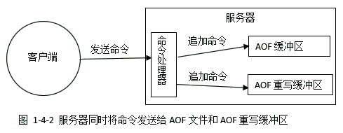

# chapter 11 AOF

知识树:
- 原理
- 保存过程
    - AOF缓存区
    - 同步机制/fsync时机: (always/everysec/no)
- 载入过程: 伪客户端
- AOF重写:
    - 原理
    - 后台重写(BGREWRITEAOF)原理

## 11.1 AOF持久化的实现

AOF
- 特点：
    - 纯文本格式
    - 只保存修改操作(select也会保存)

### 11.1.2 AOF文件的写入与同步
循环事件
- 过程
    ```python
    def loopEvent():
        while true:
            # 处理文件事件(save等), 
            # 接收用户命令请求
            # 发送命令回复等
            processFileEvents();
            
            # 过期键检查
            # 定时bgsave
            # 定时bgrewriteaof等
            processTimeEvents();

            # 根据保存策略来决定要不要进行aof
            flushAppendOnlyFile();
    ```

flushAppendOnlyFile()中的保存策略
- appendfsync配置
    - always: 每次flush后调用fsync()同步到文件
        - 效率低, 安全性高
    - everysec: flush()后, 检查距上次调用fsync()的时间是否超过了1秒, 超过了就fsync()
        - 效率中, 安全性中
    - no: 由操作系统来定期将缓存同步到文件
        - 效率高, 安全性低

## 11.2 AOF文件的载入与数据还原
载入方式
- 在初始化时创建**伪客户端**, 由伪客户端循环进行(解析命令-执行命令)直到所有命令执行完

## 11.3 AOP重写

原理: 不是简单记录每个操作, 而是对当前数据库状态生成一个快照, 然后输出成DML语句到AOF文件中

实现:
1. 遍历数据库, 对每个数据库生成一条select命令追加到aof文件中
    1. 对数据库中的每个对象生成一条/多条插入/增加元素的命令
        - 如果元素过多(如SADD/RPUSH超过64个元素)则切分成多条命令
    2. 重新演算键的过期时间, 生成EXPIRE等语句

优点: **不会有多余的命令**

### 11.3.2 AOP后台重写
实现:
1. 开始阶段:
    1. 创建**子进程**: 主线程遇到`BGREWRITEAOF`命令时, 创建新的子线程处理重写
        - 由于copy-on-write机制, 子进程会带有主进程的数据副本
    2. 创建**AOF重写缓冲区**: 重写阶段主进程的新操作除了写入自己的AOF缓冲区, 也要让子进程知道
2. 重写阶段:
    - 子进程遍历数据库数据进行写入, 写完redisDb中的数据库, 再写AOF重写缓冲区中新来的数据
3. 完成阶段:
    1. 子线程主线程发信号通知主进程
    2. 主线程接到信号调用**信号处理函数**, **阻塞**地处理新旧替换
        1. AOF缓存区中未写完的也要写入新AOF
        2. **原子**地替换旧AOF

