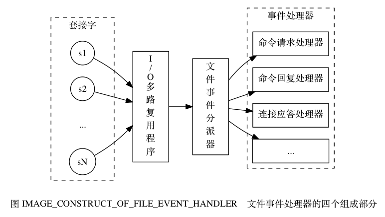

# chapter 12 事件

备注: 第12章(事件)与第14章(服务器)的关系
- 本章主要讲事件环
- 14章主要讲serverCron, 而serverCron是一类时间事件, 是事件环流程的一部分

服务器需要处理的事件:
- 文件事件: 对socket事件的抽象
    - accept, read, write, close事件
- 时间事件

## 12.1 文件事件

### 12.1.1 文件事件处理器的构成

IO多路复用 & 文件事件处理器
- **单线程**: 同时接收多个客户端的请求
- **IO多路复用程序**将socket交给事件分派器
- **文件事件分派器**根据请求的类型分派给不同的文件事件处理器
- **文件事件处理器**处理事件
  

### 12.1.2 IO多路复用程序的实现

底层实现: 
- select (POSIX, 一般系统都支持)
- epoll (LINUX)
- evport (Solaris)
- kqueue (Mac)
    
redis包装了自己的API, 可以根据系统在编译时选择最好的IO复用函数实现

### 12.1.3 事件的类型

Redis规定的事件类型
- `AE_READABLE`事件
    - 出现`readable`事件: 客户端进行`write()`或者`close()`
    - 出现`acceptable`事件: 客户端进行`connect()`
- `AE_WRITABLE`事件: 
    - 出现`writable`事件: 客户端`read()`
- 同时出现时, **`AE_READABLE`优先**


### 12.1.5

数据结构:
```cpp
typedef struct aeFileEvent {
    int mask;               /* one of AE_(READABLE|WRITABLE) */
    aeFileProc *rfileProc;  // 读事件处理器
    aeFileProc *wfileProc;  // 写事件处理器
    void *clientData;       // 客户端数据
} aeFileEvent;
```

常见文件事件处理器:
- 连接应答处理器(AE_READABLE): 创建客户端对象, 并且为其创建**命令请求处理器**并加入事件环
- 命令请求处理器(AE_READABLE): 读取已到达querybuf的字节, 解析成命令并执行, 最后写入输出缓冲区
- 命令回复处理器(AE_WRITABLE): 将输出缓存区保存的数据回写给客户端
    - 在客户端有正在等待的响应时创建该处理器(在事件环的beforeSleep()之前检查), 在客户端可写时回写
- 复制功能处理器


客户端-服务端连接示例
1. 服务端的监听socket收到客户端connect()请求时, 产生**AE_READABLE**事件, 引发**连接应答处理器**执行
    - 连接应答处理器执行: 产生客户端socket, 将客户端socket的AE_READABLE事件与**命令请求处理器**关联
    - AE_READABLE事件与**命令请求处理器**一直关联到客户端断开连接
2. 客户端socket收到客户端的命令时, 产生**AE_READABLE**事件, 由关联的**命令请求处理器**执行
    - 命令请求处理器执行: 执行命令, 产生结果, 然后将AE_WRITABLE事件与**命令回复处理器**关联
3. 客户端准备好(执行recv())时, 产生**AE_WRITABLE**事件, 由关联的**命令回复处理器**执行
    - 命令回复处理器执行: 将结果发给客户端, 然后解除AE_WRITABLE事件与命令回复处理器的关联

## 时间事件

数据结构:
```cpp
/* Time event structure */
typedef struct aeTimeEvent {
    long long id;                       
    long when_sec;                      // 执行时间: 秒
    long when_ms;                       // 执行时间: 毫秒
    aeTimeProc *timeProc;               // 时间事件处理器
    aeEventFinalizerProc *finalizerProc;// 在销毁时进行清理
    void *clientData;                   // 客户端数据
    struct aeTimeEvent *next;           // 事件链表指针
} aeTimeEvent;
```

定时事件与周期事件的区别
- 定时事件和同期事件都用aeTimeEvent表示
- 但周期事件通过`timeProc`的返回值指定了下一次执行的时间
- 定时事件`timeProc`返回AE_NOMORE


时间事件执行
- 流程
    ```python
    def processTimeEvents:
        for timeEvent in timeEvents                      # 遍历列表上所有时间事件
            # 如果到达了ddl, 则执行
            if timeEvent.when <= now()                   
                retVal = timeEvent.timeProc();

                # 如果是定时时间, 则从时间事件链表删除
                if retVal == NO_MORE                     
                    deleteTimeEventFromServer(timeEvent)

                # 否则更新下次执行时间
                else 
                    updateWhen(timeEvent, retVal)        
    ```
- serverCron: **也是时间事件**, 但没有客户端数据
    - 更新统计信息
    - 清理过期键值对
    - 清理掉线客户端
    - RDB周期持久化
    - 对于主服务器, 定期同步
    - 对于集群模式, 定期同步和连接测试


与其它功能的关系:
- 过期键删除策略: 
    - 定时删除策略通过时间事件实现, 但实际上redis**不会使用这种策略**
    - 时间事件主要用来处理服务端的重要事情, 并且每次执行时间不能太长, 使用该策略可能会对redis的性能造成严重的影响

## 事件驱动机制
- 事件环
    ```cpp
    void aeMain(aeEventLoop *eventLoop) {
        eventLoop->stop = 0;
        while (!eventLoop->stop) {
            if (eventLoop->beforesleep != NULL)
                // beforesleep()用于处理一些实时性要求比较高的任务
                eventLoop->beforesleep(eventLoop);    
            aeProcessEvents(eventLoop, AE_ALL_EVENTS);
        }
    }
    ```
    ```python    
    def aeProcessEvents():
        # 找到下一个最近的时间事件
        timeEvent = aeSearchNearestTimer()          
        remainMs = timeEvent.when - now()
        if remainMs < 0                             
            remainMs = 0;

        # 计算到下一次最近的时间事件还有多久时间
        timeVal = createTimeValWithMs(remainMs)  

        # poll到到达该定时器的执行时间
        aeApiPoll(timeVal)  

        # 处理文件事件
        processFileEvents();

        # 遍历时间事件链表, 处理时间事件
        processTimeEvents();
    ```
* main
    ```python
    def main():
        initServer()
        while serverIsNotShutdown()
            aeProcessEvents()
        cleanServer()
    ```

事件环为什么性能很高: 
- 时间链表实际长度很短
- 防饥饿机制: 在执行事件环时, 如果快到时间, 会把一些要处理的任务留到下一次, 比如回复命令等
- 通过子进程来处理一些IO, 如BGSAVE, BGREWRITEAOF