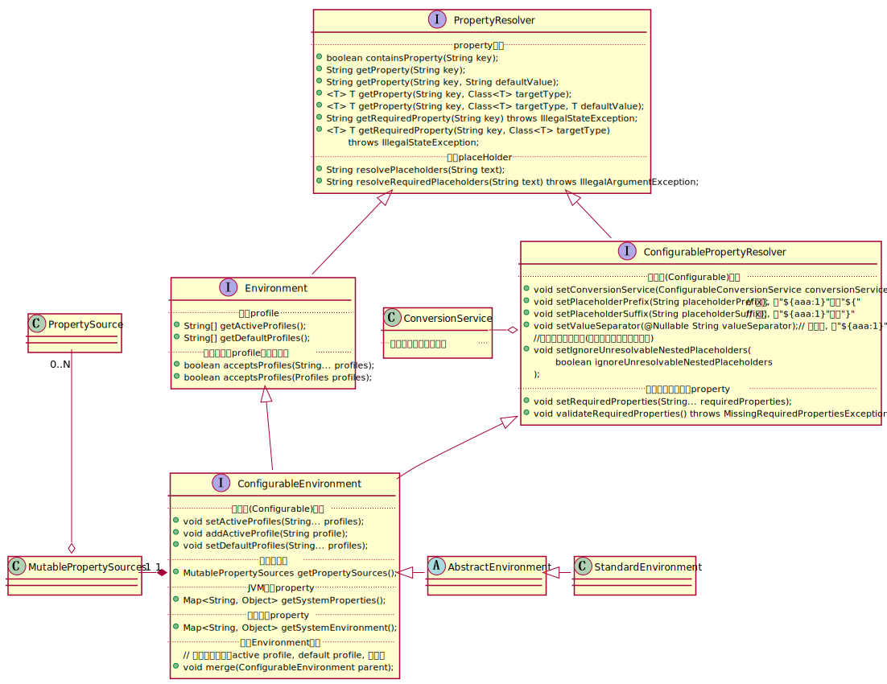
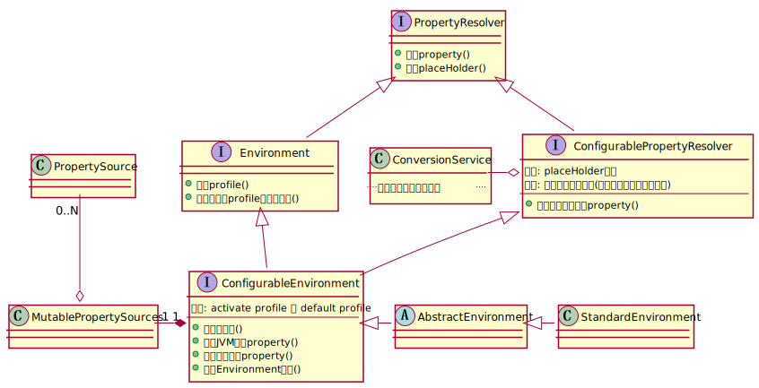

# Chapter 02 Environment

本章主要介绍``Environment``的实现原理及其设计思想. 笔者认为, 在面对Spring这样的大型项目时, 我们不应该带着**面向过程**的思维, 跟着调试器光标的走向去了解Spring做了什么工作, 这样容易被错综复杂的对象关系和频繁的方法跳转打乱思路. 在了解某个复杂的过程时, 应该: 
1. 先找出该过程涉及到的对象/接口; 
2. 了解对象/接口各自的职责范围; 
3. 了解对象之间的依赖关系;
4. 结合对象关系, 了解过程如何通过对象的协作实现.

## 2.1 Environment相关API

在了解``Environment``实现类的原理之前, 需要一些与``Environment``相关的API的先验知识, 了解``Environment``提供了什么功能, 在Spring中起到了怎样的作用.

下图以``StandardEnvironment``类为例, 列出了``StandardEnvironment``所有父类/接口的主要方法.


由于涉及的方法比较多, 看起来比较繁杂, 笔者将各接口方法按功能进行分类和简化, 得到简化后的"**伪**"类图. 如果想要了解Spring官方对于这些接口的规范以及其它细节, 读者应该直接参考这些接口源码的注释. 此处只是对接口各自的职责范围和依赖关系做一些梳理.



## 2.2 Environment的实现类
在Spring boot启动的过程中, 可能实际化的``Environment``类型有三种: ``StandardServletEnvironment``, ``StandardReactiveWebEnvironment``, ``StandardEnvironment``, 分别对应SERVLET, REATIVE和无Web类型这三种情况.
```java
/**
坐标: org.springframework.boot.SpringApplication#getOrCreateEnvironment()
*/
private ConfigurableEnvironment getOrCreateEnvironment() {
    if (this.environment != null) {
        return this.environment;
    }
    switch (this.webApplicationType) {
    case SERVLET:
        return new StandardServletEnvironment();
    case REACTIVE:
        return new StandardReactiveWebEnvironment();
    default:
        return new StandardEnvironment();
    }
}
```
其中``StandardServletEnvironment``的``StandardReactiveWebEnvironment``都继承自``StandardEnvironment``, 而``StandardEnvironment``继承自``AbstractEnvironment``. 
``StandaredEnvironment``中的大部分接口方法都在其父类``AbstractEnvironment``中实现, *因此本小节的重点放在``AbstractEnvironment``的源代码上*.

<br/>

### 2.2.1 AbstractEnvironment源码解析

``AbstractEnvironment``的类头注释如下:

> Abstract base class for Environment implementations. Supports the notion of reserved default profile names and enables specifying active and default profiles through the ``ACTIVE_PROFILES_PROPERTY_NAME`` and ``DEFAULT_PROFILES_PROPERTY_NAME`` properties.
> Concrete subclasses differ primarily on which PropertySource objects they add by default. ``AbstractEnvironment`` adds none. Subclasses should contribute property sources through the protected ``customizePropertySources(MutablePropertySources)`` hook, while clients should customize using ``ConfigurableEnvironment.getPropertySources()`` and working against the ``MutablePropertySources`` API. See ``ConfigurableEnvironment`` javadoc for usage examples.


要表达的意思大致如下: 

> ``AbstractEnvironment``类主要实现了
> - 定义保留的default profile名("default")
> - 从property ACTIVE_PROFILES_PROPERTY_NAME 中加载active profile(s)
> - 从property DEFAULT_PROFILES_PROPERTY_NAME 中加载default profile(s)
> 
> 具体的子类的区别主要体现在配置源. 子类可以通过重写``customizePropertySources(MutablePropertySources)``方法自定义配置源, 而子类的调用者可以通过``ConfiguratbleEnvironment#getPropertySrouces()``方法获取可变配置源集合(``MutablePropertySources``), 再添加配置源.

``AbstractEnvironment``运用了设计模式中的[**模板模式**](http://c.biancheng.net/view/1376.html), 实现了一系列的模板方法, 并且定义了一系列可见性为protected或public的hook方法, 开发者可以实现子类并重写这些hook方法对``Environment``进行自定义.

<br/>

下文对``AbstractEnvironment``的其中一些方法实现进行说明. 

#### 2.2.1.1 客制化配置源
开发者可以通过继承``customizePropertySources(MutablePropertySources propertySources)``方法, 在应用启动的时候添加配置源, 并且自定义配置源的优先级顺序.
```java
/**
* 模板方法
*/
public AbstractEnvironment() {
    customizePropertySources(this.propertySources); // hook方法
}

/**
* hook方法: 客制化配置源
* - 客制化不仅体现在增加自定义的配置源, 还体现在客制化配置源的加载顺序
* - 子类可以在方法进入时/退出前调用super.customizePropertySources(), 以实现将自定义的配置源置后于/优先于所以其它配置之后(之前)的目的.
*/
protected void customizePropertySources(MutablePropertySources propertySources) {}
```
其中源代码注释中给了一个重写customizePropertySources()以控制配置源优先级顺序的例子. 如果按以下方法定义Environment, 则搜索配置源的顺序为 **``{C, D, A, B}``**.

> ```java
> public class Level1Environment extends AbstractEnvironment {
>     @Override
>     protected void customizePropertySources(MutablePropertySources propertySources) {
>         super.customizePropertySources(propertySources); // no-op from base class
>         propertySources.addLast(new PropertySourceA(...));
>         propertySources.addLast(new PropertySourceB(...));
>     }
> }
> public class Level2Environment extends Level1Environment {
>     @Override
>     protected void customizePropertySources(MutablePropertySources propertySources) {
>         propertySources.addLast(new PropertySourceC(...));
>         propertySources.addLast(new PropertySourceD(...));
>         super.customizePropertySources(propertySources); // add all from superclass
>     }
> }
> ```

#### 2.2.1.2 从配置源读取active profile

```java
/**
* 激活的profile, 可以用逗号分隔, 以设置多个profile值.
* - 环境变量SPRING_PROFILES_ACTIVE可以达到同样效果, 但该property优先级更高.
*/
public static final String ACTIVE_PROFILES_PROPERTY_NAME = "spring.profiles.active";

private final Set<String> activeProfiles = new LinkedHashSet<>();

/**
 * 模板方法
 */
@Override
public String[] getActiveProfiles() {
    return StringUtils.toStringArray(doGetActiveProfiles()); // hook方法
}

/**
* hook方法 & 模板方法: 从配置源中获取配置spring.profiles.active的值, 将active profile 加载到 Environment
*/
protected Set<String> doGetActiveProfiles() {
    synchronized (this.activeProfiles) {
        if (this.activeProfiles.isEmpty()) {
            String profiles = getProperty(ACTIVE_PROFILES_PROPERTY_NAME);     // hook方法
            if (StringUtils.hasText(profiles)) {
                setActiveProfiles(StringUtils.commaDelimitedListToStringArray(
                        StringUtils.trimAllWhitespace(profiles)));
            }
        }
        return this.activeProfiles;
    }
}

/**
 * hook方法
 */
@Override
@Nullable
public String getProperty(String key) {
    return this.propertyResolver.getProperty(key);
}
```
#### 2.2.1.3 从配置源读取default profile
与active profile(s)的加载类似. **只要有active profile存在, 所有default profile都会失效**, 具体参考``isProfileActive(String)``方法.
```java
/**
* 保留的default profile名
*/
protected static final String RESERVED_DEFAULT_PROFILE_NAME = "default";

/**
* 默认的profile, 可以用逗号分隔, 以设置多个profile值.
* - 环境变量SPRING_PROFILES_DEFAULT可以达到同样效果, 但该property优先级更高.
* - 当active profiles存在时, 所有active profiles生效, 而default profiles失效.
*/
public static final String DEFAULT_PROFILES_PROPERTY_NAME = "spring.profiles.default";

private final Set<String> defaultProfiles = new LinkedHashSet<>(getReservedDefaultProfiles());

@Override
public String[] getDefaultProfiles() {
    return StringUtils.toStringArray(doGetDefaultProfiles());
}

/**
* 从配置源中获取配置spring.profiles.default的值, 将 default profile 加载到Environment
*/
protected Set<String> doGetDefaultProfiles() {
    synchronized (this.defaultProfiles) {
        if (this.defaultProfiles.equals(getReservedDefaultProfiles())) {
            String profiles = getProperty(DEFAULT_PROFILES_PROPERTY_NAME);
            if (StringUtils.hasText(profiles)) {
                setDefaultProfiles(StringUtils.commaDelimitedListToStringArray(
                        StringUtils.trimAllWhitespace(profiles)));
            }
        }
        return this.defaultProfiles;
    }
}

/**
* 保留的default profile名, 默认为{"default"}
* - 可以通过override来重定义
*/
protected Set<String> getReservedDefaultProfiles() {
    return Collections.singleton(RESERVED_DEFAULT_PROFILE_NAME);
}
```

#### 2.2.1.4 判断多个profile条件中, 是否有任一条件成立

```java
/**
* 判断在多个profile条件中, 是否有任一条件
* - 即计算命题 profile条件-1 || profile条件-2 || ... || profile条件-N 的真值
*     - 其中profileCondtion-i 形如 "profileName" 或 "!profileName", 分别表示"profileName有效" 和 "profileName无效".
*     - 而isProfileActive(String)方法定义了profile有效的判定准则.
*/
@Override
@Deprecated
public boolean acceptsProfiles(String... profiles) {
    Assert.notEmpty(profiles, "Must specify at least one profile");
    for (String profile : profiles) {
        if (StringUtils.hasLength(profile) && profile.charAt(0) == '!') {
            if (!isProfileActive(profile.substring(1))) {
                return true;
            }
        }
        else if (isProfileActive(profile)) {
            return true;
        }
    }
    return false;
}

@Override
public boolean acceptsProfiles(Profiles profiles) {
    Assert.notNull(profiles, "Profiles must not be null");
    return profiles.matches(this::isProfileActive);
}

protected boolean isProfileActive(String profile) {
    validateProfile(profile);
    Set<String> currentActiveProfiles = doGetActiveProfiles();
    return (currentActiveProfiles.contains(profile) ||
            (currentActiveProfiles.isEmpty() && doGetDefaultProfiles().contains(profile)));
}
```
这一功能的主要应用场景, 是用于判断一个bean是否应该被加载, 如下面的``MyBean``将在名为"aaa"的profile失效, 或名为"bbb"的profile无效时成立. 
```java
@Profile({"!aaa", "bbb"})
@Bean
public MyBean myBean() {
    return new MyBean();
}
```
(unfinished)

#### 2.2.1.5 从System类读取通过JVM参数定义的property
```java
/**
* 从System类读取通过JVM参数定义的property映射表
* - 如果没有调用 System.getProperties() 的权限, 则生成一个Adapter, 每次获取property时, 调用 System.getProperty(String)
*/
@Override
@SuppressWarnings({"rawtypes", "unchecked"})
public Map<String, Object> getSystemProperties() {
    try {
        return (Map) System.getProperties();
    }
    catch (AccessControlException ex) {
        return (Map) new ReadOnlySystemAttributesMap() {
            @Override
            @Nullable
            protected String getSystemAttribute(String attributeName) {
                try {
                    return System.getProperty(attributeName);
                }
                catch (AccessControlException ex) {
                    if (logger.isInfoEnabled()) {
                        logger.info("Caught AccessControlException when accessing system property '" +
                                attributeName + "'; its value will be returned [null]. Reason: " + ex.getMessage());
                    }
                    return null;
                }
            }
        };
    }
}
```

#### 2.2.1.5 从System类读取通过环境变量定义的property
与上一个功能类似, 但增加了一个"忽略环境变量"的配置项.
```java
/**
    * 配置: 是否忽略环境变量
    * 默认: true. 即Environment中找不到指定property时, 从环境变量找.
    * @see #suppressGetenvAccess()
    */
public static final String IGNORE_GETENV_PROPERTY_NAME = "spring.getenv.ignore";

/**
    * 确定是否取消 System#getenv() / System#getenv(String) 方法的调用权限(即能否从环境变量获取property的权限)
    */
protected boolean suppressGetenvAccess() {
    return SpringProperties.getFlag(IGNORE_GETENV_PROPERTY_NAME);
}

/**
    * 从System类读取通过环境变量定义的property映射表
    */
@Override
@SuppressWarnings({"rawtypes", "unchecked"})
public Map<String, Object> getSystemEnvironment() {
    if (suppressGetenvAccess()) {
        return Collections.emptyMap();
    }
    try {
        return (Map) System.getenv();
    }
    catch (AccessControlException ex) {
        return (Map) new ReadOnlySystemAttributesMap() {
            @Override
            @Nullable
            protected String getSystemAttribute(String attributeName) {
                try {
                    return System.getenv(attributeName);
                }
                catch (AccessControlException ex) {
                    if (logger.isInfoEnabled()) {
                        logger.info("Caught AccessControlException when accessing system environment variable '" +
                                attributeName + "'; its value will be returned [null]. Reason: " + ex.getMessage());
                    }
                    return null;
                }
            }
        };
    }
}

```

#### 2.2.1.6 从父Environment合并

```java
/**
    * 与父Environment进行合并:
    * - 合并配置源: 父类的配置源追加到当前Environment, 跳过已存在的
    * - 合并active profile: 父类的active profiles追加到当前Environment, 跳过已存在的
    * - 合并default profile: 父类的active profiles追加到当前Environment, 跳过已存在的
    */
@Override
public void merge(ConfigurableEnvironment parent) {
    for (PropertySource<?> ps : parent.getPropertySources()) {
        if (!this.propertySources.contains(ps.getName())) {
            this.propertySources.addLast(ps);
        }
    }
    String[] parentActiveProfiles = parent.getActiveProfiles();
    if (!ObjectUtils.isEmpty(parentActiveProfiles)) {
        synchronized (this.activeProfiles) {
            for (String profile : parentActiveProfiles) {
                this.activeProfiles.add(profile);
            }
        }
    }
    String[] parentDefaultProfiles = parent.getDefaultProfiles();
    if (!ObjectUtils.isEmpty(parentDefaultProfiles)) {
        synchronized (this.defaultProfiles) {
            this.defaultProfiles.remove(RESERVED_DEFAULT_PROFILE_NAME);
            for (String profile : parentDefaultProfiles) {
                this.defaultProfiles.add(profile);
            }
        }
    }
}
```

### 2.2 Environment的准备过程 - prepareEnvironment()

```java
private ConfigurableEnvironment prepareEnvironment(SpringApplicationRunListeners listeners,
        ApplicationArguments applicationArguments) {
    /**
    * 根据Web类型来推断Environment类型并初始化.
    * - JVM参数 & 环境变量中定义的属性将在Environment的实例化阶段加载到Environment.
    */
    ConfigurableEnvironment environment = getOrCreateEnvironment();             

    // 
    configureEnvironment(environment, applicationArguments.getSourceArgs());
    listeners.environmentPrepared(environment); // 通知listener(s)
    bindToSpringApplication(environment);

    // 判断要不要将Environment转换类型
    // 疑问: 是不是WebType或者Environment中途发生变化
    if (!this.isCustomEnvironment) { 
        environment = new EnvironmentConverter(getClassLoader()).convertEnvironmentIfNecessary(environment,
                deduceEnvironmentClass());
    }
    ConfigurationPropertySources.attach(environment);
    return environment;
}

/**
* 根据Web类型来推断Environment类型并初始化.
* - JVM参数 & 环境变量中定义的属性将在Environment的实例化阶段加载到Environment.
*/
private ConfigurableEnvironment getOrCreateEnvironment() {
    if (this.environment != null) {
        return this.environment;
    }
    switch (this.webApplicationType) {
    case SERVLET:
        return new StandardServletEnvironment();
    case REACTIVE:
        return new StandardReactiveWebEnvironment();
    default:
        return new StandardEnvironment();
    }
}
```