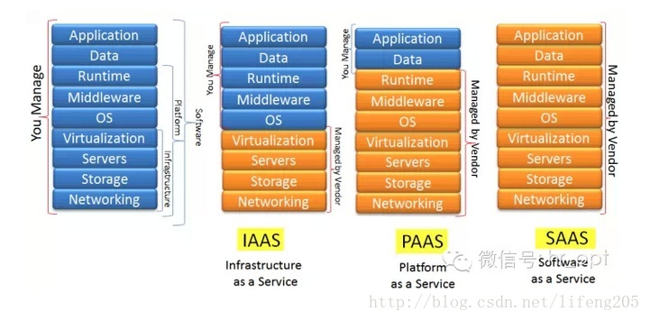

云计算的三种模式:
[content="理解IaaS、SaaS、paas的含义及区别](https://blog.csdn.net/lifeng205/article/details/79374881)
* **基础设施即服务(Infrastructure As a Service)**: 云服务的最底层，主要提供一些基础资源; 用户需要自己控制底层
* **平台即服务(PaaS)**: 软件部署平台（runtime），抽象掉了硬件和操作系统细节; 用户只关注业务逻辑
* **软件即服务(SaaS)**: 软件的开发、管理、部署都交给第三方，不需要关心技术问题，可以拿来即用
* 函数即服务(FaaS): 
* 容器即服务(CaaS): 
  
