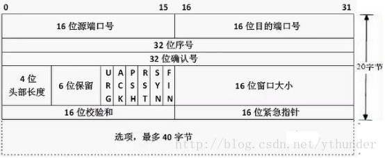
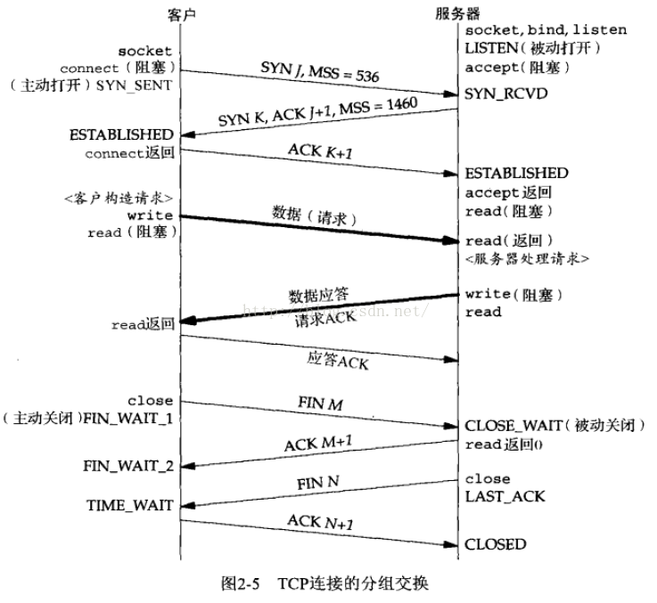
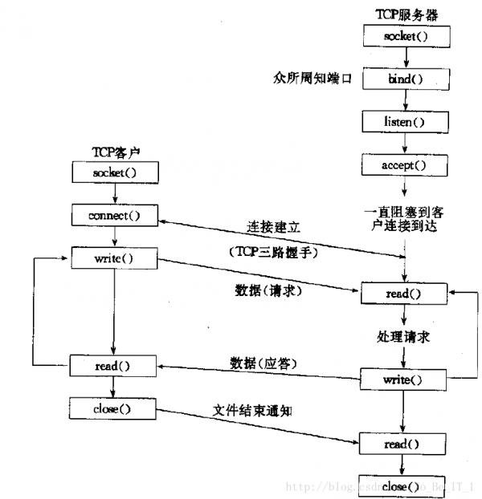

TCP与UDP区别
* TCP面向连接, UDP无连接
* TCP可靠 (出错时重传), UDP不可靠(但可以知道出错)
* TCP面向字节流, UDP面向数据报
* TCP头部开销大(20字节), UDP开销小(8字节)
* TCP有拥塞控制, UDP没有
* TCP连接只能一对一, UDP可以一对一, 一对多, 多对一, 多对多

# UDP
头部:
* 数据结构:
    * 源port   (16bit)
    * 目的port (16bit)
    * 总长度   (16bit): 长度单位为字节
    * 检验和   (16bit)
    * 
* 解释:
    * 检验和:
        * 检验时需要加上伪首部(12byte = 96bit), 包括双方IP地址, 8bit全0, 8bit协议, 16bit TCP/UDP首部长度
        * 作用是顺便把这些重要信息都检验了

应用场景:
* DNS: 客户端给服务器发一个有主机名的UDP分组, 服务器给客户端发一个有主机IP的UDP分组
  
# TCP
头部:
* 源port (16bit)
* 目的port (16bit)
* 序号  (32bit)
* 确认号 (32bit)
* 头部长度 (4bit): 单位为4byte
* 6位保留
* URG: 
* ACK:
* PSH:
* RST:
* SYN:
* FIN:
* 窗口大小 (16bit): 
* 校验和 (16bit)>
* 

三次握手
* 
* 
* 
* 

可靠性:
* 保证方法:
    1. 检验和: 综合检验了双方IP, 协议, 首部长度, 端口, 以及内容的正确性
    2. 序号: 防缺失, 防重复, 保序
    3. ACK: 
        * 超时重传
        * 快重传(重复三次ACK)

流量控制
* 停止-等待流量控制: 每发送一个

拥塞控制
* [TCP/IP详解--拥塞控制 & 慢启动 快恢复 拥塞避免 - losbyday - 博客园](https://www.cnblogs.com/losbyday/p/5847041.html)
* 慢启动, 拥塞避免:
    * 初始化: cwnd设为1MSS, ssthresh设为16
    * 不拥塞 && 没达到ssthresh时, cwnd翻倍
    * 达到ssthresh后, 开始线性增长
    * 超时(发生拥塞)后, cwnd设为1, ssthresh减半, 重新开始增长
    *   ```python
        cwnd = 1;                        // congestion window
        ssthreshold = 16;                // slow start threshold

        while(true)
            if timeout                   // 慢启动: 拥塞窗口指数增加
                ssthreshold /= 2;
                cwnd = 1;
            else 
                if cwnd >= ssthreshold   // 拥塞避免: 拥塞窗口线性增加
                    cwnd++;
                else                        
                    cwnd *= 2;          
            
            if cwnd > recvwnd            // 不可超过接收窗口
                cwnd = recvwnd
        ```
* 快重传, 快恢复: 
    * 初始化: cwnd设为1MSS, ssthresh设为16
    * 不拥塞 && 没达到ssthresh时, cwnd翻倍
    * 达到ssthresh后, 开始线性增长
    * 超时(发生拥塞)后, cwnd设为1, ssthresh减半, 重新开始增长
    * 连续收到3个同样的ack后, cwnd减半, ssthresh设为cwnd
    *   ```python
        cwnd = 1;                        // congestion window
        ssthresh = 16;                   // slow start threshold

        while(true)
            if timeout                   // 慢启动: 拥塞窗口指数增加
                ssthresh /= 2;
                cwnd = 1;
            else if repeatAckCount >=3   // 快重传: 不用等到超时
                ssthresh = (cwnd /= 2);  // 快恢复: cwnd只减半而不是reset为1
            else                        
                if cwnd >= ssthresh      // 拥塞避免: 拥塞窗口线性增加
                    cwnd++;
                else
                    cwnd *= 2;

            if cwnd > recvwnd            // 不可超过接收窗口
                cwnd = recvwnd
        ```


定时器
* 引用
    * [解读TCP 四种定时器 - xiaofei0859的专栏 - CSDN博客](https://blog.csdn.net/xiaofei0859/article/details/52794576)
    * [TCP中的7种定时器 - 姜姜！ - CSDN博客](https://blog.csdn.net/u013929635/article/details/82623611)
* **重传定时器**: 超时没有得到ACK时重传报文段
    * rtt = i * rttOld + (1-i)*rttLast   // 对上个rtt与之前的rtt进行加权
* **坚持定时器**: 当接收方表示接收窗口为0时, 发送方隔一段时间发个探测报文, 询问接收方需不需要接收
    * 防止接收方发送下一个非零ACK时, 丢失, 导致死锁
* **保活定时器**: 如果接收方长时间没有收到发送方的数据, 那就要定时(等到2小时后, 隔75s询问一次, 直到达到10次)
    * 防止客户端出故障, 浪费服务器资源
* **延迟ACK定时器**: 收到报文段以后, 不立即回复ACK, 而是等一段时间(最大200ms), 看有没收到其它报文段, 然后一次确认
    * 节省ACK报文
* 连接/断开连接相关的定时器:
    * connection establishment 定时器: 循环定时发送SYN直到收到回应或者超过最大次数
    * FIN_WAIT_2定时器: 主动关闭方等待被动关闭方发送最后一个FIN的时候, 需要计时, 超时则CLOSED
    * TIME_WAIT / 2MSL(Maximum Segment Lifeness)定时器: 主动关闭方在发送最后一个ACK以后, 要等待2MSL, 保证被动关闭方收到FIN
        * 防止被动关闭方一直等待
    

滑动窗口
* 作用: 
    * **流量控制**, 即协调两端的速度
    * **拥塞避免**
    * **可靠性**
* TCP是全双工的, 因此有**接收窗口**和**发送窗口**
    * 发送窗口取决于对方接收窗口, 接收窗口取决于应用

半连接与半关闭:
* 半连接: 三次握手中的第三次之前, 都属于半连接
* 半关闭: CLOSED_WAIT阶段