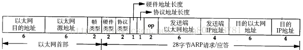
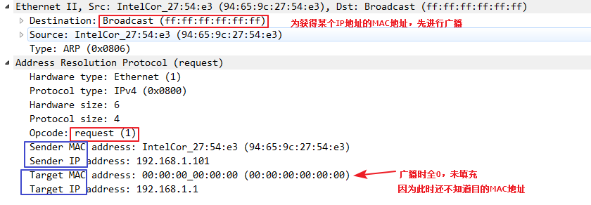
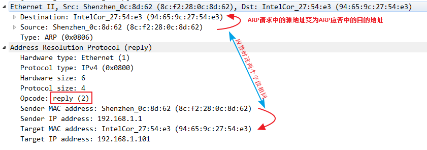

ARP(Address Resolution Protocol)
* 将IP地址转化成MAC地址
* ARP请求被封装在以太网帧(以广播的方式)
* 结构:
    * 以太网目的地址：接收方设备的硬件地址（48bit，目的地址全为1的特殊地址是广播地址）。
    * 以太网源地址：发送方的硬件地址帧类型：表示后面数据的类型（其中，0x0806表示后面的数据是属于ARP包的，其他还可能属于IP包）。
    * 硬件类型：表示硬件地址的类型（其中，值为1表示以太网地址，其他还可能表示令牌环地址）。
    * 协议类型：表示要映射的协议地址类型（其中，0x0800表示IP地址，其他还可能是ICMP/IGMP）。
    * 硬件地址长度：指出该报文中硬件地址的长度（ARP报文中，它的值为6）。
    * 协议地址长度：指出该报文中协议地址的长度（ARP报文中，它的值为4）。
    * op：操作字段，共有4种类型（1.ARP请求，2.ARP应答，3.RARP请求，4.RARP应答）。
    * 发送端以太网地址：发送方设备的硬件地址。
    * 发送端IP地址：发送方设备的IP地址。
    * 目的以太网地址：接收方设备的硬件地址。
    * 目的IP地址：接收方设备的IP地址。
    * 
    * 
    * 
ICMP(Internet Control Message Protocol)Internet控制报文协议