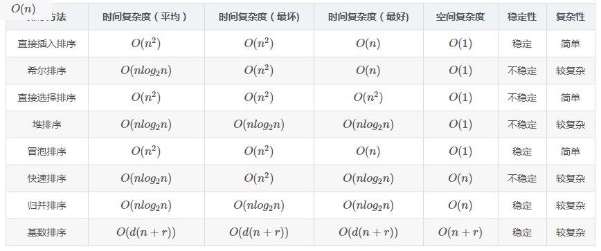

排序算法比较:
* 
* 插入/冒泡/选择:
    * 在已经排好的情况下, 插入排序与冒泡排序复杂度为O(n), 而选择排序还是要每次找最值, 所以复杂度为O(n2)
* 快排/归并
    * 快排最坏情况的例子: 在第i轮选到第i小/大的元素, 此时复杂度为O(n2)
    * 快排的空间复杂度体现在递归, 平均O(log n), 最坏O(n)
    * 归并排序每轮需要复制数组(n), 以及递归(log n), 所以空间复杂度为O(n)
* 不稳定
    * 选排, 堆排不稳定的例子:
        * 对set {B:0, B:1, A:2} 排序
        * 结果为 {A:2, B:1, B:0}
    * 快排不稳定的例子:
        * 对set {B:0, A:1, A:2} 排序
        * 结果为 {A:2, A:1, B:0}