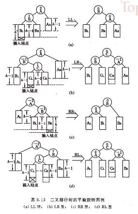
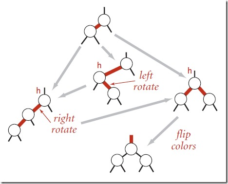

二叉查找树:
* 删除:
    * 如果被删除结点为叶结点, 直接删除
    * 如果被删除结点有一个分支, 把该分支替换到该结点的位置
    * 如果被删除结点有两个分支, 用左支的最大结点(或者右支的最小结点)替换要删除的结点, 再按删除叶结点的方法删除

二叉平衡树:
* 插入的平衡方法:
    * 
* 删除的平衡方法:
    * 如果是叶结点, 并且删除以后不平衡, 那不平衡的状态只有上图的四种, 可以按上图方法处理
    * 如果不是叶结点, 先用左支的最大结点(或者右支的最小结点)替换要删除的结点, 再按叶结点的方法删除

B树:
* 特点:
    * 对于非根结点, 阶数(子结点数)为M, 则
        * 最少子结点数为ceil(M/2)
        * 最大key数为M-1
        * 最少key数为ceil(M/2)-1
          | 阶数 | 最小阶数 | 最大key数| 最小key数 |
          |:-:   |:-:      | :-:      | :-:      |
          |M|ceil(M/2)|M-1|ceil(M/2)-1|
          |3|2|2|1|
          |4|2|3|1|
          |5|3|4|2|
          |6|3|5|2|
          |...|...|...|...|

红黑树
* 特点:
    * 实质上为2-3树(3阶B树)
    * 高度为h时, 结点数至少为
* 定义:
    * 结点为红或者黑
    * 根结点与叶结点(NULL)为黑
    * 红结点的子结点一定为黑结点
    * 任意结点的任意路径的黑结点个数相等
* 插入平衡方法:
    