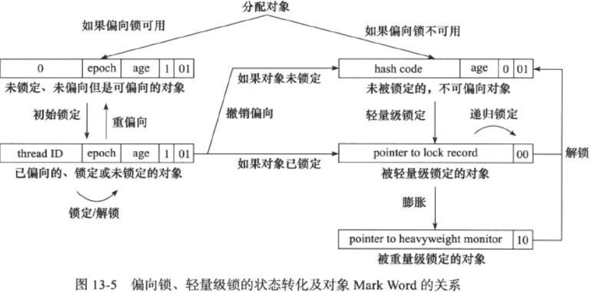

# 前提
死锁:
必要条件:
* 互斥条件: 一个资源一次只能给一个线程使用
* 不可剥夺条件: 线程使用资源时, 不可剥夺其对资源的占有
* 请求与保持条件: 线程在占有资源时, 继续请求其它资源
* 循环等待条件: 形成一个进程等待环路

CAS:
* 算法:
    ```
    T cas(Ptr addr, T A, T B){
        if(addr.value == A)
            addr.value = B;
        return addr.value;
    }
    ```
* 问题: ABA
    * 解决: 追加版本号
* 循环CAS: 循环执行CAS直到成功

MESI协议:
[Java的多线程机制系列：(二）缓存一致性和CAS](https://www.cnblogs.com/mengheng/p/3491092.html)
[《大话处理器》Cache一致性协议之MESI](https://blog.csdn.net/muxiqingyang/article/details/6615199)
* 状态:
    * Modified: 缓存行的数据已修改, 与内存不一致; 数据只存在该缓存
    * Exclusive: 缓存行的数据与内存一致; 数据只存在该缓存
    * Shared: 缓存行的数据与内存一致; 数据存在于多个缓存
    * Invalied: 缓存行的数据无效.
* 监听:
    * M: 监听缓存行所在内存地址的读操作. 操作发生之前, 将缓存行写回内存, 然后状态转为S
    * E: 监听缓存行所在内存地址的读操作. 操作发生之后, 状态改为S
    * S: 监听缓存行所在内存地址的写操作. 操作发生后, 状态改为I
* 状态机:
    * 
    * remote read与remote write指其它缓存的操作
    * local read与local write指本缓存的操作
* **M状态缓存行监听到remote write的行为**:
    * 假设缓存A监听到的remote write行为来自B
        * B一定是I状态
        * A先将缓存行写入内存
        * B从内存读入缓存行, 在缓存中修改, 状态改为M
        * A的状态改为I

volatile
* 轻量级synchronized
* 语义:
    1. 线程修改一个共享的变量时, 另一个线程对该变量的修改立即可见
    2. 禁止指令重排序
* 实现:
    * #Lock
        1. Lock指令会将缓存的数据写到内存(在这之前, 缓存状态为M)
        2. M状态缓存写入内存时, 其它处理器的该缓存行无效化(状态变成I)
        3. Lock之前的内存数据需要同步, 因此Lock以后的指令不能排到Lock之前, 也就是说Lock指令起到了**内存屏障**的作用


## 锁
### synchronized(重量级锁):
synchronized使用形式:
* 对普通同步方法, 锁是当前实例对象
* 对静态同步方法, 锁是对象类的Class对象
* 对同步方法块, 锁是synchronized()括号中的对象

monitor: 每个对象有个对应的monitor用于实现同步
  
同步语句块实现:
* **显式同步**, monitorenter与monitorexit
* 进入语句块前用monitorenter指令, 记数+1; 离开语句块前用monitorexit; 异常时释放锁
* monitorenter与monitorexit必须配对

同步方法:
* **隐式同步**, method_info::access_flags::ACC_SYNCHRONIZED
* 异常时退出


### 偏向锁/轻量级锁/重量级锁
[1] [JVM内部细节之二：偏向锁(Biased Locking)](http://www.cnblogs.com/javaminer/p/3892288.html?utm_source=tuicool&utm_medium=referral)
[2] [【转载】Java中的锁机制 synchronized & 偏向锁 & 轻量级锁 & 重量级锁 & 各自优缺点及场景 & AtomicReference](https://www.cnblogs.com/charlesblc/p/5994162.html)

* 数据:
    * 对象头
        * 线程ID
        * 偏向锁flag
        * 锁标志位(01)
* 升级算法:
    ```python
        if 对象头.线程偏向ID == currentThread.ID
            run()
        else
            if 对象头.偏向锁flag == 1                            // 偏向锁可用
                markWord = {currentThread.ID | 1 | 01}          // {指向自己        | 可偏向 | 偏向锁   }
                if !CAS(对象头.markWord, markWord)               // CAS尝试让对象头指向自己
                    请求撤销轻量级锁
                else
                    run();
            else                                                // 偏向锁不可用(可能是参数设置的, 也可能是竞争触发的)
                prepareLockRecord();
                markWord = {lockRecordPtr  | 0 | 00}            // {自己的锁记录指针 |   -   | 轻量级锁 }

                n = 0;
                while(                                          // 自旋CAS
                    !CAS(对象头.markWord, markWord) 
                    && n++ < spinThreshold 
                );
                    
                if (n >= spinThreshold)
                    对象头.markWord = {对象.Monitor|0|10}        // 锁膨胀
                    currentThread.wait()
                else
                    run();
                    if !CAS(markWord, lockRecord)               // 释放时发现锁已膨胀, 则通知所有阻塞的线程
                        getMonitor(对象头.monitor).signallAll();    
    ```
* 撤销算法:
    ```python
        在safepoint检查占有锁的线程状态, 把线程执行完
        根据竞争情况, 选择不同操作
            1. 偏向线程置0                                      //  {无线程(0)  | 可偏向 | 偏向锁}
            2. 偏向其它线程                                     //  {ID        | 可偏向 | 偏向锁}
            3. 不适合偏向                                       //  {锁记录指针 | 可偏向 | 偏向锁}
    ```
* 示意图
    * 

### 轻量级锁
* 数据:
    * 对象头:
        * 锁记录指针
        * 锁标志位(00)
* 锁定算法
    ```python
        recordPtr = this.allocateRecord();                        // 在栈帧中为锁记录分配空间

        count = 0;
        do {  
            CAS(MarkWord);                                        // 对象头.锁标志 = 00, 对象头.锁记录指针 = recordPtr
            count++;                                                           
        } while ( 对象头.标志 == 00 && 对象头.锁记录 == recordPtr && count <= MAX_COUNT)   // 自旋  

        对象.锁标志 = 10;                                          // 锁膨胀
        对象.重量级锁指针 = 
        this.block();
    ```
* 解锁算法
    ```python
        currentMarkWord = CAS(MarkWord)                           // 从锁记录中恢复MarkWord
        if currentMarkWord != MarkWordOld                         // CAS失败
            对象头.重量级锁指针 = 0                                 // 释放锁
            notifyAll();                                          // 唤醒阻塞的线程, 令其重新竞争
    ```

比较:
|分类  | 优点 |缺点|适用|
|:--:|:--:|:--:|:--:|
|偏向锁| 通过减少CAS的使用和避免阻塞提高性能 | 线程竞争比较激烈时, 偏向锁会造成更大的消耗| 单个线程访问同步块 |
|轻量级锁| 通过自旋来避免阻塞带来的代价 | 自旋会消耗CPU | 追求**响应时间**, 同步块执行较快 |
|重量级锁| 不用自旋, 不消耗CPU | 阻塞(进行用户态和内核态的切换)需要代价| 追求**吞吐量**, 同步块执行较长 | 

自旋锁: 通过循环来避免阻塞, 适于同步块较小的场景
* 自适应自旋锁: 根据上次请求锁和线程状态来自适应地确定自旋的循环次数的自旋锁

## 原子性
处理器实现原子性:
* 锁总线
    * 缺点: 代价大
* 锁缓存:
    * 缺点: 
        * 当数据不能缓存到处理器, 或者跨缓存行读取数据时, 只能锁总线
        * 需要处理器的支持

Java中原子操作的实现:
* 循环CAS:
    * JVM中的CAS通过处理器提供的CMPXCHG指令实现
    * 缺点:
        * 循环消耗处理器时间
        * ABA问题
        * 一次只能实现一个变量的原子性
* 锁机制:
    * 除偏向锁外, 其它锁的加锁和解锁操作都通过循环CAS实现