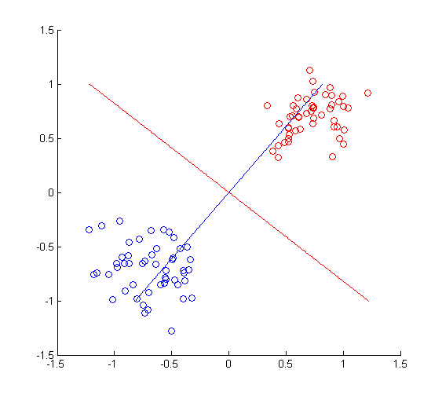
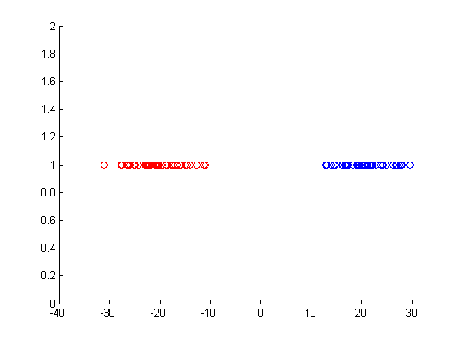

theta = 45./180.* pi;  
%A类样本，正态分布随机数，此处样本为行向量
classA = [randn(50,1)./5 - cos(theta) ,randn(50,1)./5 -sin(theta)];  
%B类样本，正态分布随机数，此处样本为行向量 
classB = [randn(50,1)./5 + cos(theta) ,randn(50,1)./5 + sin(theta)];  

%核心算法  
Sw = cov(classA)+cov(classB);  
wx = (Sw)^-1 * transp(mean(classA) - mean(classB));  

figure(1);  
scatter(classA(:,1),classA(:,2));hold on;  
scatter(classB(:,1),classB(:,2),'r');  
plot(wx(1)./wx(2).* (-1:0.01:1),-1:0.01:1);  
plot(-wx(2)./wx(1).* (-1:0.01:1),-1:0.01:1,'r');  
hold off;  

figure(2);  
scatter(classA*wx,ones(1,50));hold on;  
scatter(classB*wx,ones(1,50),'r');  
hold off;  

%

%

%缺点�?
theta = 45./180.* pi;  
%A类样本，正态分布随机数，此处样本为行向量
classA = [
    [(randn(25,1)./5 - 0.5*cos(theta)) ,(randn(25,1)./5 -0.5*sin(theta))];
    [(randn(25,1)./5 - 1*cos(theta)) ,(randn(25,1)./5 -4*sin(theta))]
];  
%B类样本，正态分布随机数，此处样本为行向量
classB = [(randn(50,1)./5 + 0.5*cos(theta)) ,[(randn(50,1)./5 + 0.5*sin(theta))]];  

%核心算法  
Sw = cov(classA)+cov(classB);  
wx = (Sw)^-1 * transp(mean(classA) - mean(classB));  

figure(1);  
scatter(classA(:,1),classA(:,2));hold on;  
scatter(classB(:,1),classB(:,2),'r');  
plot(wx(1)./wx(2).* (-1:0.01:1),-1:0.01:1);  
plot(-wx(2)./wx(1).* (-1:0.01:1),-1:0.01:1,'r');  
hold off;  

figure(2);  
scatter(classA*wx,ones(1,50));hold on;  
scatter(classB*wx,ones(1,50),'r');  
hold off;
