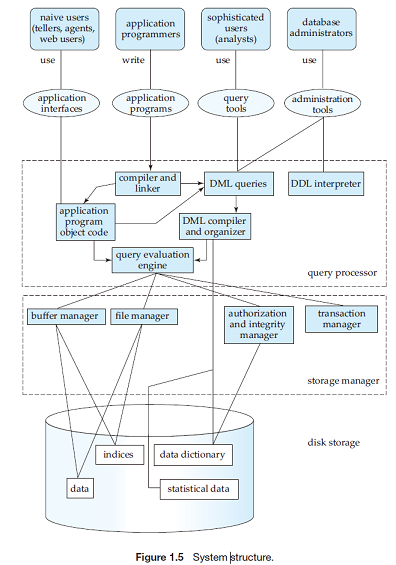

    #Chapter 01 数据库概论

**数据库管理系统** {  
 &emsp;&emsp;由一个相互关联的**数据集合**  
 &emsp;&emsp;和一组访问这些数据的**程序**组成  
}  

## 1.2 数据库系统的目标  

**文件处理系统** {  
 &emsp;&emsp;数据冗余,不一致：  
 &emsp;&emsp;数据访问困难：访问特定数据可能造成困难  
}

数据库管理系统要解决的问题 {  
 &emsp;&emsp;**数据孤立**：数据格式不同，文件格式不同  
 &emsp;&emsp;**完整性问题**：  
 &emsp;&emsp;&emsp;&emsp;- **一致性约束**  
 &emsp;&emsp;**原子性问题**  
 &emsp;&emsp;**并发访问操作**  
 &emsp;&emsp;**安全性问题**  
}

## 1.3 数据抽象

**数据抽象**三个层次 {  
 &emsp;&emsp;**物理层**  
 &emsp;&emsp;**逻辑层**  
 &emsp;&emsp;**视图层**  
}

**实例**：特定时刻存储在数据库中的信息  

**模式**：数据库的整体设计 {  
 &emsp;&emsp;**物理模式**：对应物理层  
 &emsp;&emsp;&emsp;&emsp;- **物理数据独立性**：应用程序不依赖于物理模式  
 &emsp;&emsp;**逻辑模式**：对应逻辑层  
 &emsp;&emsp;&emsp;&emsp;从对应用程序的效果看，逻辑层最重要  
 &emsp;&emsp;**子模式**：对应视图层  
}

**数据模型** {  
 &emsp;&emsp;数据模型是数据库结构的基础 {  
 &emsp;&emsp;&emsp;&emsp;描述数据、数据联系、数据语义及一致性约束  
 &emsp;&emsp;&emsp;&emsp;提供一种描述三个抽象层次的方式  
 &emsp;&emsp;}  
 &emsp;&emsp;分类 {  
 &emsp;&emsp;&emsp;&emsp;**关系模型** ：用表的集合来表示数据和数据间的联系  
 &emsp;&emsp;&emsp;&emsp;**实体联系模型（E-R）**：  
 &emsp;&emsp;&emsp;&emsp;**基于对象数据模型**：  
 &emsp;&emsp;&emsp;&emsp;**半结构化数据模型**：  

 &emsp;&emsp;&emsp;&emsp;**网状数据模型**：  
 &emsp;&emsp;&emsp;&emsp;**层次数据模型**：  
 &emsp;&emsp;}  
}

## 1.4 数据库语言

数据库语言 {  
&emsp;&emsp;分类 {  
&emsp;&emsp;&emsp;&emsp;**数据定义语言（DDL）**:定义数据库模式和数据库的其它特性 {  
&emsp;&emsp;&emsp;&emsp;&emsp;&emsp;定义一致性约束：{  
&emsp;&emsp;&emsp;&emsp;&emsp;&emsp;&emsp;&emsp;**域约束**：值域满足要求  
&emsp;&emsp;&emsp;&emsp;&emsp;&emsp;&emsp;&emsp;**参照完整性**：满足数据间的依赖关系  
&emsp;&emsp;&emsp;&emsp;&emsp;&emsp;&emsp;&emsp;**断言**：如：x必须大于1，域约束与参照完整性是断言的特殊形式  
&emsp;&emsp;&emsp;&emsp;&emsp;&emsp;&emsp;&emsp;**授权**：{  
&emsp;&emsp;&emsp;&emsp;&emsp;&emsp;&emsp;&emsp;&emsp;&emsp;**读授权**  
&emsp;&emsp;&emsp;&emsp;&emsp;&emsp;&emsp;&emsp;&emsp;&emsp;**插入授权**  
&emsp;&emsp;&emsp;&emsp;&emsp;&emsp;&emsp;&emsp;&emsp;&emsp;**更新授权**  
&emsp;&emsp;&emsp;&emsp;&emsp;&emsp;&emsp;&emsp;&emsp;&emsp;**删除授权**  
&emsp;&emsp;&emsp;&emsp;&emsp;&emsp;&emsp;&emsp;}  
&emsp;&emsp;&emsp;&emsp;&emsp;&emsp;}  
&emsp;&emsp;&emsp;&emsp;}  
&emsp;&emsp;&emsp;&emsp;**数据操纵语言（DML）** {  
&emsp;&emsp;&emsp;&emsp;&emsp;&emsp;分类 {  
&emsp;&emsp;&emsp;&emsp;&emsp;&emsp;&emsp;&emsp;**过程化DML**  
&emsp;&emsp;&emsp;&emsp;&emsp;&emsp;&emsp;&emsp;**声明式DML**  
&emsp;&emsp;&emsp;&emsp;&emsp;&emsp;}  
&emsp;&emsp;&emsp;&emsp;&emsp;&emsp;访问类型 {  
&emsp;&emsp;&emsp;&emsp;&emsp;&emsp;&emsp;&emsp;**增**  
&emsp;&emsp;&emsp;&emsp;&emsp;&emsp;&emsp;&emsp;**删**  
&emsp;&emsp;&emsp;&emsp;&emsp;&emsp;&emsp;&emsp;**改**  
&emsp;&emsp;&emsp;&emsp;&emsp;&emsp;&emsp;&emsp;**查**  
&emsp;&emsp;&emsp;&emsp;&emsp;&emsp;}  
&emsp;&emsp;&emsp;&emsp;}  
&emsp;&emsp;}  
&emsp;&emsp;DDL的输出放在**数据字典**， 数据字典中包含**元数据**  
&emsp;&emsp;数据字典可以看作一种特殊的，只能由数据库系统本身访问和修改的表  
}

## 1.5 关系数据库简介

**关系数据库**：基于关系模型，使用一系列表来表达数据及数据间的联系  
**宿主语言** 执行DML语句的方式：{  
&emsp;&emsp; **应用程序接口**：将DML语句发送给数据库，再返回结果  
&emsp;&emsp; **嵌入DML调用**：通过**DML预编译器**将DML语句转变成语言的调用&emsp;&emsp;  
}   

## 1.8 - 1.9 数据存储与查询；事务

**数据库系统**模块{  
&emsp;&emsp;**存储管理器** ：负责与文件系统进行交互{  
&emsp;&emsp;&emsp;&emsp;部件{  
&emsp;&emsp;&emsp;&emsp;&emsp;&emsp;**权限及完整性管理器**： 检查完整性约束与用户权限  
&emsp;&emsp;&emsp;&emsp;&emsp;&emsp;**事务管理器**：保持数据库一致，防止并发冲突 {  
&emsp;&emsp;&emsp;&emsp;&emsp;&emsp;&emsp;&emsp;**原子性**：要么发生，要么不发生  
&emsp;&emsp;&emsp;&emsp;&emsp;&emsp;&emsp;&emsp;**一致性**：数据正确  
&emsp;&emsp;&emsp;&emsp;&emsp;&emsp;&emsp;&emsp;**持久性**：即使出故障也要保存数据不变  
&emsp;&emsp;&emsp;&emsp;&emsp;&emsp;&emsp;&emsp;事务{  
&emsp;&emsp;&emsp;&emsp;&emsp;&emsp;&emsp;&emsp;&emsp;&emsp;原子性  
&emsp;&emsp;&emsp;&emsp;&emsp;&emsp;&emsp;&emsp;&emsp;&emsp;一致性  
&emsp;&emsp;&emsp;&emsp;&emsp;&emsp;&emsp;&emsp;}  
&emsp;&emsp;&emsp;&emsp;&emsp;&emsp;&emsp;&emsp;事务管理部件负责原子性和持久性  
&emsp;&emsp;&emsp;&emsp;&emsp;&emsp;&emsp;&emsp;**并发控制管理器**负责一致性  
&emsp;&emsp;&emsp;&emsp;&emsp;&emsp;}  
&emsp;&emsp;&emsp;&emsp;&emsp;&emsp;**文件管理器**：管理磁盘空间，管理存储信息的数据结构  
&emsp;&emsp;&emsp;&emsp;&emsp;&emsp;**缓冲管理器**  
&emsp;&emsp;&emsp;&emsp;}  
&emsp;&emsp;&emsp;&emsp;数据结构 {  
&emsp;&emsp;&emsp;&emsp;&emsp;&emsp;**数据文件**： 存储数据库自身  
&emsp;&emsp;&emsp;&emsp;&emsp;&emsp;**数据字典**：存储关于数据库结构的元数据，特别是数据模式  
&emsp;&emsp;&emsp;&emsp;&emsp;&emsp;**索引**： 提供对数据项的快速访问  
&emsp;&emsp;&emsp;&emsp;}  
&emsp;&emsp;}  
&emsp;&emsp;**查询处理器** {  
&emsp;&emsp;&emsp;&emsp;**DDL解释器**：解释DDL语句，将定义记录在数据字典  
&emsp;&emsp;&emsp;&emsp;**DML编译器**：生成计算方案，**查询优化**，编译  
&emsp;&emsp;&emsp;&emsp;**查询计算引擎**：执行低级指令  
&emsp;&emsp;}  
}

## 1.11数据库体系结构
  
  

数据库应用程序结构 {  
&emsp;&emsp;两层结构体系  
&emsp;&emsp;三层结构体系  
}  

## 1.2 数据库用户和管理员

**数据库管理员（DBA）** {  
&emsp;&emsp;模式定义  
&emsp;&emsp;存储结构及存取方式定义  
&emsp;&emsp;模式及物理组织的修改  
&emsp;&emsp;数据访问授权  
&emsp;&emsp;日常维护  
}
