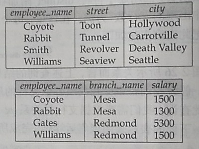
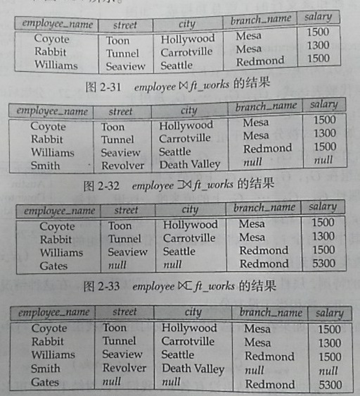

# Chapter 02 

## 2.1 关系数据库

### 2.1.1 基本结构
**关系数据库** : **表**的集合
* 表(table) / 关系(relation) : 一系列的域上的笛卡尔积的**子集**, 是行/元组的集合
    * 行(row) / 元组(tuple) : 
    * 列首 / 属性(attribute) : 
        * 域 : 属性的值域

其它特性 :
* 域必须是原子的
* **null**是所有域的成员
* // 不同属性可以属于相同的域

### 2.1.2 数据库模式
* 数据库模式
* 数据库实例
* **关系模式** : 相当于表的类型定义, 由**属性**及其对应的**域**决定
* **关系实例** : 特定关系模式下表的值
* // 在关系模式中使用相同属性是将不同关系的元组联系起来的一种方法

### 2.1.3 码
* **超码(superkey)** : 能够唯一地标识一个元组的**属性集合**
    * **候选码** : 任意真子集都不是**超码**的**最小超码**
        * // 超码的任意超集都是超码 
    * **主码** : 被选中的候选码
        * // 主码应该尽可能很少变化
    * **外码** : r2的主码k是r1的某属性, 则称
        * r1**参照**r2
        * k是r1参照r2的**外码**
        * r1是外码的**参照关系(referencing relation)**
        * r2是外码的**被参照关系(referened relation)**    

### 2.1.4 查询语言

查询语言 :
* 过程化语言 : 用户指导系统对数据库执行一系列操作以计算所得结果
    * 关系代数
* 非过程化语言 : 用户只需描述所需信息, 不用给出获取信息的具体过程
    * 元组关系演算
    * 域关系演算

## 2.2 关系代数基本运算

关系代数 : 
* 基本运算 : 
    * **选择运算** : $ \sigma_{c_0}(R_0) $ 
        * 语义 : 选择关系$R_0$中符合条件$c_0$的行, 作为新的关系并返回
    * **投影** : $ \Pi_{a_{x0}, a_{x1},..., a_{xn}}(R_0)$
        * 语义 : 选择关系$R_0$中的属性$c_0$的列$ a_{x0}, a_{x1},..., a_{xn} $组成新的关系并返回
    * **集合并** : $ R_0 \cup R_1 $
        * 语义 : 将关系模式相同(**相容, 即属性个数相同（同元）, 对应属性的域相同**)的两个关系$R_0$与$R_1$做集合并运算, 返回结果
    * **集合差** : $ R_0 - R_1 $
        * 语义 : 将关系模式相同(**相容, 即属性个数相同（同元）, 对应属性的域相同**)的两个关系$R_0$与$R_1$做集合差运算, 返回结果
    * **笛卡尔积** : $ R_0 \times R_1 $
        * 当一个关系与自身做笛卡尔积运算时, 命名时应该对相同属性取不同的新属性名
    * **更名** : $ \rho_{R_1}(R_0)$
        * 语义 : 返回关系$R_0$的结果, 并将新名字$R_1$赋给$R_0$
* 附加运算 : 
    * **集合交** : $ R_0 \cap R_1  = R_0 - (R_0 - R_1)$
        * 语义 : 将关系模式相同(**相容, 即属性个数相同（同元）, 对应属性的域相同**)的两个关系$R_0$与$R_1$做集合交运算, 返回结果 
    * **自然连接** : $ R_0 \Join R_1 $
        * 语义 : 将所有共有属性(同名属性)都相同的元组连接起来, 当且仅当所有同名属性的值都相同时才能连接
    * **$\theta$连接** : $ R_0 \Join_\theta R_1 = \sigma_\theta(R_0 \times R_1)$
        * 语义 : 
    * 赋值
* 扩展的关系代数运算 : 
    * 广义投影 : $ \Pi_{F_1,F_2,...,F_n}(R) $
        * 语义 : 表达式中$F_i$表示对R中某些属性进行算术运算以后的结果
    * 聚集函数 :
        * sum 
        * count 
        * min 
        * max
        * avg 
    * 外连接 ($\theta$连接的扩展): 
        * 左外连接 : 结果中属于**左表**的属性的值不会为NULL
        * 右外连接 : 结果中属于**右表**的属性的值不会为NULL
        * 内连接 : 左外连接与右外连接做集合交的结果(带NULL的元组不会出现)
        * 外连接 : 左外连接与右外连接做集合并的结果(带NULL的元组都会出现)
        * **自然连接** : SQL会自动判断属性是不是共同属性, 并自动合并同名属性

    * 
    * 

## 2.5 空值 

* **null**
    * 处理运算
        * **null**的运算
            * 算术运算(+-\*/) : 返回null
            * 比较运算(>, <等) : 返回 **unknown**
        * **unknown**的运算
            * 逻辑运算 : 
                * and : 
                    * true && unknown = unknown
                    * false && unknown = false
                    * unknown && unknown = unknown 
                * or : 
                    * true || unknown = true
                    * false || unknown = unknown
                    * unknown || unknown = unknown
                * not : 
                    * !unknown = unknown
    * 处理关系运算
        * select : where unknown时不选中
        * join : 只要共有属性中有NULL, 该元组就不会被选中(元组不匹配)
        * 投影, 并, 交, 差 : 只要两个元组所有对应属性都相等(值可为NULL), 则视为重复
        * 聚集运算 : 
            * count : 
                * 除了count(*)外, 其它情况下都忽略NULL(即属性全为NULL的元组会被count)
                * 忽略含NULL属性使得聚集运算的对象为空集时, count(*)结果为0
            * 其它 :
                * 忽略NULL
                * 忽略含NULL属性使得聚集运算的对象为空集时, 返回结果为NULL